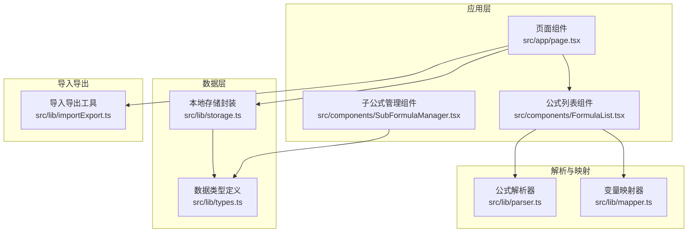
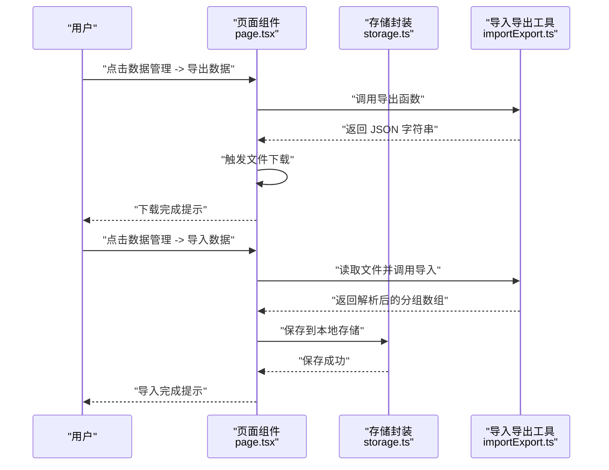
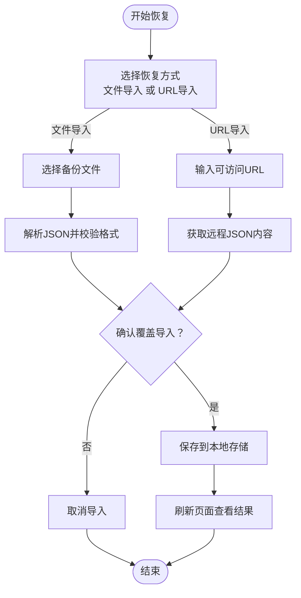
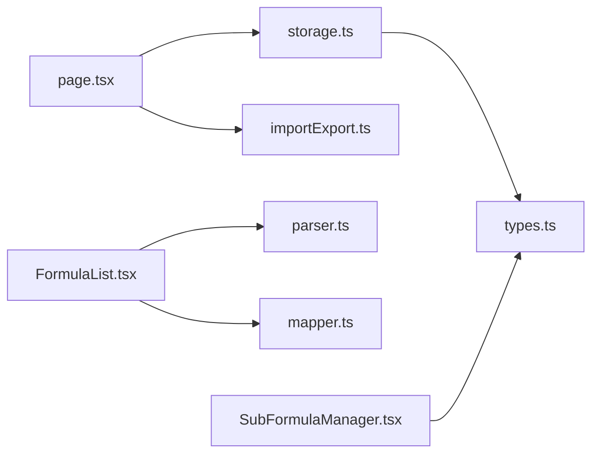

# 数据备份与恢复

<cite>
**本文档引用的文件**
- [src/lib/importExport.ts](file://src/lib/importExport.ts)
- [src/lib/storage.ts](file://src/lib/storage.ts)
- [src/lib/types.ts](file://src/lib/types.ts)
- [src/app/page.tsx](file://src/app/page.tsx)
- [src/components/FormulaList.tsx](file://src/components/FormulaList.tsx)
- [src/components/SubFormulaManager.tsx](file://src/components/SubFormulaManager.tsx)
- [src/lib/parser.ts](file://src/lib/parser.ts)
- [src/lib/mapper.ts](file://src/lib/mapper.ts)
- [package.json](file://package.json)
</cite>

## 目录
1. [简介](#简介)
2. [项目结构](#项目结构)
3. [核心组件](#核心组件)
4. [架构总览](#架构总览)
5. [详细组件分析](#详细组件分析)
6. [依赖关系分析](#依赖关系分析)
7. [性能考虑](#性能考虑)
8. [故障排查指南](#故障排查指南)
9. [结论](#结论)
10. [附录](#附录)

## 简介
本指南面向“公式变量映射与可视化工具”项目的数据备份与恢复需求，基于现有代码实现，提供可操作的备份策略、手动备份流程、备份文件管理、恢复步骤与风险评估，并结合项目特性讨论数据一致性保障、存储位置选择、安全保护措施、灾难恢复计划、紧急恢复流程以及多设备同步、版本历史管理与数据比较的实践建议。

## 项目结构
该项目采用 Next.js 前端应用结构，数据持久化通过浏览器本地存储实现，数据交换采用 JSON 文件格式。核心模块包括：
- 应用入口与页面逻辑：负责数据加载、保存、导入导出、URL 参数同步等
- 数据模型与类型：定义公式、分组、子公式等数据结构
- 解析与映射：公式词法分析与变量映射
- 导入导出：JSON 导出与导入（文件与 URL）

图表来源
- [src/app/page.tsx:1-798](file://src/app/page.tsx#L1-L798)
- [src/lib/storage.ts:1-50](file://src/lib/storage.ts#L1-L50)
- [src/lib/importExport.ts:1-120](file://src/lib/importExport.ts#L1-L120)
- [src/lib/types.ts:1-51](file://src/lib/types.ts#L1-L51)
- [src/lib/parser.ts:1-159](file://src/lib/parser.ts#L1-L159)
- [src/lib/mapper.ts:1-89](file://src/lib/mapper.ts#L1-L89)
- [src/components/FormulaList.tsx:1-387](file://src/components/FormulaList.tsx#L1-L387)
- [src/components/SubFormulaManager.tsx:1-201](file://src/components/SubFormulaManager.tsx#L1-L201)

章节来源
- [src/app/page.tsx:1-798](file://src/app/page.tsx#L1-L798)
- [src/lib/storage.ts:1-50](file://src/lib/storage.ts#L1-L50)
- [src/lib/importExport.ts:1-120](file://src/lib/importExport.ts#L1-L120)
- [src/lib/types.ts:1-51](file://src/lib/types.ts#L1-L51)
- [src/lib/parser.ts:1-159](file://src/lib/parser.ts#L1-L159)
- [src/lib/mapper.ts:1-89](file://src/lib/mapper.ts#L1-L89)
- [src/components/FormulaList.tsx:1-387](file://src/components/FormulaList.tsx#L1-L387)
- [src/components/SubFormulaManager.tsx:1-201](file://src/components/SubFormulaManager.tsx#L1-L201)

## 核心组件
- 本地存储封装：提供数据加载与保存接口，键名为固定标识，值为序列化的分组与公式集合
- 导入导出工具：提供 JSON 导出、文件下载、文本导入、URL 导入等功能，并进行数据格式校验
- 页面逻辑：在组件挂载时加载本地数据，监听 URL 参数变化，维护分组与侧边栏状态缓存，并在用户操作时调用保存接口
- 组件交互：公式列表与子公式管理组件配合导入导出功能，实现数据的增删改与批量迁移

章节来源
- [src/lib/storage.ts:1-50](file://src/lib/storage.ts#L1-L50)
- [src/lib/importExport.ts:1-120](file://src/lib/importExport.ts#L1-L120)
- [src/app/page.tsx:85-133](file://src/app/page.tsx#L85-L133)
- [src/app/page.tsx:365-420](file://src/app/page.tsx#L365-L420)

## 架构总览
系统采用前端单页应用架构，数据持久化依赖浏览器本地存储，导入导出通过 JSON 文件完成。页面组件负责状态管理与用户交互，存储封装负责数据读写，导入导出工具负责数据格式转换与校验。

图表来源
- [src/app/page.tsx:365-420](file://src/app/page.tsx#L365-L420)
- [src/lib/importExport.ts:12-120](file://src/lib/importExport.ts#L12-L120)
- [src/lib/storage.ts:5-25](file://src/lib/storage.ts#L5-L25)

## 详细组件分析

### 自动备份策略
- 策略建议
  - 基于浏览器本地存储的自动备份：页面组件在每次数据变更后立即调用保存接口，确保数据持久化到本地存储，形成“实时备份”
  - 定期导出备份：建议用户每周或每月定期执行一次导出操作，生成离线备份文件，便于跨设备迁移与长期归档
  - 版本化命名：导出文件名包含时间戳，便于区分不同版本
- 实施要点
  - 本地存储键名固定，避免重复覆盖
  - 导出数据包含版本信息与导出时间，便于后续版本对比与恢复

章节来源
- [src/app/page.tsx:172-173](file://src/app/page.tsx#L172-L173)
- [src/lib/storage.ts:17-25](file://src/lib/storage.ts#L17-L25)
- [src/lib/importExport.ts:12-20](file://src/lib/importExport.ts#L12-L20)

### 手动备份流程
- 步骤
  1) 在页面顶部打开“数据管理”菜单
  2) 点击“导出数据”，系统自动生成并下载 JSON 文件
  3) 将下载的文件保存至安全位置（如加密云盘、移动硬盘等）
- 注意事项
  - 导出文件包含完整的分组与公式结构，建议同时记录导出时间与版本信息
  - 下载完成后可在浏览器下载管理器中核对文件大小与完整性

章节来源
- [src/app/page.tsx:488-525](file://src/app/page.tsx#L488-L525)
- [src/lib/importExport.ts:25-38](file://src/lib/importExport.ts#L25-L38)

### 备份文件管理
- 文件命名规范
  - 推荐使用“公式映射器-YYYYMMDD-HHMMSS.json”的命名方式，便于排序与检索
- 存储位置建议
  - 本地：桌面、文档目录等常用位置
  - 远程：加密云盘、企业网盘等具备版本控制能力的平台
- 文件完整性验证
  - 使用导入功能对备份文件进行二次验证，确保可正常恢复
  - 对比导出时间与本地数据状态，确认数据一致性

章节来源
- [src/lib/importExport.ts:30-32](file://src/lib/importExport.ts#L30-L32)
- [src/app/page.tsx:374-393](file://src/app/page.tsx#L374-L393)

### 数据恢复步骤
- 从文件恢复
  1) 在“数据管理”菜单中选择“导入数据”
  2) 选择备份 JSON 文件，系统读取并解析
  3) 出现覆盖确认提示后，确认导入
  4) 系统将解析结果保存到本地存储，页面刷新后生效
- 从 URL 恢复
  1) 在“数据管理”菜单中选择“从 URL 导入”
  2) 输入备份文件的可访问 URL
  3) 确认覆盖导入
  4) 成功后刷新页面查看数据
- 风险提示
  - 导入会覆盖当前本地数据，务必确认备份文件版本与来源
  - 若导入失败，检查文件格式与网络连接

图表来源
- [src/app/page.tsx:374-420](file://src/app/page.tsx#L374-L420)
- [src/lib/importExport.ts:80-119](file://src/lib/importExport.ts#L80-L119)

章节来源
- [src/app/page.tsx:374-420](file://src/app/page.tsx#L374-L420)
- [src/lib/importExport.ts:43-75](file://src/lib/importExport.ts#L43-L75)
- [src/lib/importExport.ts:105-119](file://src/lib/importExport.ts#L105-L119)

### 数据一致性保证
- 本地存储一致性
  - 每次数据变更后立即保存，减少断电或刷新导致的数据丢失风险
  - 读取时进行 JSON 解析异常捕获，避免因损坏数据导致应用崩溃
- 导入一致性
  - 导入前进行格式校验与结构验证，失败时抛出明确错误信息
  - 导入后统一保存到本地存储，确保状态一致
- URL 导入一致性
  - 网络请求失败时提供明确错误提示，避免半成品数据写入

章节来源
- [src/lib/storage.ts:5-25](file://src/lib/storage.ts#L5-L25)
- [src/lib/importExport.ts:43-75](file://src/lib/importExport.ts#L43-L75)
- [src/lib/importExport.ts:105-119](file://src/lib/importExport.ts#L105-L119)

### 备份频率设置
- 建议频率
  - 日常使用：每次重要修改后均进行一次导出备份
  - 周度：每周固定时间点导出一次全量备份
  - 月度：每月末导出一次长期归档备份
- 触发时机
  - 新建/删除分组与公式
  - 修改公式内容或变量映射
  - 批量导入/导出操作前后

章节来源
- [src/app/page.tsx:172-173](file://src/app/page.tsx#L172-L173)
- [src/lib/importExport.ts:12-20](file://src/lib/importExport.ts#L12-L20)

### 存储位置选择
- 本地存储（默认）
  - 优点：无需网络，访问速度快；适合临时备份与快速恢复
  - 风险：浏览器清理、设备更换可能导致数据丢失
- 远程存储（推荐）
  - 优点：跨设备可用、具备版本控制与权限管理
  - 建议：使用加密云盘或企业网盘，开启版本历史与访问日志

章节来源
- [src/lib/storage.ts:3](file://src/lib/storage.ts#L3)
- [src/app/page.tsx:395-420](file://src/app/page.tsx#L395-L420)

### 安全保护措施
- 文件安全
  - 对备份文件进行加密存储，限制访问权限
  - 在多人共享环境中，使用独立账号与权限控制
- 网络安全
  - URL 导入仅限于可信来源，避免恶意数据注入
  - 导入前进行格式与结构校验，防止异常数据破坏本地状态
- 访问控制
  - 浏览器本地存储受同源策略保护，避免跨站脚本攻击影响

章节来源
- [src/lib/importExport.ts:43-75](file://src/lib/importExport.ts#L43-L75)
- [src/lib/importExport.ts:105-119](file://src/lib/importExport.ts#L105-L119)

### 灾难恢复计划
- 恢复目标
  - 快速定位最近可用备份，完成数据恢复与验证
- 恢复流程
  1) 确认灾难范围与影响程度
  2) 选择最近版本的备份文件进行恢复
  3) 执行导入操作并确认覆盖导入
  4) 验证数据完整性与一致性
  5) 记录恢复过程与结果
- 预防措施
  - 定期导出备份并异地存放
  - 建立版本化命名规范与归档策略

章节来源
- [src/app/page.tsx:374-420](file://src/app/page.tsx#L374-L420)
- [src/lib/importExport.ts:12-20](file://src/lib/importExport.ts#L12-L20)

### 紧急恢复流程
- 快速定位
  - 优先使用最近一次导出的备份文件
  - 若本地无备份，检查远程存储中的历史版本
- 紧急导入
  - 使用“从 URL 导入”功能快速恢复
  - 导入前确认网络稳定与 URL 可达性
- 验证与回滚
  - 导入后立即验证数据完整性
  - 如发现异常，使用上一版本备份进行回滚

章节来源
- [src/app/page.tsx:395-420](file://src/app/page.tsx#L395-L420)
- [src/lib/importExport.ts:105-119](file://src/lib/importExport.ts#L105-L119)

### 数据修复技术
- 结构修复
  - 导入时对 JSON 格式与数据结构进行严格校验，发现异常立即中断并提示
- 内容修复
  - 对于部分字段缺失的情况，导入工具会抛出明确错误，便于用户修正备份文件
- 语法修复
  - 公式解析器对表达式进行词法与语法分析，异常时提供具体错误信息，辅助用户修正公式

章节来源
- [src/lib/importExport.ts:43-75](file://src/lib/importExport.ts#L43-L75)
- [src/lib/parser.ts:12-22](file://src/lib/parser.ts#L12-L22)

### 多设备同步
- 同步方案
  - 使用远程存储作为中心化数据源，各设备通过 URL 导入实现同步
  - 建议在远程存储中保留版本历史，便于追踪变更与回滚
- 同步注意事项
  - 避免同时在多设备上进行相同范围的数据修改
  - 同步前先导出当前设备的最新备份，防止覆盖丢失

章节来源
- [src/app/page.tsx:395-420](file://src/app/page.tsx#L395-L420)
- [src/lib/importExport.ts:105-119](file://src/lib/importExport.ts#L105-L119)

### 版本历史管理
- 建议策略
  - 为每次导出的备份文件添加版本标签（日期/时间/版本号）
  - 在远程存储中启用版本历史功能，保留至少 3-6 个月的历史版本
- 使用场景
  - 数据误删或误改时，可快速回滚到上一版本
  - 对比不同版本之间的差异，评估变更影响

章节来源
- [src/lib/importExport.ts:12-20](file://src/lib/importExport.ts#L12-L20)
- [src/app/page.tsx:395-420](file://src/app/page.tsx#L395-L420)

### 数据比较功能使用说明
- 本地比较
  - 通过导入工具对备份文件进行结构与格式校验，发现差异时及时修正
- 远程比较
  - 在远程存储中对比不同版本的备份文件，确认变更范围与影响
- 公式层面的比较
  - 使用公式解析与变量映射功能，验证公式结构与变量对应关系的一致性

章节来源
- [src/lib/importExport.ts:43-75](file://src/lib/importExport.ts#L43-L75)
- [src/lib/parser.ts:12-22](file://src/lib/parser.ts#L12-L22)
- [src/lib/mapper.ts:52-70](file://src/lib/mapper.ts#L52-L70)

## 依赖关系分析
- 组件耦合
  - 页面组件依赖存储封装与导入导出工具，承担数据生命周期管理职责
  - 公式列表与子公式管理组件依赖类型定义与解析映射工具，负责数据展示与编辑
- 外部依赖
  - 项目使用 Next.js 与 React 生态，浏览器本地存储作为唯一持久化介质
  - 无第三方数据库或后端服务依赖，数据完全驻留在客户端

图表来源
- [src/app/page.tsx:1-13](file://src/app/page.tsx#L1-L13)
- [src/components/FormulaList.tsx:1-11](file://src/components/FormulaList.tsx#L1-L11)
- [src/components/SubFormulaManager.tsx:1-6](file://src/components/SubFormulaManager.tsx#L1-L6)
- [src/lib/storage.ts:1-3](file://src/lib/storage.ts#L1-L3)
- [src/lib/importExport.ts:1-7](file://src/lib/importExport.ts#L1-L7)
- [src/lib/parser.ts:1-2](file://src/lib/parser.ts#L1-L2)
- [src/lib/mapper.ts:1-2](file://src/lib/mapper.ts#L1-L2)
- [src/lib/types.ts:1-51](file://src/lib/types.ts#L1-L51)

章节来源
- [package.json:15-34](file://package.json#L15-L34)
- [src/app/page.tsx:1-13](file://src/app/page.tsx#L1-L13)
- [src/lib/storage.ts:1-3](file://src/lib/storage.ts#L1-L3)
- [src/lib/importExport.ts:1-7](file://src/lib/importExport.ts#L1-L7)
- [src/lib/parser.ts:1-2](file://src/lib/parser.ts#L1-L2)
- [src/lib/mapper.ts:1-2](file://src/lib/mapper.ts#L1-L2)
- [src/lib/types.ts:1-51](file://src/lib/types.ts#L1-L51)

## 性能考虑
- 导入导出性能
  - JSON 文件体积较大时，建议拆分为多个分组的备份，减少单次导入压力
  - URL 导入时注意网络延迟与超时处理，避免长时间阻塞 UI
- 本地存储性能
  - 频繁保存可能影响 UI 响应，建议在批量操作后统一保存
  - 大数据量时，建议定期清理不必要的历史版本备份

## 故障排查指南
- 导入失败
  - 检查 JSON 文件格式是否正确，是否存在字段缺失或类型不符
  - 确认文件编码为 UTF-8，避免乱码导致解析失败
- URL 导入失败
  - 检查 URL 是否可达，服务器是否返回正确的 JSON 内容
  - 确认跨域策略允许访问，避免浏览器安全策略拦截
- 本地存储异常
  - 检查浏览器隐私模式或存储配额限制，必要时清理过期数据
  - 确认页面运行环境为浏览器而非 SSR 环境

章节来源
- [src/lib/importExport.ts:70-75](file://src/lib/importExport.ts#L70-L75)
- [src/lib/importExport.ts:113-119](file://src/lib/importExport.ts#L113-L119)
- [src/lib/storage.ts:8-14](file://src/lib/storage.ts#L8-L14)

## 结论
本项目通过浏览器本地存储与 JSON 导入导出实现了轻量级的数据备份与恢复能力。建议在现有基础上建立完善的备份频率、版本管理与安全保护机制，结合远程存储实现跨设备同步与灾难恢复，确保数据的完整性与可恢复性。

## 附录
- 关键接口与文件路径
  - 导出接口：[src/lib/importExport.ts:12-20](file://src/lib/importExport.ts#L12-L20)
  - 下载接口：[src/lib/importExport.ts:25-38](file://src/lib/importExport.ts#L25-L38)
  - 导入接口（文件）：[src/lib/importExport.ts:80-100](file://src/lib/importExport.ts#L80-L100)
  - 导入接口（URL）：[src/lib/importExport.ts:105-119](file://src/lib/importExport.ts#L105-L119)
  - 本地存储读取：[src/lib/storage.ts:5-15](file://src/lib/storage.ts#L5-L15)
  - 本地存储保存：[src/lib/storage.ts:17-25](file://src/lib/storage.ts#L17-L25)
  - 页面数据加载与保存：[src/app/page.tsx:85-133](file://src/app/page.tsx#L85-L133)