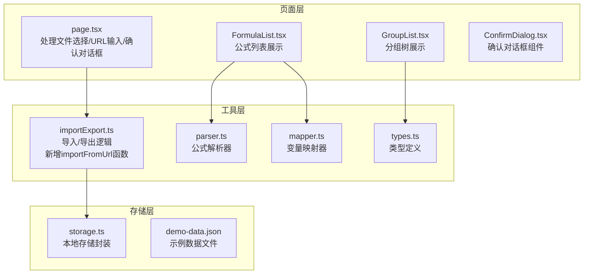
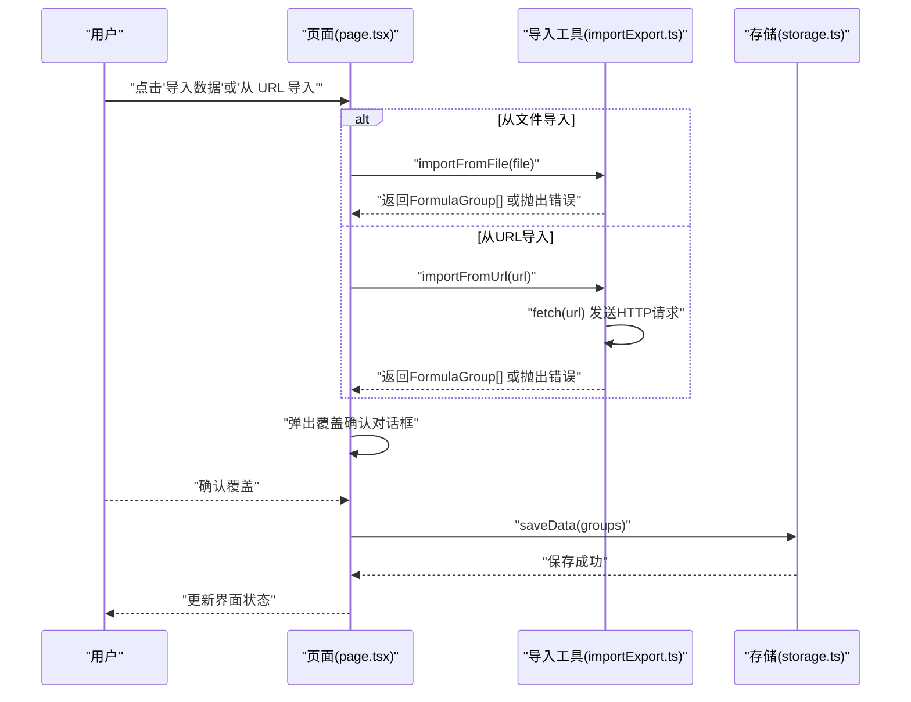
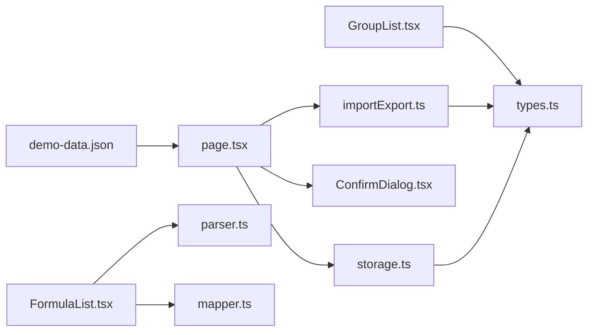

# 数据导入

<cite>
**本文档引用的文件**
- [importExport.ts](file://src/lib/importExport.ts)
- [storage.ts](file://src/lib/storage.ts)
- [types.ts](file://src/lib/types.ts)
- [page.tsx](file://src/app/page.tsx)
- [FormulaList.tsx](file://src/components/FormulaList.tsx)
- [GroupList.tsx](file://src/components/GroupList.tsx)
- [parser.ts](file://src/lib/parser.ts)
- [mapper.ts](file://src/lib/mapper.ts)
- [ConfirmDialog.tsx](file://src/components/ConfirmDialog.tsx)
- [demo-data.json](file://public/demo-data.json)
- [package.json](file://package.json)
</cite>

## 更新摘要
**变更内容**
- 新增URL数据导入功能，支持从远程JSON端点导入公式数据
- 添加importFromUrl函数实现远程数据获取和验证
- 新增URL导入模态界面，提供用户友好的导入体验
- 增强错误处理机制，支持网络请求失败和HTTP错误处理
- 添加示例数据URL和一键复制功能

## 目录
1. [简介](#简介)
2. [项目结构](#项目结构)
3. [核心组件](#核心组件)
4. [架构总览](#架构总览)
5. [详细组件分析](#详细组件分析)
6. [依赖分析](#依赖分析)
7. [性能考虑](#性能考虑)
8. [故障排除指南](#故障排除指南)
9. [结论](#结论)
10. [附录](#附录)

## 简介
本指南面向使用"公式映射器"应用的用户，提供数据导入功能的完整操作说明。内容涵盖：
- 支持的文件格式与来源（JSON 文件、远程 URL）
- 导入流程步骤与注意事项
- 数据验证规则与冲突处理机制
- 导入前的数据准备要求、格式规范与最佳实践
- 导入过程中的错误处理、数据完整性检查与回滚机制
- 常见导入问题的诊断方法与解决方案
- 批量导入与从 URL 导入等高级功能的使用说明

**更新** 新增URL数据导入功能，用户可以通过输入远程JSON端点地址直接导入数据，支持示例数据URL的一键复制功能。

## 项目结构
数据导入功能由前端页面与工具模块协同完成：
- 页面层负责触发导入、接收用户确认与错误提示
- 工具层负责解析与校验导入数据
- 存储层负责持久化导入后的数据

**图表来源**
- [page.tsx:13-13](file://src/app/page.tsx#L13-L13)
- [importExport.ts:105-119](file://src/lib/importExport.ts#L105-L119)
- [storage.ts:5-25](file://src/lib/storage.ts#L5-L25)
- [parser.ts:12-22](file://src/lib/parser.ts#L12-L22)
- [mapper.ts:52-87](file://src/lib/mapper.ts#L52-L87)
- [types.ts:44-50](file://src/lib/types.ts#L44-L50)
- [ConfirmDialog.tsx:16-53](file://src/components/ConfirmDialog.tsx#L16-L53)
- [demo-data.json:1-107](file://public/demo-data.json#L1-L107)

**章节来源**
- [page.tsx:13-13](file://src/app/page.tsx#L13-L13)
- [importExport.ts:1-120](file://src/lib/importExport.ts#L1-L120)
- [storage.ts:1-50](file://src/lib/storage.ts#L1-L50)
- [types.ts:1-51](file://src/lib/types.ts#L1-L51)

## 核心组件
- 导入/导出工具：提供 JSON 导入、文件读取、远程 URL 导入与导出能力，并内置数据结构验证
- 页面交互：提供"从文件导入""从 URL 导入"入口，以及导入前的覆盖确认
- 存储封装：基于浏览器本地存储进行数据持久化
- 类型系统：定义分组、公式、变量映射等核心数据模型
- 确认对话框：提供导入前的覆盖确认和危险操作确认

**更新** 新增URL导入功能，包括importFromUrl函数和URL导入模态界面组件。

**章节来源**
- [importExport.ts:1-120](file://src/lib/importExport.ts#L1-L120)
- [page.tsx:415-449](file://src/app/page.tsx#L415-L449)
- [storage.ts:1-50](file://src/lib/storage.ts#L1-L50)
- [types.ts:1-51](file://src/lib/types.ts#L1-L51)
- [ConfirmDialog.tsx:16-53](file://src/components/ConfirmDialog.tsx#L16-L53)

## 架构总览
导入流程的关键参与者与调用关系如下：

**图表来源**
- [page.tsx:388-449](file://src/app/page.tsx#L388-L449)
- [importExport.ts:80-119](file://src/lib/importExport.ts#L80-L119)
- [storage.ts:17-25](file://src/lib/storage.ts#L17-L25)

## 详细组件分析

### 导入工具模块（importExport.ts）
- 功能职责
  - 将 JSON 字符串解析为分组与公式结构
  - 校验版本字段与数组结构
  - 校验每个分组的标识、名称与公式数组
  - 校验每个公式的标识、名称与双语公式字段
  - 提供文件读取与远程 URL 获取能力
- 关键行为
  - JSON 解析失败时抛出明确错误
  - 结构校验失败时抛出定位性错误
  - 文件读取失败与网络请求失败分别处理
  - HTTP 错误状态码会被转换为用户友好的错误消息
- 错误处理
  - 语法错误：提示 JSON 格式错误
  - 结构错误：提示具体分组/公式的字段缺失
  - IO/网络错误：提示读取失败或 URL 不可用
  - HTTP 错误：显示具体的HTTP状态码和状态文本

**更新** 新增importFromUrl函数，支持从远程URL获取JSON数据并进行验证。

**章节来源**
- [importExport.ts:43-119](file://src/lib/importExport.ts#L43-L119)

### 页面交互（page.tsx）
- 功能职责
  - 提供"从文件导入""从 URL 导入"的入口按钮
  - 在导入前弹出覆盖确认对话框
  - 展示导入错误信息
  - 调用导入工具与存储模块
  - 管理URL导入模态界面的状态
- 用户体验
  - 文件导入：通过隐藏的文件输入控件触发
  - URL 导入：弹窗输入 URL，支持回车快捷提交
  - 加载状态：导入过程中禁用按钮并显示加载动画
  - 示例数据：提供一键复制示例URL的功能
- 状态管理
  - showUrlImportModal：控制URL导入模态界面显示
  - importUrl：存储用户输入的URL地址
  - isImporting：导入过程中的加载状态
  - importError：导入错误信息的显示

**更新** 新增URL导入模态界面，包括URL输入框、示例数据按钮和导入状态管理。

**章节来源**
- [page.tsx:415-449](file://src/app/page.tsx#L415-L449)
- [page.tsx:540-549](file://src/app/page.tsx#L540-L549)
- [page.tsx:792-848](file://src/app/page.tsx#L792-L848)

### 确认对话框组件（ConfirmDialog.tsx）
- 功能职责
  - 提供标准的确认对话框UI组件
  - 支持默认确认和危险操作确认两种变体
  - 处理确认和取消事件回调
- 设计特点
  - 响应式设计，适配移动端和桌面端
  - 支持自定义标题、消息内容和按钮文本
  - 危险操作使用红色主题强调风险

**章节来源**
- [ConfirmDialog.tsx:16-53](file://src/components/ConfirmDialog.tsx#L16-L53)

### 存储封装（storage.ts）
- 功能职责
  - 读取与保存 FormulaGroup[] 到浏览器本地存储
  - 提供分组与公式的创建辅助函数
- 注意事项
  - 仅在浏览器环境生效
  - 异常时记录错误但不中断流程

**章节来源**
- [storage.ts:5-25](file://src/lib/storage.ts#L5-L25)

### 类型系统（types.ts）
- 定义了导入/导出数据的核心结构：
  - 分组：包含标识、名称、父分组标识、公式数组与创建时间
  - 公式：包含标识、名称、英式/中式公式、创建时间等
- 导入工具严格依据这些类型进行结构校验

**章节来源**
- [types.ts:27-50](file://src/lib/types.ts#L27-L50)

### 公式解析与变量映射（parser.ts, mapper.ts）
- 作用
  - 解析英式公式为抽象语法树（AST），用于展示与结构可视化
  - 提取变量并建立英式变量到中式变量的映射
- 与导入的关系
  - 导入后数据可用于后续的公式解析与映射展示
  - 若公式语法错误，将在公式详情区域显示错误提示

**章节来源**
- [parser.ts:12-22](file://src/lib/parser.ts#L12-L22)
- [mapper.ts:52-87](file://src/lib/mapper.ts#L52-L87)
- [FormulaList.tsx:169-192](file://src/components/FormulaList.tsx#L169-L192)

### 示例数据（demo-data.json）
- 提供完整的示例数据结构，包含：
  - 版本信息和导出时间戳
  - 多个分组及其嵌套关系
  - 包含变量映射和子公式的复杂公式
- 用途
  - 作为URL导入的示例数据源
  - 帮助用户理解数据结构要求
  - 支持一键复制功能

**章节来源**
- [demo-data.json:1-107](file://public/demo-data.json#L1-L107)

## 依赖分析
- 前端框架与样式
  - Next.js、React、TailwindCSS、Radix UI 组件库
- 数学公式渲染
  - KaTeX 用于公式渲染
- 依赖关系概览

**图表来源**
- [page.tsx:13-13](file://src/app/page.tsx#L13-L13)
- [importExport.ts:1-7](file://src/lib/importExport.ts#L1-L7)
- [storage.ts:1-3](file://src/lib/storage.ts#L1-L3)
- [FormulaList.tsx:1-11](file://src/components/FormulaList.tsx#L1-L11)
- [GroupList.tsx:1-6](file://src/components/GroupList.tsx#L1-L6)
- [parser.ts:1-1](file://src/lib/parser.ts#L1-L1)
- [mapper.ts:1-1](file://src/lib/mapper.ts#L1-L1)
- [types.ts:1-1](file://src/lib/types.ts#L1-L1)
- [ConfirmDialog.tsx:16-53](file://src/components/ConfirmDialog.tsx#L16-L53)
- [demo-data.json:1-107](file://public/demo-data.json#L1-L107)

**章节来源**
- [package.json:15-34](file://package.json#L15-L34)

## 性能考虑
- 导入数据规模
  - 导入工具对数据结构进行线性扫描校验，复杂度 O(N+M)，其中 N 为分组数，M 为公式总数
  - URL导入需要额外的网络请求开销
- 浏览器限制
  - 大型 JSON 文件可能导致内存占用上升，建议控制单次导入数据规模
  - 网络请求可能受到CORS策略限制
- UI 响应
  - 导入过程中禁用按钮并显示加载动画，避免重复提交
  - URL导入模态界面提供实时反馈状态

## 故障排除指南

### 常见错误与解决方法
- JSON 格式错误
  - 现象：提示 JSON 格式错误
  - 排查：检查文件是否为合法 JSON；使用在线 JSON 校验工具
  - 来源：导入工具在解析阶段捕获语法错误
- 数据结构不正确
  - 现象：提示某分组或某公式字段缺失
  - 排查：对照类型定义，确保包含标识、名称、公式等字段
  - 来源：导入工具对版本、数组与字段进行严格校验
- 文件读取失败
  - 现象：提示文件读取失败
  - 排查：确认文件可访问且未被浏览器拦截
  - 来源：FileReader 的 onerror 回调
- 网络请求失败
  - 现象：提示网络请求失败或 URL 不可用
  - 排查：确认 URL 可达且返回 2xx 状态码
  - 来源：fetch 请求的异常处理
- HTTP 错误状态码
  - 现象：显示具体的HTTP状态码和状态文本
  - 排查：检查服务器响应状态和权限设置
  - 来源：importFromUrl 函数的HTTP错误处理
- URL为空或格式不正确
  - 现象：提示请输入有效的URL
  - 排查：确认URL格式正确且以http://或https://开头
  - 来源：URL导入前的输入验证

**更新** 新增HTTP错误状态码处理和URL格式验证。

**章节来源**
- [importExport.ts:105-119](file://src/lib/importExport.ts#L105-L119)
- [page.tsx:415-449](file://src/app/page.tsx#L415-L449)

### 数据完整性检查
- 导入工具在解析后立即执行结构校验，确保：
  - 版本字段存在
  - 分组数组存在
  - 每个分组包含标识、名称与公式数组
  - 每个公式包含标识、名称与双语公式字段
- 若任一校验失败，导入流程终止并提示具体错误

**章节来源**
- [importExport.ts:43-75](file://src/lib/importExport.ts#L43-L75)

### 回滚机制
- 当前实现采用"一次性覆盖"策略：导入成功后直接替换本地存储中的数据
- 若需要回滚，建议：
  - 导入前手动导出当前数据作为备份
  - 导入失败时保留原数据不变

**章节来源**
- [page.tsx:388-449](file://src/app/page.tsx#L388-L449)
- [storage.ts:17-25](file://src/lib/storage.ts#L17-L25)

## 结论
本指南总结了数据导入功能的使用方法与注意事项。通过严格的结构校验与清晰的错误提示，用户可以安全地将外部数据整合到应用中。新增的URL导入功能提供了更便捷的数据获取方式，支持从远程端点直接导入数据。建议在导入前做好数据备份，并遵循格式规范以减少导入失败的概率。

**更新** 新增URL导入功能显著提升了数据获取的便利性，用户可以通过示例数据URL快速体验应用功能。

## 附录

### 支持的文件格式与来源
- 文件格式：JSON
- 来源：
  - 本地文件：从设备选择 JSON 文件
  - 远程 URL：输入可访问的 JSON 文件地址
  - 示例数据：提供预设的示例数据URL

**更新** 新增远程URL导入和示例数据支持。

**章节来源**
- [importExport.ts:25-38](file://src/lib/importExport.ts#L25-L38)
- [importExport.ts:80-119](file://src/lib/importExport.ts#L80-L119)
- [page.tsx:800-811](file://src/app/page.tsx#L800-L811)

### 导入流程步骤
1. 打开"数据管理"菜单，选择"导入数据"或"从 URL 导入"
2. 从文件导入：选择本地 JSON 文件；从 URL 导入：输入可访问的 URL 并确认
3. 确认覆盖：导入前弹出覆盖确认对话框，确认后继续
4. 等待导入完成：导入成功后自动保存并刷新界面
5. 查看结果：在公式列表与分组树中核对导入数据

**更新** URL导入流程包括URL验证和示例数据一键复制功能。

**章节来源**
- [page.tsx:540-549](file://src/app/page.tsx#L540-L549)
- [page.tsx:415-449](file://src/app/page.tsx#L415-L449)

### 数据验证规则
- 导入数据必须包含：
  - 版本字段
  - 分组数组
  - 每个分组必须包含：
    - 标识
    - 名称
    - 公式数组
  - 每个公式必须包含：
    - 标识
    - 名称
    - 英式公式
    - 中式公式

**章节来源**
- [importExport.ts:43-75](file://src/lib/importExport.ts#L43-L75)
- [types.ts:27-50](file://src/lib/types.ts#L27-L50)

### 冲突处理机制
- 当前实现为"一次性覆盖"，即导入成功后直接替换本地存储中的数据
- 冲突处理建议：
  - 导入前导出当前数据作为备份
  - 对比导入前后数据差异
  - 如需保留历史数据，可在导入后手动合并

**章节来源**
- [page.tsx:388-449](file://src/app/page.tsx#L388-L449)
- [storage.ts:17-25](file://src/lib/storage.ts#L17-L25)

### 导入前的数据准备要求
- 文件命名：建议使用 .json 扩展名
- 编码格式：UTF-8
- 结构规范：严格遵循类型定义，确保字段齐全
- URL要求：确保远程端点可访问且返回有效的JSON数据
- CORS策略：确保服务器允许跨域请求
- 最佳实践：
  - 使用最小必要数据集进行测试导入
  - 在开发环境中先行验证 JSON 合法性
  - 导入前备份现有数据
  - 使用HTTPS协议确保数据传输安全

**更新** 新增URL导入的特殊要求和最佳实践。

**章节来源**
- [importExport.ts:43-75](file://src/lib/importExport.ts#L43-L75)
- [types.ts:27-50](file://src/lib/types.ts#L27-L50)

### 批量导入与增量导入
- 批量导入
  - 支持一次性导入大量分组与公式
  - 建议控制单次导入规模，避免浏览器内存压力过大
  - URL导入同样支持大批量数据的远程获取
- 增量导入
  - 当前实现不提供增量合并功能
  - 如需增量更新，建议：
    - 导出当前数据
    - 合并新数据后重新生成 JSON
    - 导入合并后的数据

**更新** URL导入同样支持批量数据处理。

**章节来源**
- [importExport.ts:43-75](file://src/lib/importExport.ts#L43-L75)
- [storage.ts:17-25](file://src/lib/storage.ts#L17-L25)

### 公式解析与变量映射对导入的影响
- 导入后，公式详情区域可进行：
  - 变量映射展示
  - 抽象语法树（AST）可视化
  - 语法错误提示
- 若公式语法不合法，将在详情区域显示错误信息，不影响整体导入流程

**章节来源**
- [FormulaList.tsx:169-192](file://src/components/FormulaList.tsx#L169-L192)
- [parser.ts:12-22](file://src/lib/parser.ts#L12-L22)
- [mapper.ts:52-87](file://src/lib/mapper.ts#L52-L87)

### URL导入功能详细说明
- 功能特性
  - 支持从任意可访问的JSON端点导入数据
  - 提供示例数据URL的一键复制功能
  - 实时的导入状态反馈和错误提示
  - 支持回车快捷键提交
- 使用场景
  - 从云端服务导入共享数据
  - 从API端点获取动态数据
  - 使用示例数据快速体验应用功能
- 安全考虑
  - 建议使用HTTPS协议确保数据传输安全
  - 注意远程端点的可信度和数据完整性
  - 避免导入来自不受信任来源的数据

**新增** 详细介绍URL导入功能的特性和使用方法。

**章节来源**
- [page.tsx:792-848](file://src/app/page.tsx#L792-L848)
- [importExport.ts:105-119](file://src/lib/importExport.ts#L105-L119)
- [demo-data.json:1-107](file://public/demo-data.json#L1-L107)