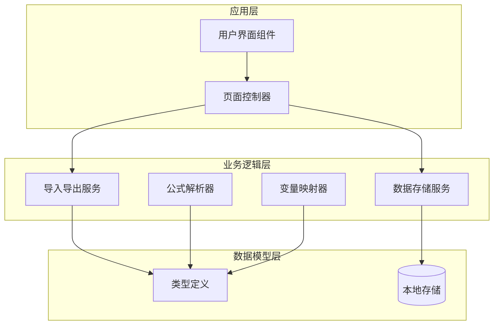
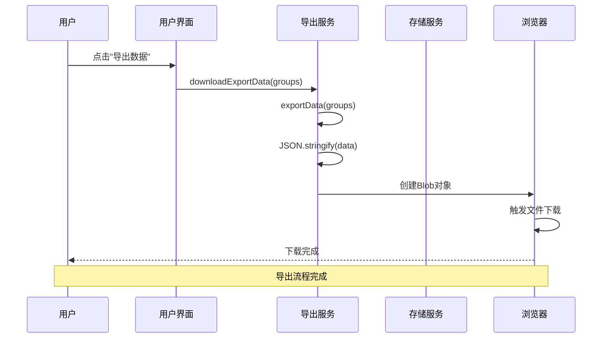
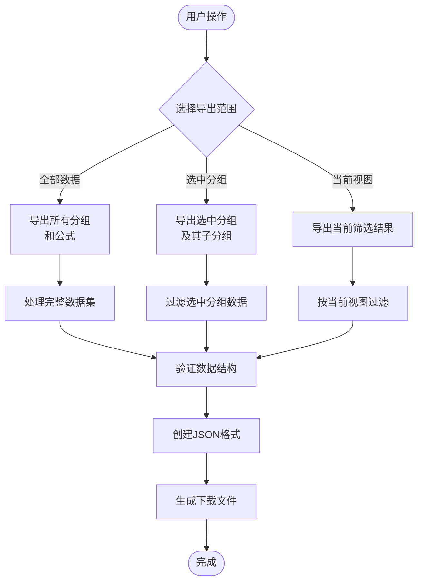
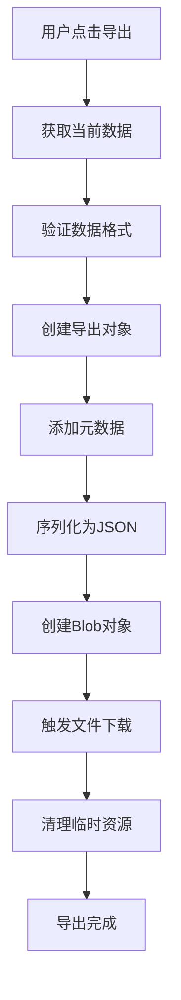
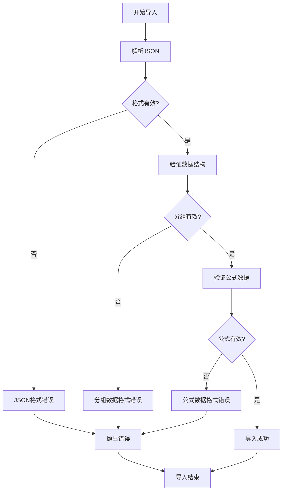
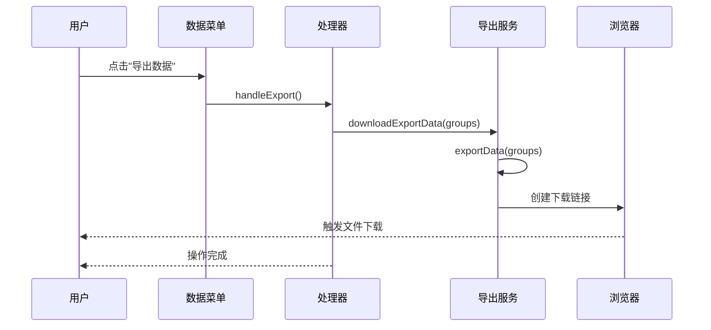
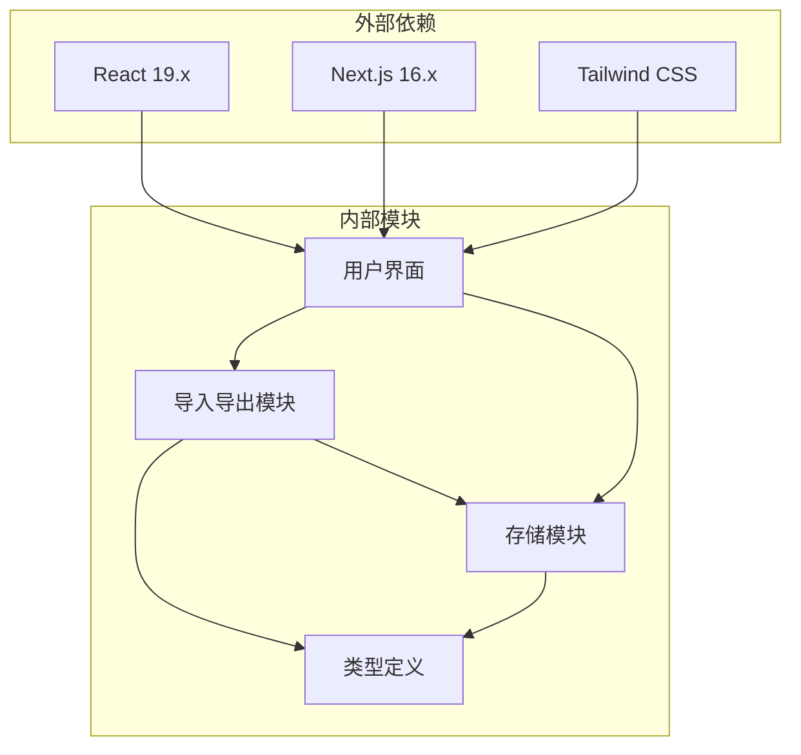
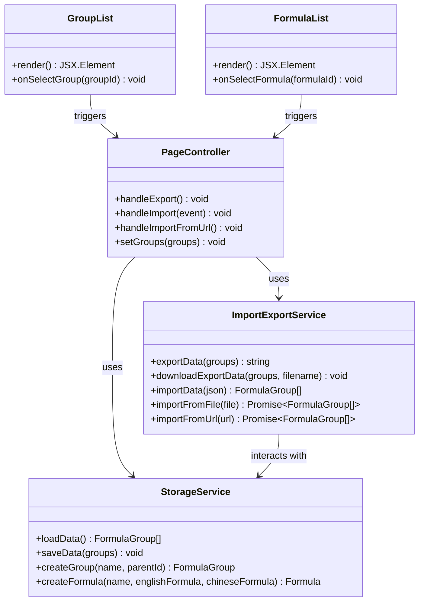

# 数据导出

<cite>
**本文档引用的文件**
- [importExport.ts](file://src/lib/importExport.ts)
- [page.tsx](file://src/app/page.tsx)
- [types.ts](file://src/lib/types.ts)
- [storage.ts](file://src/lib/storage.ts)
- [GroupList.tsx](file://src/components/GroupList.tsx)
- [FormulaList.tsx](file://src/components/FormulaList.tsx)
- [GroupSelector.tsx](file://src/components/GroupSelector.tsx)
- [FormulaReferenceSelector.tsx](file://src/components/FormulaReferenceSelector.tsx)
</cite>

## 目录
1. [简介](#简介)
2. [项目结构](#项目结构)
3. [核心组件](#核心组件)
4. [架构概览](#架构概览)
5. [详细组件分析](#详细组件分析)
6. [依赖关系分析](#依赖关系分析)
7. [性能考虑](#性能考虑)
8. [故障排除指南](#故障排除指南)
9. [结论](#结论)

## 简介

本指南详细介绍公式映射工具的数据导出功能。该系统支持将公式分组数据导出为JSON格式，并提供完整的导入/导出工作流程。用户可以通过图形界面轻松管理公式数据，支持多种导出范围选择和验证机制。

## 项目结构

项目采用模块化架构设计，主要分为以下层次：

**图表来源**
- [page.tsx:1-798](file://src/app/page.tsx#L1-L798)
- [importExport.ts:1-120](file://src/lib/importExport.ts#L1-L120)
- [storage.ts:1-50](file://src/lib/storage.ts#L1-L50)

**章节来源**
- [page.tsx:1-798](file://src/app/page.tsx#L1-L798)
- [importExport.ts:1-120](file://src/lib/importExport.ts#L1-L120)
- [storage.ts:1-50](file://src/lib/storage.ts#L1-L50)

## 核心组件

### 数据导出接口

系统实现了完整的JSON数据导出功能，支持以下特性：

- **版本控制**: 导出数据包含版本信息，便于未来兼容性管理
- **时间戳记录**: 自动记录导出时间，便于审计和版本追踪
- **完整数据结构**: 导出所有分组和公式信息，确保数据完整性
- **文件下载**: 自动生成并触发浏览器下载

### 数据导入接口

提供多种数据导入方式：

- **文件导入**: 支持从本地JSON文件导入数据
- **URL导入**: 支持从远程URL获取JSON数据
- **格式验证**: 自动验证导入数据的结构完整性
- **错误处理**: 提供详细的错误信息和异常处理

**章节来源**
- [importExport.ts:3-75](file://src/lib/importExport.ts#L3-L75)
- [page.tsx:365-420](file://src/app/page.tsx#L365-L420)

## 架构概览

系统采用分层架构设计，确保功能模块的清晰分离和高内聚低耦合：

**图表来源**
- [page.tsx:365-372](file://src/app/page.tsx#L365-L372)
- [importExport.ts:25-38](file://src/lib/importExport.ts#L25-L38)

### 数据流架构

**图表来源**
- [GroupList.tsx:67-72](file://src/components/GroupList.tsx#L67-L72)
- [FormulaList.tsx:48-79](file://src/components/FormulaList.tsx#L48-L79)

## 详细组件分析

### 导出功能实现

#### 导出数据结构

导出的数据采用标准化的JSON格式，包含以下关键字段：

| 字段名 | 类型 | 描述 | 必需 |
|--------|------|------|------|
| version | string | 数据格式版本号 | 是 |
| exportDate | string | 导出时间戳（ISO 8601） | 是 |
| groups | FormulaGroup[] | 分组数据数组 | 是 |

每个分组包含：
- `id`: 分组唯一标识符
- `name`: 分组名称
- `parentId`: 父分组ID（顶级分组为null）
- `formulas`: 包含的公式数组
- `createdAt`: 创建时间戳

#### 导出流程

**图表来源**
- [importExport.ts:12-20](file://src/lib/importExport.ts#L12-L20)
- [importExport.ts:25-38](file://src/lib/importExport.ts#L25-L38)

**章节来源**
- [importExport.ts:3-20](file://src/lib/importExport.ts#L3-L20)
- [importExport.ts:25-38](file://src/lib/importExport.ts#L25-L38)

### 导入功能实现

#### 数据验证机制

系统提供了多层次的数据验证：

1. **基本格式验证**: 检查JSON语法和必需字段
2. **结构完整性验证**: 验证分组和公式的必需属性
3. **数据一致性验证**: 确保引用关系的正确性

#### 错误处理策略

**图表来源**
- [importExport.ts:43-75](file://src/lib/importExport.ts#L43-L75)

**章节来源**
- [importExport.ts:43-75](file://src/lib/importExport.ts#L43-L75)
- [importExport.ts:79-100](file://src/lib/importExport.ts#L79-L100)
- [importExport.ts:105-119](file://src/lib/importExport.ts#L105-L119)

### 用户界面集成

#### 导出操作流程

**图表来源**
- [page.tsx:489-498](file://src/app/page.tsx#L489-L498)
- [page.tsx:365-372](file://src/app/page.tsx#L365-L372)

**章节来源**
- [page.tsx:489-498](file://src/app/page.tsx#L489-L498)
- [page.tsx:365-372](file://src/app/page.tsx#L365-L372)

## 依赖关系分析

系统的核心依赖关系如下：

**图表来源**
- [package.json:15-34](file://package.json#L15-L34)
- [page.tsx:1-12](file://src/app/page.tsx#L1-L12)

### 组件间交互

**图表来源**
- [importExport.ts:1-120](file://src/lib/importExport.ts#L1-L120)
- [storage.ts:1-50](file://src/lib/storage.ts#L1-L50)
- [page.tsx:1-12](file://src/app/page.tsx#L1-L12)

**章节来源**
- [importExport.ts:1-120](file://src/lib/importExport.ts#L1-L120)
- [storage.ts:1-50](file://src/lib/storage.ts#L1-L50)
- [page.tsx:1-12](file://src/app/page.tsx#L1-L12)

## 性能考虑

### 导出性能优化

1. **内存管理**: 导出完成后及时清理Blob URL，避免内存泄漏
2. **数据处理**: 使用高效的JSON序列化方法
3. **异步处理**: 导入操作采用异步处理，避免阻塞UI线程

### 数据完整性保证

1. **格式验证**: 导入时进行严格的格式验证
2. **引用完整性**: 确保公式引用关系的正确性
3. **错误恢复**: 提供完善的错误处理和回滚机制

## 故障排除指南

### 常见问题及解决方案

#### 导出失败

**问题**: 导出过程中出现错误
**可能原因**:
- 数据格式不正确
- 内存不足
- 浏览器兼容性问题

**解决步骤**:
1. 检查浏览器控制台是否有错误信息
2. 确认数据格式符合要求
3. 尝试刷新页面后重试

#### 导入失败

**问题**: 无法导入数据文件
**可能原因**:
- JSON格式错误
- 文件损坏
- 权限问题

**解决步骤**:
1. 验证JSON文件格式正确性
2. 检查文件编码格式
3. 确认文件完整性

#### 数据验证错误

**错误信息**: "无效的数据格式"
**解决方法**:
1. 检查导出文件的version字段
2. 验证groups数组格式
3. 确认每个分组包含必需字段

**章节来源**
- [importExport.ts:69-75](file://src/lib/importExport.ts#L69-L75)
- [page.tsx:390-393](file://src/app/page.tsx#L390-L393)

## 结论

本数据导出系统提供了完整、可靠的公式数据管理功能。通过标准化的JSON格式和严格的验证机制，确保了数据的完整性和可移植性。用户界面简洁直观，支持多种导出范围选择，满足不同场景下的数据管理需求。

系统的主要优势包括：
- **标准化格式**: 使用标准JSON格式，便于第三方集成
- **完整性保证**: 多层次验证确保数据质量
- **用户体验**: 直观的操作界面和清晰的反馈机制
- **扩展性**: 模块化设计便于功能扩展和维护