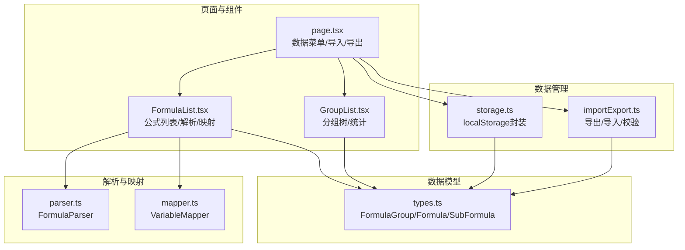
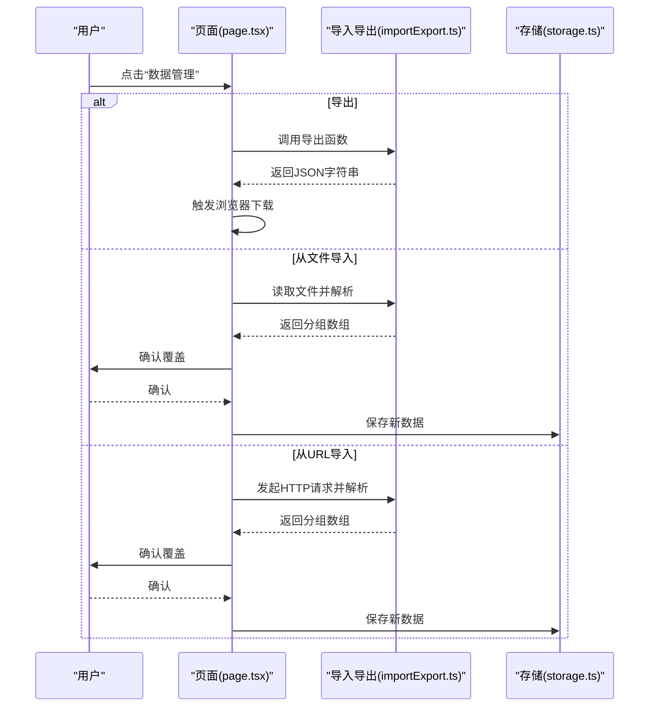
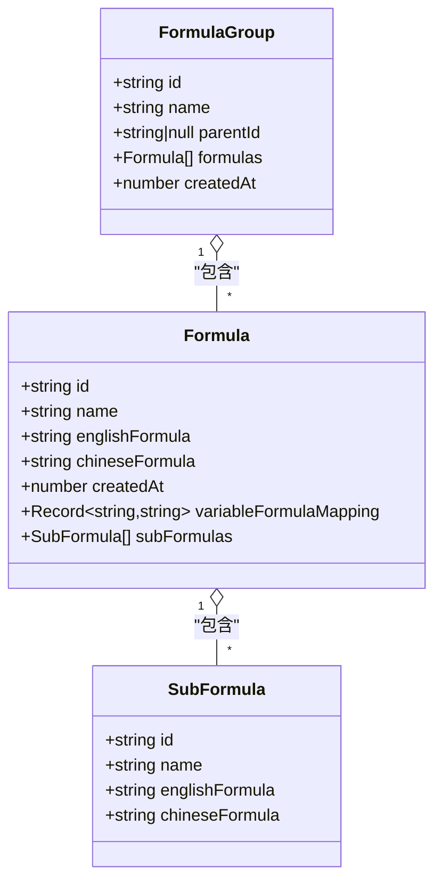
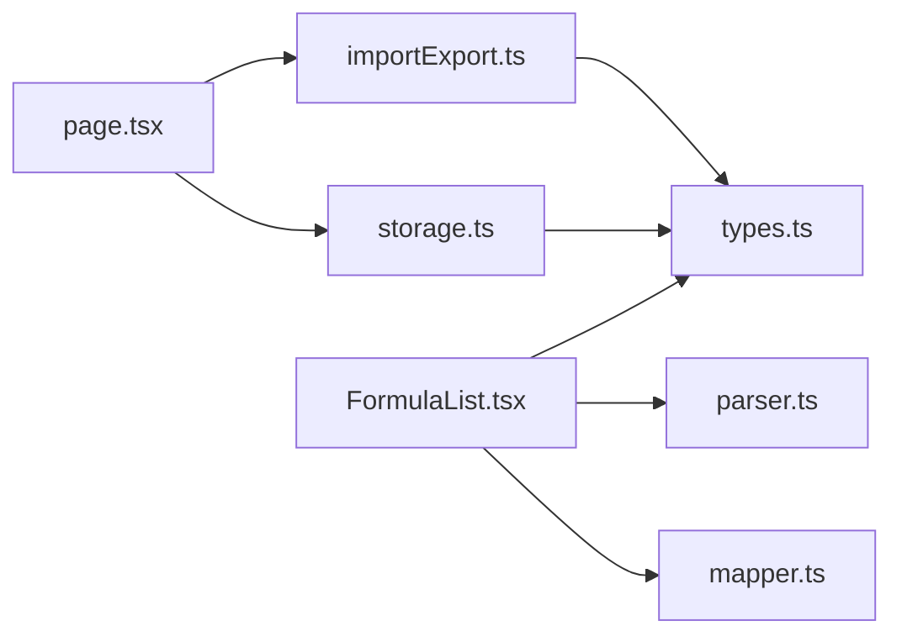

# 数据管理

<cite>
**本文档引用的文件**
- [src/lib/importExport.ts](file://src/lib/importExport.ts)
- [src/lib/storage.ts](file://src/lib/storage.ts)
- [src/lib/types.ts](file://src/lib/types.ts)
- [src/lib/parser.ts](file://src/lib/parser.ts)
- [src/lib/mapper.ts](file://src/lib/mapper.ts)
- [src/app/page.tsx](file://src/app/page.tsx)
- [src/components/GroupList.tsx](file://src/components/GroupList.tsx)
- [src/components/FormulaList.tsx](file://src/components/FormulaList.tsx)
- [package.json](file://package.json)
</cite>

## 目录
1. [简介](#简介)
2. [项目结构](#项目结构)
3. [核心组件](#核心组件)
4. [架构总览](#架构总览)
5. [详细组件分析](#详细组件分析)
6. [依赖关系分析](#依赖关系分析)
7. [性能考量](#性能考量)
8. [故障排查指南](#故障排查指南)
9. [结论](#结论)
10. [附录](#附录)

## 简介
本指南面向使用者，系统讲解“公式映射器”应用中的数据管理功能，包括：
- 数据导入：支持的文件格式、导入流程、数据验证与冲突处理
- 数据导出：导出格式、文件结构、备份策略
- 本地存储与持久化：浏览器本地存储机制与数据持久化原理
- 数据迁移最佳实践与注意事项
- 高级功能：数据恢复、版本管理、同步策略
- 数据安全性与隐私保护
- 常见数据问题的诊断与解决

## 项目结构
数据管理相关的核心代码集中在以下模块：
- 类型定义与数据模型：src/lib/types.ts
- 数据导入/导出：src/lib/importExport.ts
- 本地存储：src/lib/storage.ts
- 解析与映射：src/lib/parser.ts、src/lib/mapper.ts
- 页面与组件：src/app/page.tsx、src/components/GroupList.tsx、src/components/FormulaList.tsx

图表来源
- [src/lib/types.ts:1-51](file://src/lib/types.ts#L1-L51)
- [src/lib/importExport.ts:1-120](file://src/lib/importExport.ts#L1-L120)
- [src/lib/storage.ts:1-50](file://src/lib/storage.ts#L1-L50)
- [src/lib/parser.ts:1-159](file://src/lib/parser.ts#L1-L159)
- [src/lib/mapper.ts:1-89](file://src/lib/mapper.ts#L1-L89)
- [src/app/page.tsx:1-797](file://src/app/page.tsx#L1-L797)
- [src/components/GroupList.tsx:1-294](file://src/components/GroupList.tsx#L1-L294)
- [src/components/FormulaList.tsx:1-387](file://src/components/FormulaList.tsx#L1-L387)

章节来源
- [src/lib/types.ts:1-51](file://src/lib/types.ts#L1-L51)
- [src/lib/importExport.ts:1-120](file://src/lib/importExport.ts#L1-L120)
- [src/lib/storage.ts:1-50](file://src/lib/storage.ts#L1-L50)
- [src/app/page.tsx:1-797](file://src/app/page.tsx#L1-L797)

## 核心组件
- 数据模型：FormulaGroup、Formula、SubFormula 定义了分组、公式与子公式的数据结构，支持父子分组、变量映射、子公式等特性。
- 导入/导出：提供 JSON 格式导出与导入，包含版本信息、导出时间戳、分组与公式集合；导入时进行严格的数据结构校验。
- 本地存储：基于 localStorage 的轻量持久化，键名固定，统一加载/保存接口。
- 页面与组件：在主页提供“数据管理”菜单，支持导出、从文件导入、从 URL 导入，并在导入前进行覆盖确认。

章节来源
- [src/lib/types.ts:27-50](file://src/lib/types.ts#L27-L50)
- [src/lib/importExport.ts:3-20](file://src/lib/importExport.ts#L3-L20)
- [src/lib/storage.ts:3-25](file://src/lib/storage.ts#L3-L25)
- [src/app/page.tsx:477-525](file://src/app/page.tsx#L477-L525)

## 架构总览
数据管理的端到端流程如下：
- 导出：页面触发导出，调用导出函数生成 JSON 字符串，浏览器下载文件。
- 导入：支持文件导入与 URL 导入两种方式，导入前弹窗确认覆盖，成功后立即保存至本地存储。
- 本地存储：应用启动时从 localStorage 加载数据，后续变更实时保存。

图表来源
- [src/app/page.tsx:477-525](file://src/app/page.tsx#L477-L525)
- [src/lib/importExport.ts:25-119](file://src/lib/importExport.ts#L25-L119)
- [src/lib/storage.ts:5-25](file://src/lib/storage.ts#L5-L25)

## 详细组件分析

### 数据模型与数据结构
- FormulaGroup：包含 id、name、parentId（支持二级分组）、formulas 列表、createdAt 时间戳。
- Formula：包含 id、name、englishFormula、chineseFormula、createdAt、可选 variableFormulaMapping（变量到公式ID的映射）、可选 subFormulas（子公式列表）。
- SubFormula：包含 id、name、englishFormula、chineseFormula。

图表来源
- [src/lib/types.ts:27-50](file://src/lib/types.ts#L27-L50)

章节来源
- [src/lib/types.ts:27-50](file://src/lib/types.ts#L27-L50)

### 导入功能
- 支持的输入源：本地文件（.json）、远程 URL（返回 JSON 文本）。
- 导入流程：
  - 文件导入：FileReader 读取文本，调用 importData 进行 JSON 解析与结构校验。
  - URL 导入：fetch 请求远程地址，校验响应状态，再进行解析。
  - 成功后弹窗确认覆盖，确认后更新内存状态并保存到本地存储。
- 数据验证与错误处理：
  - 校验顶层字段 version 与 groups 数组存在性。
  - 校验每个分组的 id、name、formulas 数组。
  - 校验每个公式必须包含 id、name、englishFormula、chineseFormula。
  - 对 JSON 语法错误、HTTP 错误、文件读取失败等场景进行明确错误提示。

图表来源
- [src/lib/importExport.ts:43-119](file://src/lib/importExport.ts#L43-L119)
- [src/app/page.tsx:374-420](file://src/app/page.tsx#L374-L420)

章节来源
- [src/lib/importExport.ts:43-119](file://src/lib/importExport.ts#L43-L119)
- [src/app/page.tsx:374-420](file://src/app/page.tsx#L374-L420)

### 导出功能
- 导出格式：JSON，包含版本号、导出时间戳、分组数组。
- 文件结构：顶层对象包含 version、exportDate、groups；groups 中每个元素为 FormulaGroup；每个 FormulaGroup 包含 id、name、parentId、formulas、createdAt。
- 下载行为：生成 Blob 并触发浏览器下载，默认文件名为带时间戳的 JSON 文件。
- 备份策略建议：
  - 定期执行导出，保留多个历史版本文件。
  - 将导出文件存放在受控的云存储或本地备份介质中。
  - 在导入前先备份当前数据（通过导出当前状态）。

章节来源
- [src/lib/importExport.ts:3-20](file://src/lib/importExport.ts#L3-L20)
- [src/lib/importExport.ts:25-38](file://src/lib/importExport.ts#L25-L38)

### 本地存储与持久化
- 存储机制：使用 localStorage，键名固定，值为序列化的 FormulaGroup[]。
- 生命周期：
  - 应用启动时加载：loadData 从 localStorage 读取并解析，异常时回退为空数组。
  - 实时保存：每次数据变更后调用 saveData 写入 localStorage。
- 注意事项：
  - localStorage 有容量限制，建议控制单次导出规模。
  - 不同浏览器可能有不同的容量与清理策略，建议定期备份。
  - 服务端部署时，localStorage 仅适用于客户端持久化，不参与服务端数据同步。

章节来源
- [src/lib/storage.ts:3-25](file://src/lib/storage.ts#L3-L25)

### 数据解析与映射（辅助功能）
- 表达式解析：FormulaParser 将英文公式转换为 AST，支持加减乘除、括号（含中文括号），并进行语法校验。
- 变量提取与映射：VariableMapper 提取英文字母变量与中文变量片段，建立一一对应映射，支持“多余中文变量”的检测。
- 组件集成：FormulaList 展示时在展开状态下解析 AST 并生成变量映射，便于用户理解公式结构与变量对应关系。

章节来源
- [src/lib/parser.ts:12-22](file://src/lib/parser.ts#L12-L22)
- [src/lib/parser.ts:24-68](file://src/lib/parser.ts#L24-L68)
- [src/lib/mapper.ts:4-27](file://src/lib/mapper.ts#L4-L27)
- [src/lib/mapper.ts:52-70](file://src/lib/mapper.ts#L52-L70)
- [src/components/FormulaList.tsx:169-192](file://src/components/FormulaList.tsx#L169-L192)

## 依赖关系分析
- 导入导出依赖类型定义（FormulaGroup）。
- 页面组件依赖导入导出与存储模块，负责 UI 交互与状态更新。
- 公式列表组件依赖解析与映射模块，用于展示与验证公式。

图表来源
- [src/lib/importExport.ts:1](file://src/lib/importExport.ts#L1)
- [src/lib/storage.ts:1](file://src/lib/storage.ts#L1)
- [src/lib/types.ts:1](file://src/lib/types.ts#L1)
- [src/lib/parser.ts:1](file://src/lib/parser.ts#L1)
- [src/lib/mapper.ts:1](file://src/lib/mapper.ts#L1)
- [src/app/page.tsx:10-12](file://src/app/page.tsx#L10-L12)
- [src/components/FormulaList.tsx:4-8](file://src/components/FormulaList.tsx#L4-L8)

章节来源
- [src/app/page.tsx:10-12](file://src/app/page.tsx#L10-L12)
- [src/components/FormulaList.tsx:4-8](file://src/components/FormulaList.tsx#L4-L8)

## 性能考量
- 导入/导出复杂度：主要受分组与公式数量影响，JSON 解析与字符串序列化的时间复杂度近似 O(n)，空间复杂度与对象数量线性相关。
- 本地存储写入：saveData 为 O(n)（序列化），频繁写入可能导致 UI 卡顿，建议在批量变更后集中保存。
- 解析与映射：FormulaParser 与 VariableMapper 在公式展开时触发，避免在未展开时进行计算。
- 建议：
  - 大数据量时分批导入，避免一次性覆盖导致长时间卡顿。
  - 使用浏览器开发者工具监控 localStorage 使用量，防止超出限额。

[本节为通用性能讨论，无需特定文件来源]

## 故障排查指南
- 导入失败（JSON 格式错误）
  - 现象：提示 JSON 格式错误。
  - 排查：检查导出文件是否被修改、编码是否为 UTF-8、顶层字段是否完整。
  - 处理：重新导出或修正文件内容。
  
  章节来源
  - [src/lib/importExport.ts:69-74](file://src/lib/importExport.ts#L69-L74)

- 导入失败（数据格式不正确）
  - 现象：提示某分组或某公式的数据格式不正确。
  - 排查：核对分组 id/name/formulas 与公式 id/name/english/chinese 字段是否存在且类型正确。
  - 处理：修正数据结构后重试。
  
  章节来源
  - [src/lib/importExport.ts:48-66](file://src/lib/importExport.ts#L48-L66)

- 从 URL 导入失败
  - 现象：提示网络请求失败或 HTTP 错误。
  - 排查：确认 URL 可访问、返回内容为纯文本 JSON、响应状态码正常。
  - 处理：更换可用 URL 或检查网络与跨域设置。
  
  章节来源
  - [src/lib/importExport.ts:105-119](file://src/lib/importExport.ts#L105-L119)

- 文件读取失败
  - 现象：提示文件读取失败。
  - 排查：确认文件存在、权限允许、未被其他程序占用。
  - 处理：更换文件或检查系统权限。
  
  章节来源
  - [src/lib/importExport.ts:94-96](file://src/lib/importExport.ts#L94-L96)

- 本地存储保存失败
  - 现象：控制台出现保存失败日志。
  - 排查：检查浏览器隐私模式、存储配额、磁盘空间。
  - 处理：清理缓存或更换存储环境。
  
  章节来源
  - [src/lib/storage.ts:20-24](file://src/lib/storage.ts#L20-L24)

- 导入覆盖确认
  - 现象：导入前弹窗确认覆盖当前数据。
  - 处理：若误操作，可在确认前取消；确认后会立即保存新数据。
  
  章节来源
  - [src/app/page.tsx:378-382](file://src/app/page.tsx#L378-L382)
  - [src/app/page.tsx:403-408](file://src/app/page.tsx#L403-L408)

## 结论
本应用提供了简洁可靠的本地数据管理能力：以 JSON 作为标准交换格式，结合严格的导入校验与本地存储持久化，满足日常使用场景。建议用户遵循“定期导出备份、谨慎覆盖导入、关注浏览器存储限额”的原则，确保数据安全与可恢复性。

[本节为总结性内容，无需特定文件来源]

## 附录

### 数据导入操作步骤
- 打开“数据管理”菜单，选择“导出数据”保存当前状态。
- 选择“导入数据”，选择本地 JSON 文件，确认覆盖提示后导入。
- 或选择“从 URL 导入”，输入远程 JSON 地址，确认覆盖提示后导入。

章节来源
- [src/app/page.tsx:477-525](file://src/app/page.tsx#L477-L525)
- [src/lib/importExport.ts:25-119](file://src/lib/importExport.ts#L25-L119)

### 数据导出操作步骤
- 在“数据管理”菜单中选择“导出数据”，浏览器将自动下载 JSON 文件。
- 建议为不同时间点的导出文件命名区分，便于版本管理与回滚。

章节来源
- [src/lib/importExport.ts:25-38](file://src/lib/importExport.ts#L25-L38)

### 本地存储与数据持久化
- 应用启动时自动从 localStorage 加载数据；每次数据变更后自动保存。
- 若需手动恢复，可将之前导出的 JSON 文件再次导入。

章节来源
- [src/lib/storage.ts:5-25](file://src/lib/storage.ts#L5-L25)
- [src/app/page.tsx:85-87](file://src/app/page.tsx#L85-L87)

### 数据迁移与版本管理
- 迁移策略：先导出旧版本数据，再导入到新环境中；如需跨设备迁移，建议通过云端共享 JSON 文件。
- 版本管理：为每次导出文件添加日期与版本标签，保留多份历史快照。

章节来源
- [src/lib/importExport.ts:3-20](file://src/lib/importExport.ts#L3-L20)

### 同步策略与注意事项
- 同步范围：当前实现为本地存储，不涉及服务端同步。
- 注意事项：不同浏览器或设备上的 localStorage 是隔离的；如需跨设备同步，建议通过导出/导入或服务端方案配合使用。

章节来源
- [src/lib/storage.ts:3-25](file://src/lib/storage.ts#L3-L25)

### 数据安全与隐私
- 数据存储位置：浏览器本地存储，不上传至服务器。
- 隐私保护：应用未收集用户数据，仅在本地处理与存储。
- 安全建议：避免在公共电脑上登录；导出文件妥善保管；不要将敏感信息放入公式内容。

章节来源
- [src/lib/storage.ts:3-25](file://src/lib/storage.ts#L3-L25)