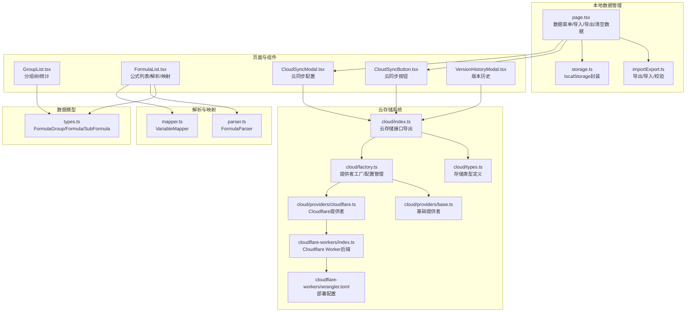
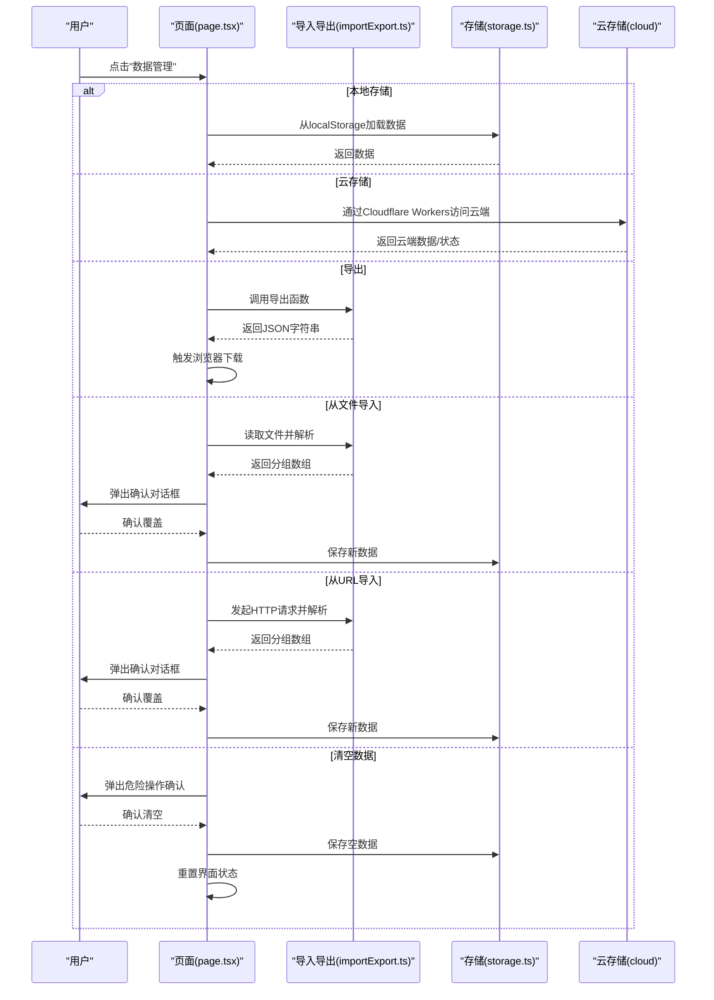
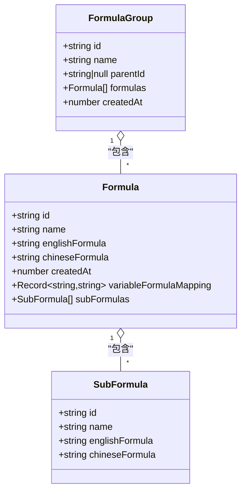
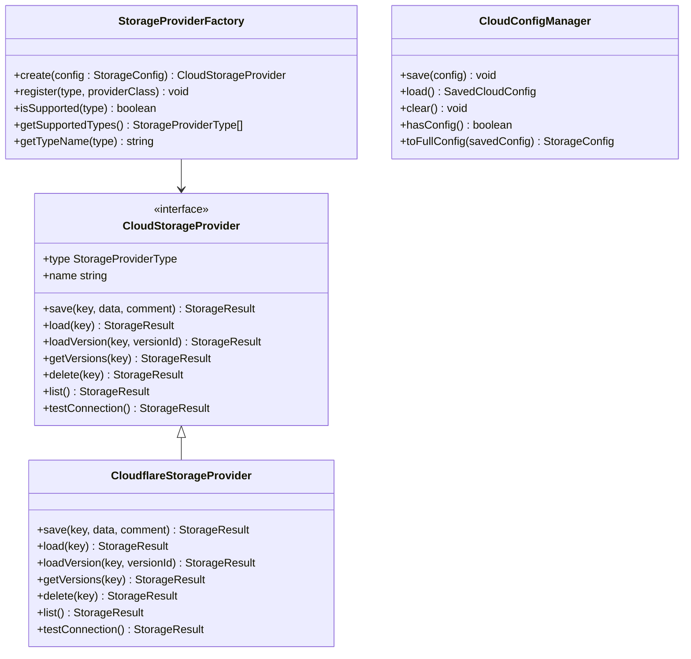
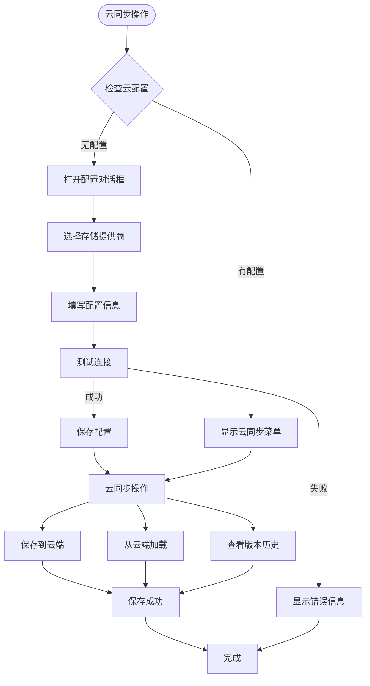
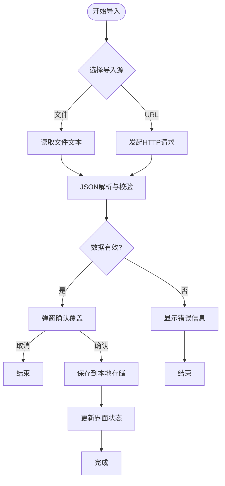
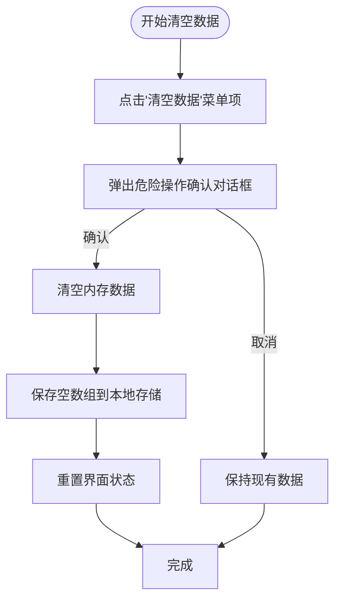
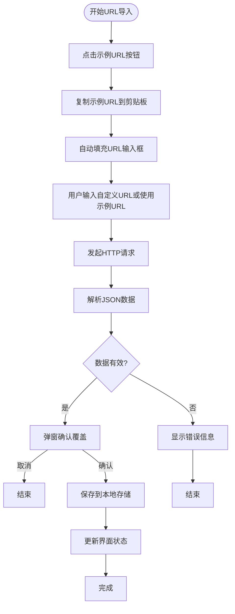
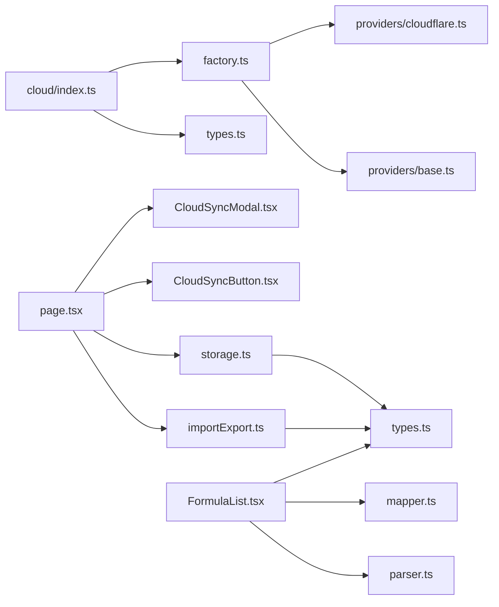

# 数据管理

<cite>
**本文档引用的文件**
- [src/lib/importExport.ts](file://src/lib/importExport.ts)
- [src/lib/storage.ts](file://src/lib/storage.ts)
- [src/lib/types.ts](file://src/lib/types.ts)
- [src/lib/parser.ts](file://src/lib/parser.ts)
- [src/lib/mapper.ts](file://src/lib/mapper.ts)
- [src/lib/cloud/index.ts](file://src/lib/cloud/index.ts)
- [src/lib/cloud/types.ts](file://src/lib/cloud/types.ts)
- [src/lib/cloud/factory.ts](file://src/lib/cloud/factory.ts)
- [src/lib/cloud/providers/base.ts](file://src/lib/cloud/providers/base.ts)
- [src/lib/cloud/providers/cloudflare.ts](file://src/lib/cloud/providers/cloudflare.ts)
- [cloud/cloudflare-workers/index.ts](file://cloud/cloudflare-workers/index.ts)
- [cloud/cloudflare-workers/wrangler.toml](file://cloud/cloudflare-workers/wrangler.toml)
- [src/components/CloudSyncButton.tsx](file://src/components/CloudSyncButton.tsx)
- [src/components/CloudSyncModal.tsx](file://src/components/CloudSyncModal.tsx)
- [src/components/VersionHistoryModal.tsx](file://src/components/VersionHistoryModal.tsx)
- [src/app/page.tsx](file://src/app/page.tsx)
- [src/components/GroupList.tsx](file://src/components/GroupList.tsx)
- [src/components/FormulaList.tsx](file://src/components/FormulaList.tsx)
- [package.json](file://package.json)
- [public/demo-data.json](file://public/demo-data.json)
</cite>

## 更新摘要
**变更内容**
- 新增云存储系统支持，包括 Cloudflare KV 存储后端
- 新增多存储后端架构，支持可扩展的存储提供者模式
- 新增云同步功能，提供云端数据保存、加载和版本管理
- 新增版本历史管理，支持数据版本回滚和历史记录查看
- 新增云存储配置管理，支持配置保存、测试连接和切换服务
- 更新数据管理架构，支持本地存储与云存储双模式

## 目录
1. [简介](#简介)
2. [项目结构](#项目结构)
3. [核心组件](#核心组件)
4. [架构总览](#架构总览)
5. [详细组件分析](#详细组件分析)
6. [依赖关系分析](#依赖关系分析)
7. [性能考量](#性能考量)
8. [故障排查指南](#故障排查指南)
9. [结论](#结论)
10. [附录](#附录)

## 简介
本指南面向使用者，系统讲解"公式映射器"应用中的数据管理功能，包括：
- 数据导入：支持的文件格式、导入流程、数据验证与冲突处理
- 数据导出：导出格式、文件结构、备份策略
- 本地存储与持久化：浏览器本地存储机制与数据持久化原理
- 云存储系统：多存储后端支持、Cloudflare KV 同步、版本管理
- 数据迁移最佳实践与注意事项
- 高级功能：数据恢复、版本管理、同步策略
- 数据安全性与隐私保护
- 常见数据问题的诊断与解决

## 项目结构
数据管理相关的核心代码集中在以下模块：
- 类型定义与数据模型：src/lib/types.ts
- 数据导入/导出：src/lib/importExport.ts
- 本地存储：src/lib/storage.ts
- 云存储系统：src/lib/cloud/（多存储后端架构）
- 解析与映射：src/lib/parser.ts、src/lib/mapper.ts
- 页面与组件：src/app/page.tsx、src/components/GroupList.tsx、src/components/FormulaList.tsx
- 云同步组件：src/components/CloudSyncButton.tsx、src/components/CloudSyncModal.tsx

**图表来源**
- [src/lib/types.ts:1-51](file://src/lib/types.ts#L1-L51)
- [src/lib/importExport.ts:1-120](file://src/lib/importExport.ts#L1-L120)
- [src/lib/storage.ts:1-50](file://src/lib/storage.ts#L1-L50)
- [src/lib/cloud/index.ts:1-20](file://src/lib/cloud/index.ts#L1-L20)
- [src/lib/cloud/types.ts:1-134](file://src/lib/cloud/types.ts#L1-L134)
- [src/lib/cloud/factory.ts:1-180](file://src/lib/cloud/factory.ts#L1-L180)
- [src/lib/cloud/providers/base.ts](file://src/lib/cloud/providers/base.ts)
- [src/lib/cloud/providers/cloudflare.ts](file://src/lib/cloud/providers/cloudflare.ts)
- [cloud/cloudflare-workers/index.ts:1-314](file://cloud/cloudflare-workers/index.ts#L1-L314)
- [cloud/cloudflare-workers/wrangler.toml:1-13](file://cloud/cloudflare-workers/wrangler.toml#L1-L13)
- [src/components/CloudSyncButton.tsx:1-182](file://src/components/CloudSyncButton.tsx#L1-L182)
- [src/components/CloudSyncModal.tsx:1-390](file://src/components/CloudSyncModal.tsx#L1-L390)
- [src/components/VersionHistoryModal.tsx](file://src/components/VersionHistoryModal.tsx)

**章节来源**
- [src/lib/types.ts:1-51](file://src/lib/types.ts#L1-L51)
- [src/lib/importExport.ts:1-120](file://src/lib/importExport.ts#L1-L120)
- [src/lib/storage.ts:1-50](file://src/lib/storage.ts#L1-L50)
- [src/lib/cloud/index.ts:1-20](file://src/lib/cloud/index.ts#L1-L20)
- [src/lib/cloud/types.ts:1-134](file://src/lib/cloud/types.ts#L1-L134)
- [src/lib/cloud/factory.ts:1-180](file://src/lib/cloud/factory.ts#L1-L180)
- [cloud/cloudflare-workers/index.ts:1-314](file://cloud/cloudflare-workers/index.ts#L1-L314)

## 核心组件
- 数据模型：FormulaGroup、Formula、SubFormula 定义了分组、公式与子公式的数据结构，支持父子分组、变量映射、子公式等特性。
- 本地存储：基于 localStorage 的轻量持久化，键名固定，统一加载/保存接口。
- 云存储系统：多存储后端架构，支持可扩展的存储提供者模式，当前实现 Cloudflare KV 存储后端。
- 云同步组件：提供云同步按钮、配置对话框和版本历史管理功能。
- 页面与组件：在主页提供"数据管理"菜单，支持导出、从文件导入、从 URL 导入、清空数据，并在导入前进行覆盖确认。

**章节来源**
- [src/lib/types.ts:27-50](file://src/lib/types.ts#L27-L50)
- [src/lib/storage.ts:3-25](file://src/lib/storage.ts#L3-L25)
- [src/lib/cloud/types.ts:63-120](file://src/lib/cloud/types.ts#L63-L120)
- [src/lib/cloud/factory.ts:13-86](file://src/lib/cloud/factory.ts#L13-L86)
- [src/components/CloudSyncButton.tsx:17-181](file://src/components/CloudSyncButton.tsx#L17-L181)

## 架构总览
数据管理的端到端流程如下：
- 本地存储：应用启动时从 localStorage 加载数据，后续变更实时保存。
- 云存储：通过 Cloudflare Workers API 实现云端数据存储，支持版本历史管理。
- 导出：页面触发导出，调用导出函数生成 JSON 字符串，浏览器下载文件。
- 导入：支持文件导入与 URL 导入两种方式，导入前弹窗确认覆盖，成功后立即保存至本地存储。
- 清空：提供危险操作确认，确认后清空所有数据并重置界面状态。
- 云同步：通过云同步按钮访问配置对话框，支持保存到云端、从云端加载和版本历史查看。

**图表来源**
- [src/app/page.tsx:507-578](file://src/app/page.tsx#L507-L578)
- [src/lib/importExport.ts:25-119](file://src/lib/importExport.ts#L25-L119)
- [src/lib/storage.ts:5-25](file://src/lib/storage.ts#L5-L25)
- [src/lib/cloud/index.ts:1-20](file://src/lib/cloud/index.ts#L1-L20)

## 详细组件分析

### 数据模型与数据结构
- FormulaGroup：包含 id、name、parentId（支持二级分组）、formulas 列表、createdAt 时间戳。
- Formula：包含 id、name、englishFormula、chineseFormula、createdAt、可选 variableFormulaMapping（变量到公式ID的映射）、可选 subFormulas（子公式列表）。
- SubFormula：包含 id、name、englishFormula、chineseFormula。

**图表来源**
- [src/lib/types.ts:27-50](file://src/lib/types.ts#L27-L50)

**章节来源**
- [src/lib/types.ts:27-50](file://src/lib/types.ts#L27-L50)

### 本地存储与持久化
- 存储机制：使用 localStorage，键名固定，值为序列化的 FormulaGroup[]。
- 生命周期：
  - 应用启动时加载：loadData 从 localStorage 读取并解析，异常时回退为空数组。
  - 实时保存：每次数据变更后调用 saveData 写入 localStorage。
- 注意事项：
  - localStorage 有容量限制，建议控制单次导出规模。
  - 不同浏览器可能有不同的容量与清理策略，建议定期备份。
  - 服务端部署时，localStorage 仅适用于客户端持久化，不参与服务端数据同步。

**章节来源**
- [src/lib/storage.ts:3-25](file://src/lib/storage.ts#L3-L25)

### 云存储系统架构
- 多存储后端架构：通过 StorageProviderFactory 实现可扩展的存储提供者模式，支持不同云服务提供商。
- 当前实现：Cloudflare KV 存储后端，通过 Cloudflare Workers API 提供 RESTful 接口。
- 存储格式：CloudStorageData 包含版本信息、时间戳、分组数据和元数据。
- 版本管理：支持最多10个版本的历史记录，自动清理旧版本。

**图表来源**
- [src/lib/cloud/factory.ts:13-86](file://src/lib/cloud/factory.ts#L13-L86)
- [src/lib/cloud/types.ts:63-120](file://src/lib/cloud/types.ts#L63-L120)
- [src/lib/cloud/providers/cloudflare.ts](file://src/lib/cloud/providers/cloudflare.ts)
- [src/lib/cloud/factory.ts:102-179](file://src/lib/cloud/factory.ts#L102-L179)

**章节来源**
- [src/lib/cloud/types.ts:3-134](file://src/lib/cloud/types.ts#L3-L134)
- [src/lib/cloud/factory.ts:13-86](file://src/lib/cloud/factory.ts#L13-L86)
- [src/lib/cloud/factory.ts:102-179](file://src/lib/cloud/factory.ts#L102-L179)

### Cloudflare Workers 后端实现
- RESTful API：提供 /health、/save、/load、/delete、/list、/versions、/load-version 等接口。
- 认证机制：支持可选的 Bearer Token 认证。
- 版本控制：自动创建版本历史，最多保留10个版本。
- CORS 支持：完整的跨域资源共享配置。
- 错误处理：统一的错误响应格式和状态码。

**章节来源**
- [cloud/cloudflare-workers/index.ts:42-87](file://cloud/cloudflare-workers/index.ts#L42-L87)
- [cloud/cloudflare-workers/index.ts:92-134](file://cloud/cloudflare-workers/index.ts#L92-L134)
- [cloud/cloudflare-workers/index.ts:161-186](file://cloud/cloudflare-workers/index.ts#L161-L186)
- [cloud/cloudflare-workers/index.ts:191-227](file://cloud/cloudflare-workers/index.ts#L191-L227)
- [cloud/cloudflare-workers/index.ts:232-259](file://cloud/cloudflare-workers/index.ts#L232-L259)
- [cloud/cloudflare-workers/index.ts:264-281](file://cloud/cloudflare-workers/index.ts#L264-L281)
- [cloud/cloudflare-workers/index.ts:286-293](file://cloud/cloudflare-workers/index.ts#L286-L293)

### 云同步组件
- CloudSyncButton：提供云同步按钮，支持保存到云端、从云端加载、版本历史查看和配置管理。
- CloudSyncModal：云同步配置对话框，支持服务提供商选择、配置保存、连接测试、数据同步等功能。
- VersionHistoryModal：版本历史查看和回滚功能。

**图表来源**
- [src/components/CloudSyncButton.tsx:40-95](file://src/components/CloudSyncButton.tsx#L40-L95)
- [src/components/CloudSyncModal.tsx:117-200](file://src/components/CloudSyncModal.tsx#L117-L200)

**章节来源**
- [src/components/CloudSyncButton.tsx:17-181](file://src/components/CloudSyncButton.tsx#L17-L181)
- [src/components/CloudSyncModal.tsx:42-390](file://src/components/CloudSyncModal.tsx#L42-L390)

### 导入功能
- 支持的输入源：本地文件（.json）、远程 URL（返回 JSON 文本）。
- 导入流程：
  - 文件导入：FileReader 读取文本，调用 importData 进行 JSON 解析与结构校验。
  - URL 导入：fetch 请求远程地址，校验响应状态，再进行解析。
  - 成功后弹窗确认覆盖，确认后更新内存状态并保存到本地存储。
- 数据验证与错误处理：
  - 校验顶层字段 version 与 groups 数组存在性。
  - 校验每个分组的 id、name、formulas 数组。
  - 校验每个公式必须包含 id、name、englishFormula、chineseFormula。
  - 对 JSON 语法错误、HTTP 错误、文件读取失败等场景进行明确错误提示。

**图表来源**
- [src/lib/importExport.ts:43-119](file://src/lib/importExport.ts#L43-L119)
- [src/app/page.tsx:388-413](file://src/app/page.tsx#L388-L413)

**章节来源**
- [src/lib/importExport.ts:43-119](file://src/lib/importExport.ts#L43-L119)
- [src/app/page.tsx:388-413](file://src/app/page.tsx#L388-L413)

### 导出功能
- 导出格式：JSON，包含版本号、导出时间戳、分组数组。
- 文件结构：顶层对象包含 version、exportDate、groups；groups 中每个元素为 FormulaGroup；每个 FormulaGroup 包含 id、name、parentId、formulas、createdAt。
- 下载行为：生成 Blob 并触发浏览器下载，默认文件名为带时间戳的 JSON 文件。
- 备份策略建议：
  - 定期执行导出，保留多个历史版本文件。
  - 将导出文件存放在受控的云存储或本地备份介质中。
  - 在导入前先备份当前数据（通过导出当前状态）。

**章节来源**
- [src/lib/importExport.ts:3-20](file://src/lib/importExport.ts#L3-L20)
- [src/lib/importExport.ts:25-38](file://src/lib/importExport.ts#L25-L38)

### 清空数据功能
- 功能描述：提供危险操作的安全确认机制，清空所有数据并重置界面状态。
- 操作流程：
  - 在数据管理菜单中选择"清空数据"。
  - 弹出危险操作确认对话框，显示不可恢复警告。
  - 用户确认后，清空内存中的数据，保存空数组到本地存储，重置分组和公式选择状态。
  - 用户取消则保持现有数据不变。
- 安全设计：
  - 使用红色图标和危险变体的确认对话框。
  - 明确标注"此操作不可恢复"的警告信息。
  - 采用双重确认机制防止误操作。

**图表来源**
- [src/app/page.tsx:552-575](file://src/app/page.tsx#L552-L575)

**章节来源**
- [src/app/page.tsx:552-575](file://src/app/page.tsx#L552-L575)

### URL导入功能改进
- 示例URL一键复制：在URL导入弹窗中提供"点击复制示例数据URL"功能。
- 支持的输入源：远程 URL（返回 JSON 文本）。
- 改进的导入流程：
  - 点击示例URL按钮，自动复制示例URL到剪贴板并填充到输入框。
  - 用户可直接粘贴自定义URL或使用示例URL。
  - 发起HTTP请求获取远程JSON数据，校验响应状态，再进行解析。
  - 成功后弹窗确认覆盖，确认后更新内存状态并保存到本地存储。
- 用户体验增强：
  - 提供示例数据URL，降低用户使用门槛。
  - 支持键盘快捷键（Enter键）快速导入。
  - 实时导入状态反馈，包含加载动画。

**图表来源**
- [src/app/page.tsx:800-848](file://src/app/page.tsx#L800-L848)
- [src/lib/importExport.ts:105-119](file://src/lib/importExport.ts#L105-L119)

**章节来源**
- [src/app/page.tsx:800-848](file://src/app/page.tsx#L800-L848)
- [src/lib/importExport.ts:105-119](file://src/lib/importExport.ts#L105-L119)

### 数据解析与映射（辅助功能）
- 表达式解析：FormulaParser 将英文公式转换为 AST，支持加减乘除、括号（含中文括号），并进行语法校验。
- 变量提取与映射：VariableMapper 提取英文字母变量与中文变量片段，建立一一对应映射，支持"多余中文变量"的检测。
- 组件集成：FormulaList 展示时在展开状态下解析 AST 并生成变量映射，便于用户理解公式结构与变量对应关系。

**章节来源**
- [src/lib/parser.ts:12-22](file://src/lib/parser.ts#L12-L22)
- [src/lib/parser.ts:24-68](file://src/lib/parser.ts#L24-L68)
- [src/lib/mapper.ts:4-27](file://src/lib/mapper.ts#L4-L27)
- [src/lib/mapper.ts:52-70](file://src/lib/mapper.ts#L52-L70)
- [src/components/FormulaList.tsx:169-192](file://src/components/FormulaList.tsx#L169-L192)

## 依赖关系分析
- 导入导出依赖类型定义（FormulaGroup）。
- 云存储系统依赖类型定义和提供者工厂。
- 页面组件依赖导入导出、存储模块和云同步组件。
- 公式列表组件依赖解析与映射模块，用于展示与验证公式。

**图表来源**
- [src/lib/importExport.ts:1](file://src/lib/importExport.ts#L1)
- [src/lib/storage.ts:1](file://src/lib/storage.ts#L1)
- [src/lib/types.ts:1](file://src/lib/types.ts#L1)
- [src/lib/cloud/index.ts:1](file://src/lib/cloud/index.ts#L1)
- [src/lib/cloud/types.ts:1](file://src/lib/cloud/types.ts#L1)
- [src/lib/cloud/factory.ts:1](file://src/lib/cloud/factory.ts#L1)
- [src/lib/cloud/providers/base.ts](file://src/lib/cloud/providers/base.ts)
- [src/lib/cloud/providers/cloudflare.ts](file://src/lib/cloud/providers/cloudflare.ts)
- [src/app/page.tsx:10-12](file://src/app/page.tsx#L10-L12)
- [src/components/FormulaList.tsx:4-8](file://src/components/FormulaList.tsx#L4-L8)

**章节来源**
- [src/app/page.tsx:10-12](file://src/app/page.tsx#L10-L12)
- [src/components/FormulaList.tsx:4-8](file://src/components/FormulaList.tsx#L4-L8)

## 性能考量
- 导入/导出复杂度：主要受分组与公式数量影响，JSON 解析与字符串序列化的时间复杂度近似 O(n)，空间复杂度与对象数量线性相关。
- 本地存储写入：saveData 为 O(n)（序列化），频繁写入可能导致 UI 卡顿，建议在批量变更后集中保存。
- 云存储操作：网络请求可能成为性能瓶颈，建议优化批量操作和错误重试机制。
- 解析与映射：FormulaParser 与 VariableMapper 在公式展开时触发，避免在未展开时进行计算。
- 建议：
  - 大数据量时分批导入，避免一次性覆盖导致长时间卡顿。
  - 使用浏览器开发者工具监控 localStorage 使用量，防止超出限额。
  - 云同步时考虑网络状况，提供进度反馈和取消机制。

## 故障排查指南
- 导入失败（JSON 格式错误）
  - 现象：提示 JSON 格式错误。
  - 排查：检查导出文件是否被修改、编码是否为 UTF-8、顶层字段是否完整。
  - 处理：重新导出或修正文件内容。
  
  **章节来源**
  - [src/lib/importExport.ts:69-74](file://src/lib/importExport.ts#L69-L74)

- 导入失败（数据格式不正确）
  - 现象：提示某分组或某公式的数据格式不正确。
  - 排查：核对分组 id/name/formulas 与公式 id/name/english/chinese 字段是否存在且类型正确。
  - 处理：修正数据结构后重试。
  
  **章节来源**
  - [src/lib/importExport.ts:48-66](file://src/lib/importExport.ts#L48-L66)

- 从 URL 导入失败
  - 现象：提示网络请求失败或 HTTP 错误。
  - 排查：确认 URL 可访问、返回内容为纯文本 JSON、响应状态码正常。
  - 处理：更换可用 URL 或检查网络与跨域设置。
  
  **章节来源**
  - [src/lib/importExport.ts:105-119](file://src/lib/importExport.ts#L105-L119)

- 文件读取失败
  - 现象：提示文件读取失败。
  - 排查：确认文件存在、权限允许、未被其他程序占用。
  - 处理：更换文件或检查系统权限。
  
  **章节来源**
  - [src/lib/importExport.ts:94-96](file://src/lib/importExport.ts#L94-L96)

- 本地存储保存失败
  - 现象：控制台出现保存失败日志。
  - 排查：检查浏览器隐私模式、存储配额、磁盘空间。
  - 处理：清理缓存或更换存储环境。
  
  **章节来源**
  - [src/lib/storage.ts:20-24](file://src/lib/storage.ts#L20-L24)

- 云存储连接失败
  - 现象：云同步时提示连接失败。
  - 排查：检查 Cloudflare Workers URL 是否正确、API Key 配置、网络连接、CORS 设置。
  - 处理：验证配置信息、检查 Workers 部署状态、确认网络可达性。
  
  **章节来源**
  - [src/components/CloudSyncModal.tsx:117-138](file://src/components/CloudSyncModal.tsx#L117-L138)

- 云存储认证失败
  - 现象：提示未授权访问。
  - 排查：确认 API Key 配置正确、Workers 端点配置了认证检查。
  - 处理：重新配置 API Key 或检查 Workers 端点的认证逻辑。
  
  **章节来源**
  - [cloud/cloudflare-workers/index.ts:56-61](file://cloud/cloudflare-workers/index.ts#L56-L61)

- 云存储数据加载失败
  - 现象：从云端加载数据时失败。
  - 排查：检查数据是否存在、版本号是否正确、网络连接状态。
  - 处理：确认数据键名、版本号，重试加载操作。
  
  **章节来源**
  - [src/components/CloudSyncButton.tsx:69-95](file://src/components/CloudSyncButton.tsx#L69-L95)

- 云存储版本历史查询失败
  - 现象：查看版本历史时失败。
  - 排查：检查版本前缀格式、数据完整性、Workers 端点状态。
  - 处理：清理损坏的版本数据、重新创建版本历史。
  
  **章节来源**
  - [cloud/cloudflare-workers/index.ts:191-227](file://cloud/cloudflare-workers/index.ts#L191-L227)

- 导入覆盖确认
  - 现象：导入前弹窗确认覆盖当前数据。
  - 处理：若误操作，可在确认前取消；确认后会立即保存新数据。
  
  **章节来源**
  - [src/app/page.tsx:393-413](file://src/app/page.tsx#L393-L413)
  - [src/app/page.tsx:424-449](file://src/app/page.tsx#L424-L449)

- 清空数据确认
  - 现象：清空数据前弹出危险操作确认对话框。
  - 处理：确认后将清空所有数据并重置界面状态；取消则保持现有数据。
  
  **章节来源**
  - [src/app/page.tsx:554-575](file://src/app/page.tsx#L554-L575)

- URL导入示例复制失败
  - 现象：点击示例URL按钮无法复制到剪贴板。
  - 排查：检查浏览器权限设置、HTTPS环境要求、剪贴板API支持情况。
  - 处理：手动复制示例URL或在安全环境下使用浏览器。
  
  **章节来源**
  - [src/app/page.tsx:802-806](file://src/app/page.tsx#L802-L806)

## 结论
本应用提供了全面的数据管理能力，包括本地存储、云存储同步和传统导入导出功能。新增的云存储系统支持多存储后端架构，当前实现 Cloudflare KV 存储后端，提供版本历史管理和安全的云端数据同步。建议用户遵循"定期导出备份、谨慎覆盖导入、关注浏览器存储限额、谨慎使用清空功能、合理配置云存储"的原则，确保数据安全与可恢复性。

## 附录

### 数据导入操作步骤
- 打开"数据管理"菜单，选择"导出数据"保存当前状态。
- 选择"导入数据"，选择本地 JSON 文件，确认覆盖提示后导入。
- 或选择"从 URL 导入"，点击示例URL一键复制，或输入自定义URL，确认覆盖提示后导入。

**章节来源**
- [src/app/page.tsx:517-578](file://src/app/page.tsx#L517-L578)
- [src/lib/importExport.ts:25-119](file://src/lib/importExport.ts#L25-L119)

### 数据导出操作步骤
- 在"数据管理"菜单中选择"导出数据"，浏览器将自动下载 JSON 文件。
- 建议为不同时间点的导出文件命名区分，便于版本管理与回滚。

**章节来源**
- [src/lib/importExport.ts:25-38](file://src/lib/importExport.ts#L25-L38)

### 清空数据操作步骤
- 在"数据管理"菜单中选择"清空数据"。
- 弹出危险操作确认对话框，阅读警告信息后确认清空。
- 确认后将清空所有数据并重置界面状态。

**章节来源**
- [src/app/page.tsx:552-575](file://src/app/page.tsx#L552-L575)

### URL导入操作步骤
- 在"数据管理"菜单中选择"从 URL 导入"。
- 点击"点击复制示例数据URL"按钮一键复制示例URL，或手动输入自定义URL。
- 确认覆盖提示后导入，导入完成后自动保存到本地存储。

**章节来源**
- [src/app/page.tsx:540-551](file://src/app/page.tsx#L540-L551)
- [src/app/page.tsx:800-848](file://src/app/page.tsx#L800-L848)

### 本地存储与数据持久化
- 应用启动时自动从 localStorage 加载数据；每次数据变更后自动保存。
- 若需手动恢复，可将之前导出的 JSON 文件再次导入。

**章节来源**
- [src/lib/storage.ts:5-25](file://src/lib/storage.ts#L5-L25)
- [src/app/page.tsx:99-102](file://src/app/page.tsx#L99-L102)

### 云存储配置与使用
- 配置步骤：打开云同步按钮 → 选择 Cloudflare KV → 输入 Workers URL → 可选配置 API Key 和 Namespace ID → 测试连接 → 保存配置。
- 使用步骤：保存到云端（将当前数据保存到 Cloudflare KV）→ 从云端加载（从 Cloudflare KV 加载数据到本地）→ 查看版本历史（查看和回滚历史版本）。
- 部署要求：需要 Cloudflare Workers 部署和 KV Namespace 配置。

**章节来源**
- [src/components/CloudSyncButton.tsx:40-95](file://src/components/CloudSyncButton.tsx#L40-L95)
- [src/components/CloudSyncModal.tsx:117-200](file://src/components/CloudSyncModal.tsx#L117-L200)
- [cloud/cloudflare-workers/index.ts:4-10](file://cloud/cloudflare-workers/index.ts#L4-L10)

### 数据迁移与版本管理
- 迁移策略：先导出旧版本数据，再导入到新环境中；如需跨设备迁移，建议通过云端共享 JSON 文件或使用云存储同步功能。
- 版本管理：云存储支持最多10个版本的历史记录，可通过版本历史对话框查看和回滚到任意历史版本。
- 备份策略：建议定期执行本地导出备份和云存储同步，确保数据安全。

**章节来源**
- [src/lib/importExport.ts:3-20](file://src/lib/importExport.ts#L3-L20)
- [cloud/cloudflare-workers/index.ts:139-156](file://cloud/cloudflare-workers/index.ts#L139-L156)

### 同步策略与注意事项
- 同步范围：支持本地存储与云存储双模式，可根据需要选择同步方式。
- 注意事项：云存储依赖网络连接，建议在网络稳定时进行同步操作；不同浏览器或设备上的 localStorage 是隔离的；云存储配置保存在本地，需要在每台设备上重新配置。
- 安全考虑：API Key 可选配置，建议在生产环境中启用认证；云存储数据传输建议使用 HTTPS。

**章节来源**
- [src/lib/storage.ts:3-25](file://src/lib/storage.ts#L3-L25)
- [cloud/cloudflare-workers/index.ts:56-61](file://cloud/cloudflare-workers/index.ts#L56-L61)

### 数据安全与隐私
- 数据存储位置：浏览器本地存储和 Cloudflare 云端存储，不上传至服务器。
- 隐私保护：应用未收集用户数据，仅在本地处理与存储。
- 安全建议：避免在公共电脑上登录；导出文件妥善保管；不要将敏感信息放入公式内容；谨慎使用清空功能；云存储配置包含敏感信息，建议妥善保管。
- 认证机制：Cloudflare Workers 支持可选的 Bearer Token 认证，增强数据访问安全性。

**章节来源**
- [src/lib/storage.ts:3-25](file://src/lib/storage.ts#L3-L25)
- [cloud/cloudflare-workers/index.ts:56-61](file://cloud/cloudflare-workers/index.ts#L56-L61)

### 示例数据参考
- 应用提供了示例数据文件 demo-data.json，包含完整的分组和公式结构。
- 示例数据可用于测试URL导入功能，验证数据格式正确性。

**章节来源**
- [public/demo-data.json:1-107](file://public/demo-data.json#L1-L107)