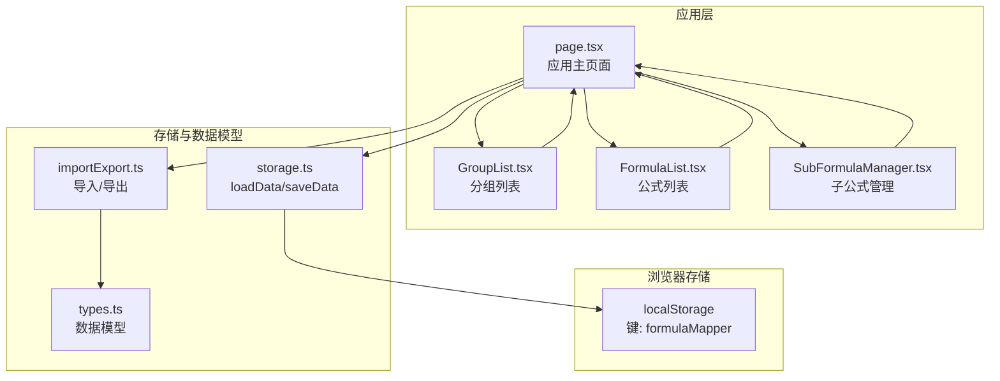
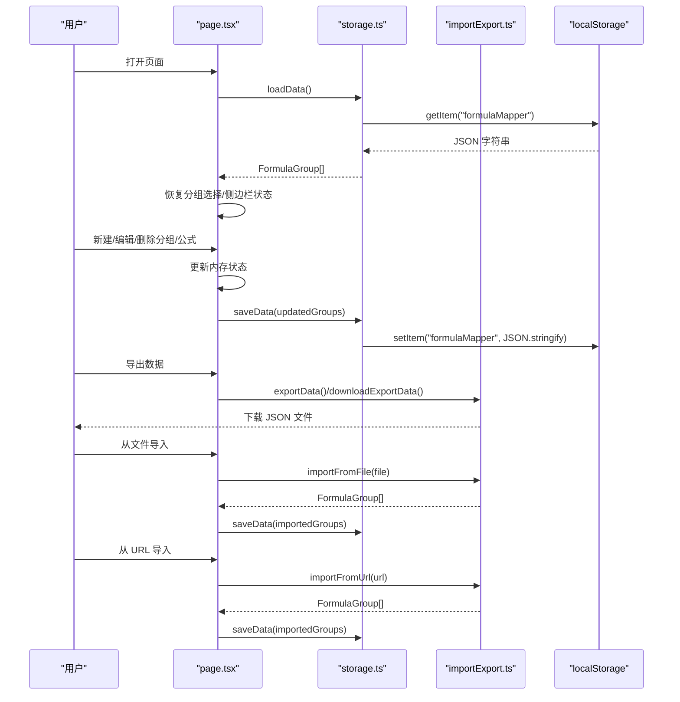
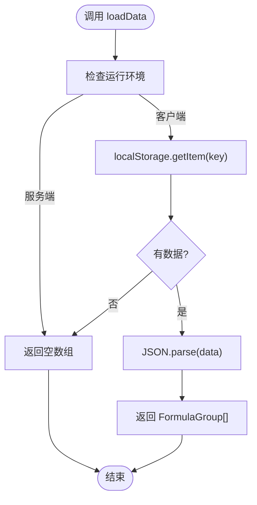
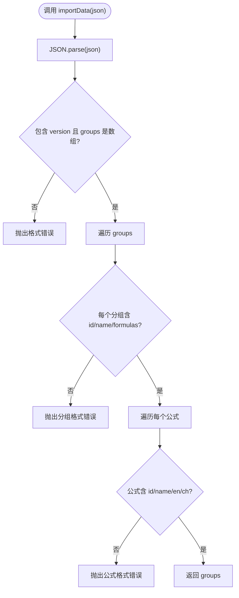
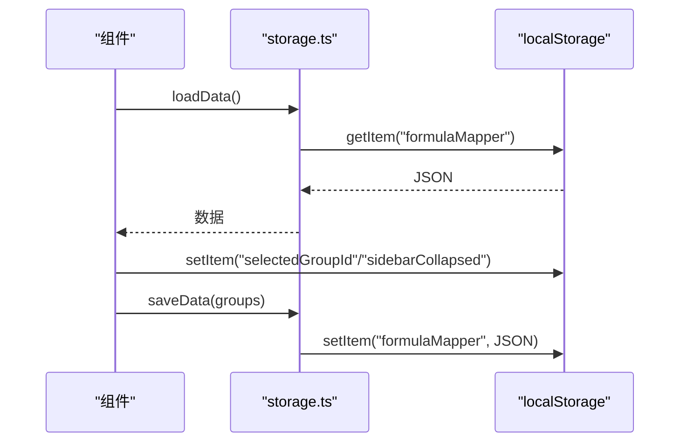
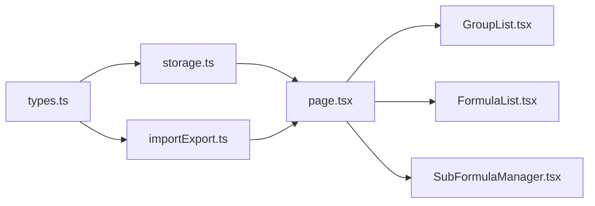

# 本地存储

<cite>
**本文档引用的文件**
- [storage.ts](file://src/lib/storage.ts)
- [importExport.ts](file://src/lib/importExport.ts)
- [types.ts](file://src/lib/types.ts)
- [page.tsx](file://src/app/page.tsx)
- [GroupList.tsx](file://src/components/GroupList.tsx)
- [FormulaList.tsx](file://src/components/FormulaList.tsx)
- [SubFormulaManager.tsx](file://src/components/SubFormulaManager.tsx)
- [package.json](file://package.json)
</cite>

## 目录
1. [简介](#简介)
2. [项目结构](#项目结构)
3. [核心组件](#核心组件)
4. [架构总览](#架构总览)
5. [详细组件分析](#详细组件分析)
6. [依赖关系分析](#依赖关系分析)
7. [性能考虑](#性能考虑)
8. [故障排查指南](#故障排查指南)
9. [结论](#结论)
10. [附录](#附录)

## 简介
本文件面向“本地存储”主题，系统性阐述该项目中基于 localStorage 的数据持久化机制。内容涵盖：
- localStorage 使用原理与数据持久化策略
- 数据序列化与反序列化实现细节
- 数据结构设计、键值管理与服务端同步机制
- 数据版本控制、向后兼容性与迁移策略
- 存储性能优化与内存管理最佳实践
- 自动化备份、恢复与清理方案

## 项目结构
该项目采用 Next.js 客户端组件模式，本地存储主要集中在 lib 层的存储与导入导出模块，以及页面层的状态同步与持久化。

图表来源
- [page.tsx:85-112](file://src/app/page.tsx#L85-L112)
- [storage.ts:5-25](file://src/lib/storage.ts#L5-L25)
- [importExport.ts:12-38](file://src/lib/importExport.ts#L12-L38)
- [types.ts:27-50](file://src/lib/types.ts#L27-L50)

章节来源
- [page.tsx:85-112](file://src/app/page.tsx#L85-L112)
- [storage.ts:5-25](file://src/lib/storage.ts#L5-L25)
- [importExport.ts:12-38](file://src/lib/importExport.ts#L12-L38)
- [types.ts:27-50](file://src/lib/types.ts#L27-L50)

## 核心组件
- 存储模块（storage.ts）：提供数据的加载与保存，使用单一键值对持久化整个 FormulaGroup 结构数组。
- 导入导出模块（importExport.ts）：定义导出数据结构与版本号，提供 JSON 导出、文件下载、JSON 导入、文件导入、URL 导入等能力。
- 数据模型（types.ts）：定义 Formula、FormulaGroup、SubFormula 等核心数据结构。
- 页面层（page.tsx）：负责初始化加载、URL 同步、状态缓存到 localStorage、触发保存等。

章节来源
- [storage.ts:5-25](file://src/lib/storage.ts#L5-L25)
- [importExport.ts:3-75](file://src/lib/importExport.ts#L3-L75)
- [types.ts:27-50](file://src/lib/types.ts#L27-L50)
- [page.tsx:85-112](file://src/app/page.tsx#L85-L112)

## 架构总览
本地存储的整体流程如下：
- 应用启动时，从 localStorage 加载数据并恢复 UI 状态
- 用户操作触发状态变更，页面层调用保存函数写回 localStorage
- 提供导入/导出功能，支持文件与 URL 两种来源
- 导入时进行数据校验，成功后覆盖本地数据并保存

图表来源
- [page.tsx:85-112](file://src/app/page.tsx#L85-L112)
- [page.tsx:168-197](file://src/app/page.tsx#L168-L197)
- [page.tsx:207-254](file://src/app/page.tsx#L207-L254)
- [page.tsx:365-420](file://src/app/page.tsx#L365-L420)
- [storage.ts:5-25](file://src/lib/storage.ts#L5-L25)
- [importExport.ts:12-38](file://src/lib/importExport.ts#L12-L38)
- [importExport.ts:80-119](file://src/lib/importExport.ts#L80-L119)

## 详细组件分析

### 存储模块（storage.ts）
- 单一键值对：使用固定键名持久化整个 FormulaGroup 数组
- 序列化策略：统一使用 JSON.stringify/parse
- 异常处理：捕获异常并记录错误，保证应用稳定性
- 辅助构造：提供创建分组与公式的工厂方法，生成带时间戳的唯一 ID

图表来源
- [storage.ts:5-15](file://src/lib/storage.ts#L5-L15)

章节来源
- [storage.ts:5-25](file://src/lib/storage.ts#L5-L25)

### 导入导出模块（importExport.ts）
- 导出结构：包含版本号、导出时间、分组数组
- 导出流程：生成导出对象并序列化为 JSON 字符串，支持下载为文件
- 导入流程：解析 JSON，验证版本与结构完整性，逐条校验分组与公式字段
- 文件导入：通过 FileReader 读取本地文件
- URL 导入：通过 fetch 获取远程 JSON 并解析
- 错误处理：区分语法错误、格式错误与网络错误，抛出明确错误信息

图表来源
- [importExport.ts:43-75](file://src/lib/importExport.ts#L43-L75)

章节来源
- [importExport.ts:3-75](file://src/lib/importExport.ts#L3-L75)
- [importExport.ts:80-119](file://src/lib/importExport.ts#L80-L119)

### 数据模型（types.ts）
- FormulaGroup：包含 id、name、parentId、formulas、createdAt
- Formula：包含 id、name、englishFormula、chineseFormula、createdAt、可选变量映射与子公式
- SubFormula：子公式轻量结构，包含 id、name、英文/中文公式
- 作用：作为存储与导入导出的数据契约，确保前后端一致

章节来源
- [types.ts:27-50](file://src/lib/types.ts#L27-L50)

### 页面层（page.tsx）与本地存储集成
- 初始化加载：组件挂载时调用 loadData 恢复数据，并从 localStorage 恢复分组选择与侧边栏状态
- 状态缓存：监听分组选择与侧边栏状态变化，实时写入 localStorage
- 数据变更：创建/编辑/删除分组与公式时，更新内存状态并调用 saveData 写回
- 导入导出：提供导出为文件、从文件导入、从 URL 导入的能力，并在成功后覆盖本地数据

图表来源
- [page.tsx:85-112](file://src/app/page.tsx#L85-L112)
- [page.tsx:122-133](file://src/app/page.tsx#L122-L133)
- [page.tsx:168-197](file://src/app/page.tsx#L168-L197)
- [page.tsx:207-254](file://src/app/page.tsx#L207-L254)
- [storage.ts:5-25](file://src/lib/storage.ts#L5-L25)

章节来源
- [page.tsx:85-112](file://src/app/page.tsx#L85-L112)
- [page.tsx:122-133](file://src/app/page.tsx#L122-L133)
- [page.tsx:168-197](file://src/app/page.tsx#L168-L197)
- [page.tsx:207-254](file://src/app/page.tsx#L207-L254)
- [storage.ts:5-25](file://src/lib/storage.ts#L5-L25)

### 组件交互与本地存储
- GroupList：负责分组树展示与交互，状态变更通过回调通知页面层
- FormulaList：负责公式列表与搜索，展开公式时进行解析与映射
- SubFormulaManager：负责子公式增删改查，变更通过回调通知页面层

章节来源
- [GroupList.tsx:16-111](file://src/components/GroupList.tsx#L16-L111)
- [FormulaList.tsx:21-138](file://src/components/FormulaList.tsx#L21-L138)
- [SubFormulaManager.tsx:12-74](file://src/components/SubFormulaManager.tsx#L12-L74)

## 依赖关系分析
- 存储模块依赖数据模型（types.ts），确保序列化/反序列化结构一致
- 页面层同时依赖存储模块与导入导出模块，形成“读取-写入-导入-导出”的闭环
- 组件层（GroupList、FormulaList、SubFormulaManager）通过回调与页面层协作，最终落到存储模块

图表来源
- [types.ts:27-50](file://src/lib/types.ts#L27-L50)
- [storage.ts:1-1](file://src/lib/storage.ts#L1-L1)
- [importExport.ts:1-1](file://src/lib/importExport.ts#L1-L1)
- [page.tsx:11-12](file://src/app/page.tsx#L11-L12)

章节来源
- [types.ts:27-50](file://src/lib/types.ts#L27-L50)
- [storage.ts:1-1](file://src/lib/storage.ts#L1-L1)
- [importExport.ts:1-1](file://src/lib/importExport.ts#L1-L1)
- [page.tsx:11-12](file://src/app/page.tsx#L11-L12)

## 性能考虑
- 序列化成本：每次 saveData 都会进行 JSON.stringify，建议在批量变更后合并一次保存
- 读取成本：loadData 在组件挂载时执行，建议在大型数据集下考虑分页或懒加载
- UI 响应：URL 同步与状态缓存写入 localStorage 的频率较高，注意避免过度频繁的写入
- 内存管理：避免在组件中持有过大的临时对象；及时清理事件监听与定时器
- 导入/导出：大文件导入时注意异步处理与进度提示，避免阻塞主线程

## 故障排查指南
- 无法加载数据
  - 检查浏览器是否禁用 localStorage 或处于隐私模式
  - 确认键名是否被意外修改（固定键名为 formulaMapper）
  - 查看控制台是否有 JSON 解析错误
- 保存失败
  - 检查磁盘空间与存储配额
  - 确认序列化对象不包含不可序列化字段
- 导入失败
  - 确认 JSON 格式正确且包含 version 与 groups 字段
  - 确认每个分组与公式字段完整
- URL 导入失败
  - 检查网络连通性与跨域设置
  - 确认响应状态码与内容类型

章节来源
- [storage.ts:5-25](file://src/lib/storage.ts#L5-L25)
- [importExport.ts:43-75](file://src/lib/importExport.ts#L43-L75)
- [importExport.ts:105-119](file://src/lib/importExport.ts#L105-L119)

## 结论
本项目以 localStorage 为核心实现本地数据持久化，结合导入导出与 URL 同步，形成了完整的数据生命周期管理。通过单一键值对与统一的序列化策略，简化了数据模型与存储逻辑。未来可在以下方面进一步增强：
- 版本控制与迁移：为导出结构引入版本号字段，实现向后兼容与自动迁移
- 存储配额监控：在保存前检测可用空间，避免超出限制
- 增量保存：对频繁变更场景采用防抖/节流策略
- 数据压缩：对超大数据集考虑压缩存储（需权衡 CPU 与内存）

## 附录

### 数据结构设计与键值管理
- 存储键：固定键名用于存放 FormulaGroup 数组
- 导入导出键：导出对象包含 version、exportDate、groups
- UI 状态键：selectedGroupId、sidebarCollapsed 用于恢复界面状态

章节来源
- [storage.ts:3](file://src/lib/storage.ts#L3)
- [importExport.ts:3-7](file://src/lib/importExport.ts#L3-L7)
- [page.tsx:90-97](file://src/app/page.tsx#L90-L97)
- [page.tsx:122-133](file://src/app/page.tsx#L122-L133)

### 服务端同步机制
- 本项目未实现服务端同步，导入/导出与 URL 导入仅用于本地数据交换
- 如需服务端同步，建议在导入导出模块中扩展服务端接口调用，并在页面层增加“云端同步”按钮与状态反馈

章节来源
- [importExport.ts:105-119](file://src/lib/importExport.ts#L105-L119)
- [page.tsx:365-420](file://src/app/page.tsx#L365-L420)

### 数据版本控制、向后兼容性与迁移策略
- 当前导出结构包含 version 字段，但迁移逻辑尚未实现
- 建议在导入时根据 version 执行迁移脚本，逐步升级数据结构
- 保持默认值与可选字段，确保旧版本数据可读

章节来源
- [importExport.ts:13-19](file://src/lib/importExport.ts#L13-L19)

### 存储性能优化与内存管理最佳实践
- 合并保存：批量变更后一次性 saveData
- 避免重复渲染：合理使用依赖项，减少不必要的 useEffect 触发
- 控制台日志：仅保留必要错误日志，避免频繁输出影响性能
- 大数据处理：分页加载、懒渲染、虚拟滚动等策略

章节来源
- [page.tsx:168-197](file://src/app/page.tsx#L168-L197)
- [page.tsx:207-254](file://src/app/page.tsx#L207-L254)

### 自动化备份、恢复与清理方案
- 备份：定期调用导出函数生成 JSON 文件，可结合浏览器下载 API 实现一键备份
- 恢复：提供文件导入与 URL 导入入口，导入成功后覆盖本地数据
- 清理：提供“清空数据”确认对话框，导入时可选择覆盖现有数据

章节来源
- [importExport.ts:12-38](file://src/lib/importExport.ts#L12-L38)
- [page.tsx:365-420](file://src/app/page.tsx#L365-L420)