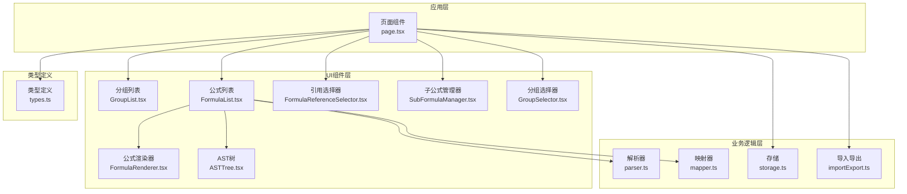
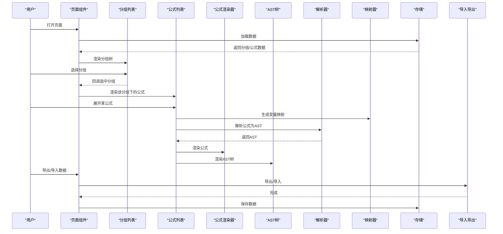
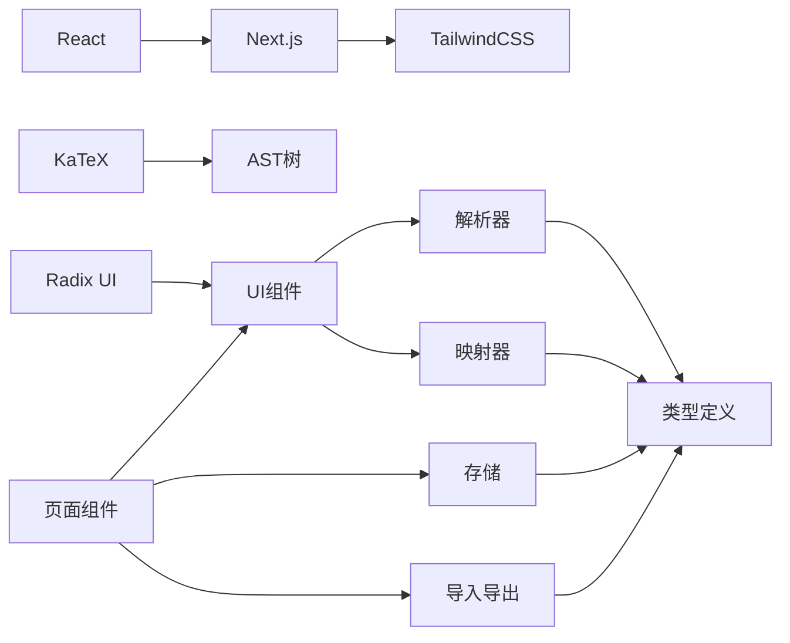
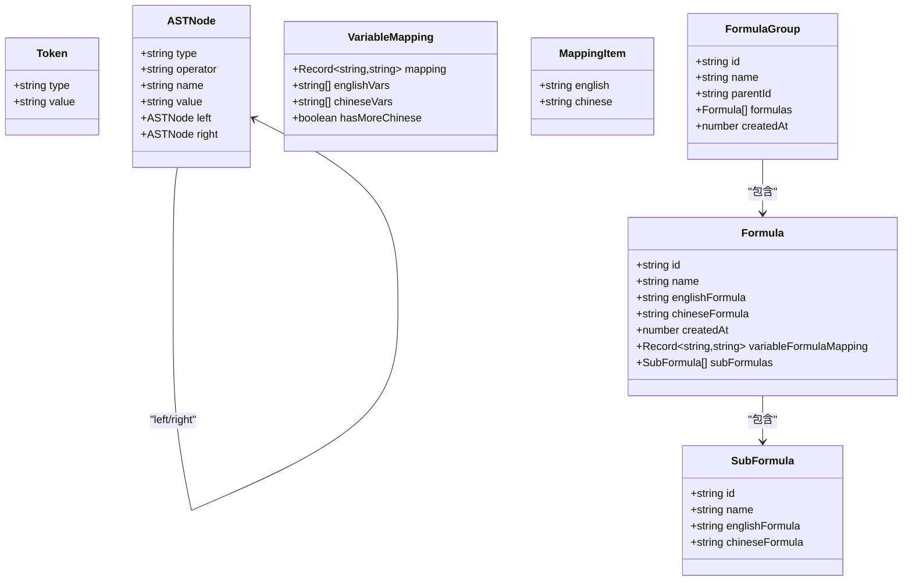
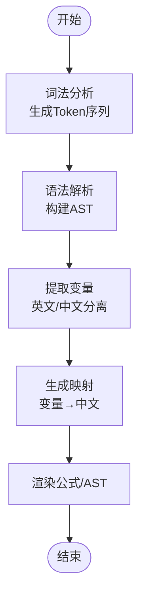

# 用户指南

<cite>
**本文档引用的文件**
- [page.tsx](file://src/app/page.tsx)
- [FormulaList.tsx](file://src/components/FormulaList.tsx)
- [GroupList.tsx](file://src/components/GroupList.tsx)
- [FormulaRenderer.tsx](file://src/components/FormulaRenderer.tsx)
- [ASTTree.tsx](file://src/components/ASTTree.tsx)
- [FormulaReferenceSelector.tsx](file://src/components/FormulaReferenceSelector.tsx)
- [SubFormulaManager.tsx](file://src/components/SubFormulaManager.tsx)
- [GroupSelector.tsx](file://src/components/GroupSelector.tsx)
- [parser.ts](file://src/lib/parser.ts)
- [mapper.ts](file://src/lib/mapper.ts)
- [storage.ts](file://src/lib/storage.ts)
- [importExport.ts](file://src/lib/importExport.ts)
- [types.ts](file://src/lib/types.ts)
- [package.json](file://package.json)
</cite>

## 目录
1. [简介](#简介)
2. [项目结构](#项目结构)
3. [核心组件](#核心组件)
4. [架构总览](#架构总览)
5. [详细组件使用指南](#详细组件使用指南)
6. [依赖关系分析](#依赖关系分析)
7. [性能与可用性建议](#性能与可用性建议)
8. [故障排查](#故障排查)
9. [结论](#结论)
10. [附录](#附录)

## 简介
本工具是一个“公式变量映射与可视化”应用，帮助用户：
- 创建、编辑、删除、搜索公式
- 通过分组进行层级化管理
- 实时渲染公式为可读的图形化展示
- 生成并查看公式结构树（AST）
- 设置变量映射与引用关系
- 导入/导出数据，便于备份与迁移

工具采用 Next.js + React + TailwindCSS 构建，前端状态持久化于浏览器本地存储，支持在线渲染 LaTeX 公式。

## 项目结构
- 应用入口位于页面组件，负责全局状态与路由参数同步
- 组件层包含分组列表、公式列表、公式渲染器、AST 树、引用选择器、子公式管理器、分组选择器等
- 逻辑层包含解析器、映射器、存储与导入导出工具
- 类型定义集中于类型模块，保证数据结构一致性

图表来源
- [page.tsx:1-707](file://src/app/page.tsx#L1-L707)
- [GroupList.tsx:1-294](file://src/components/GroupList.tsx#L1-L294)
- [FormulaList.tsx:1-387](file://src/components/FormulaList.tsx#L1-L387)
- [FormulaRenderer.tsx:1-169](file://src/components/FormulaRenderer.tsx#L1-L169)
- [ASTTree.tsx:1-179](file://src/components/ASTTree.tsx#L1-L179)
- [FormulaReferenceSelector.tsx:1-132](file://src/components/FormulaReferenceSelector.tsx#L1-L132)
- [SubFormulaManager.tsx:1-201](file://src/components/SubFormulaManager.tsx#L1-L201)
- [GroupSelector.tsx:1-197](file://src/components/GroupSelector.tsx#L1-L197)
- [parser.ts:1-159](file://src/lib/parser.ts#L1-L159)
- [mapper.ts:1-89](file://src/lib/mapper.ts#L1-L89)
- [storage.ts:1-50](file://src/lib/storage.ts#L1-L50)
- [importExport.ts:1-101](file://src/lib/importExport.ts#L1-L101)
- [types.ts:1-51](file://src/lib/types.ts#L1-L51)

章节来源
- [page.tsx:1-707](file://src/app/page.tsx#L1-L707)
- [package.json:1-48](file://package.json#L1-L48)

## 核心组件
- 页面组件：负责全局状态、URL 参数同步、分组/公式 CRUD、导入导出、数据持久化
- 分组列表：树形展示分组，支持创建、编辑、删除、展开折叠、面包屑导航
- 公式列表：支持搜索、展开查看变量映射、公式渲染、AST 树、引用弹窗
- 公式渲染器：将公式令牌化，按变量着色，支持引用跳转
- AST 树：将 AST 转换为 LaTeX 并渲染，支持中英文切换与变量说明
- 引用选择器：为变量绑定外部公式或子公式引用
- 子公式管理器：维护当前公式内部的子公式集合
- 分组选择器：多级分组选择，支持面包屑与直接选择
- 解析器/映射器：词法分析、语法解析、变量提取与映射
- 存储/导入导出：本地存储与 JSON 文件导入导出

章节来源
- [FormulaList.tsx:1-387](file://src/components/FormulaList.tsx#L1-L387)
- [GroupList.tsx:1-294](file://src/components/GroupList.tsx#L1-L294)
- [FormulaRenderer.tsx:1-169](file://src/components/FormulaRenderer.tsx#L1-L169)
- [ASTTree.tsx:1-179](file://src/components/ASTTree.tsx#L1-L179)
- [FormulaReferenceSelector.tsx:1-132](file://src/components/FormulaReferenceSelector.tsx#L1-L132)
- [SubFormulaManager.tsx:1-201](file://src/components/SubFormulaManager.tsx#L1-L201)
- [GroupSelector.tsx:1-197](file://src/components/GroupSelector.tsx#L1-L197)
- [parser.ts:1-159](file://src/lib/parser.ts#L1-L159)
- [mapper.ts:1-89](file://src/lib/mapper.ts#L1-L89)
- [storage.ts:1-50](file://src/lib/storage.ts#L1-L50)
- [importExport.ts:1-101](file://src/lib/importExport.ts#L1-L101)

## 架构总览
应用采用“页面组件 + 多个 UI 组件 + 业务逻辑模块”的分层设计：
- 页面组件作为控制器，协调状态与事件
- UI 组件负责视图与交互
- 业务逻辑模块封装解析、映射、存储与导入导出
- 类型模块统一数据结构

图表来源
- [page.tsx:1-707](file://src/app/page.tsx#L1-L707)
- [FormulaList.tsx:1-387](file://src/components/FormulaList.tsx#L1-L387)
- [FormulaRenderer.tsx:1-169](file://src/components/FormulaRenderer.tsx#L1-L169)
- [ASTTree.tsx:1-179](file://src/components/ASTTree.tsx#L1-L179)
- [parser.ts:1-159](file://src/lib/parser.ts#L1-L159)
- [mapper.ts:1-89](file://src/lib/mapper.ts#L1-L89)
- [storage.ts:1-50](file://src/lib/storage.ts#L1-L50)
- [importExport.ts:1-101](file://src/lib/importExport.ts#L1-L101)

## 详细组件使用指南

### 一、公式管理（创建、编辑、删除、搜索）
- 创建公式
  - 在顶部点击“数据管理”→“导出数据”备份现有数据；点击“导入数据”可恢复
  - 在左侧分组列表中选择目标分组，点击右侧“新建公式”
  - 填写公式名称、英文公式、中文公式，选择所属分组
  - 可选：配置变量引用公式映射与子公式
  - 点击“创建”完成
- 编辑公式
  - 在公式列表中点击“编辑”，修改信息后点击“更新”
  - 支持跨分组移动（会自动从原分组移除并加入目标分组）
- 删除公式
  - 在公式列表中点击“删除”，确认后移除
- 搜索公式
  - 在公式列表顶部输入关键词，支持按名称模糊搜索

章节来源
- [page.tsx:204-360](file://src/app/page.tsx#L204-L360)
- [FormulaList.tsx:120-139](file://src/components/FormulaList.tsx#L120-L139)

### 二、分组管理（创建、编辑、删除、层级管理）
- 创建分组
  - 在分组列表中点击“新建”，输入分组名称
  - 可在任意分组下创建子分组
- 编辑分组
  - 点击分组右侧“编辑”，修改名称后保存
- 删除分组
  - 点击分组右侧“删除”，确认后删除该分组及其所有子分组
- 层级管理
  - 点击分组左侧箭头展开/折叠
  - 点击“添加子分组”在当前分组下创建子分组
  - 选中分组后，面包屑自动高亮路径

章节来源
- [GroupList.tsx:16-81](file://src/components/GroupList.tsx#L16-L81)
- [GroupList.tsx:114-196](file://src/components/GroupList.tsx#L114-L196)

### 三、公式渲染与 AST 树可视化
- 公式渲染
  - 展开公式后，渲染器将公式按令牌拆分，变量按颜色区分
  - 变量若存在引用，点击可打开引用公式详情
- AST 树
  - 展开公式后，AST 树将表达式转换为 LaTeX 并渲染
  - 支持“英文公式/中文公式”切换，中文模式会将变量替换为中文说明
  - 可查看变量映射说明

章节来源
- [FormulaList.tsx:315-358](file://src/components/FormulaList.tsx#L315-L358)
- [FormulaRenderer.tsx:27-116](file://src/components/FormulaRenderer.tsx#L27-L116)
- [ASTTree.tsx:11-112](file://src/components/ASTTree.tsx#L11-L112)

### 四、变量映射设置与配置
- 变量映射
  - 自动从英文公式提取变量，从中文公式提取变量，生成映射
  - 渲染器与 AST 树均使用该映射进行展示
- 变量引用映射
  - 在“变量引用公式映射”区域，为每个变量选择引用的外部公式或子公式
  - 选中后，渲染器中的变量会显示引用标识，点击可跳转到引用公式
- 子公式管理
  - 在“子公式管理”中添加/编辑/删除当前公式内部的子公式
  - 子公式在引用选择器中以“子公式”分组显示，引用时前缀为“sub_”

章节来源
- [FormulaList.tsx:170-192](file://src/components/FormulaList.tsx#L170-L192)
- [FormulaReferenceSelector.tsx:14-113](file://src/components/FormulaReferenceSelector.tsx#L14-L113)
- [SubFormulaManager.tsx:12-75](file://src/components/SubFormulaManager.tsx#L12-L75)

### 五、数据导入导出
- 导出
  - 点击“数据管理”→“导出数据”，下载 JSON 文件
- 导入
  - 点击“数据管理”→“导入数据”，选择 JSON 文件
  - 系统验证版本与结构，确认覆盖当前数据后导入
- 注意事项
  - 导入会覆盖当前数据，请提前导出备份
  - JSON 文件需包含版本号与分组数组，且每个分组与公式需满足结构要求

章节来源
- [page.tsx:362-390](file://src/app/page.tsx#L362-L390)
- [importExport.ts:12-101](file://src/lib/importExport.ts#L12-L101)

### 六、用户界面组件与交互
- 侧边栏分组列表
  - 可收起/展开，支持面包屑导航与快捷选择
- 公式卡片
  - 点击标题展开/收起，显示变量映射、公式渲染、AST 树
  - 支持编辑、删除、引用跳转
- 对话框
  - 创建/编辑分组、创建/编辑公式、添加/编辑子公式、确认删除
- 数据菜单
  - 导出/导入数据，支持键盘回车快速提交

章节来源
- [page.tsx:437-500](file://src/app/page.tsx#L437-L500)
- [GroupList.tsx:198-294](file://src/components/GroupList.tsx#L198-L294)
- [FormulaList.tsx:232-387](file://src/components/FormulaList.tsx#L232-L387)

### 七、常见使用场景与最佳实践
- 快速入门
  - 先创建分组（如“数学公式”），再在该分组下创建公式
  - 使用英文公式编写，中文公式对应中文变量，便于自动生成映射
- 结构化管理
  - 使用多级分组组织复杂公式集，利用面包屑快速定位
  - 为常用变量建立引用映射，提升复用性
- 可视化学习
  - 展开公式查看 AST 树，理解表达式优先级与结构
  - 切换中英文模式，核对变量含义
- 数据安全
  - 定期导出数据，防止意外丢失
  - 导入前先确认 JSON 结构与版本

[本节为概念性总结，无需列出具体文件来源]

## 依赖关系分析
- 外部依赖
  - React、Next.js、TailwindCSS：构建 UI 与样式
  - KaTeX：LaTeX 渲染
  - Radix UI：基础 UI 组件库
- 内部模块
  - 页面组件依赖 UI 组件与业务逻辑模块
  - UI 组件依赖类型定义与业务逻辑模块
  - 业务逻辑模块相互独立，通过类型接口耦合

图表来源
- [package.json:15-34](file://package.json#L15-L34)
- [page.tsx:1-13](file://src/app/page.tsx#L1-L13)
- [ASTTree.tsx:120-142](file://src/components/ASTTree.tsx#L120-L142)

章节来源
- [package.json:15-34](file://package.json#L15-L34)

## 性能与可用性建议
- 避免在单个分组中存放过多公式，建议按主题拆分
- 使用搜索功能快速定位公式，减少滚动查找时间
- 子公式数量较多时，建议在“变量引用公式映射”中统一管理
- 导入/导出大文件时，注意浏览器兼容性与网络环境

[本节为通用建议，无需列出具体文件来源]

## 故障排查
- 公式渲染失败
  - 检查英文公式是否符合语法（支持 + - * / 与多种括号）
  - 若出现“渲染失败”，可在 AST 树中查看变量映射说明
- 导入失败
  - 确认 JSON 文件格式正确、包含版本号与分组数组
  - 确保每个分组与公式字段完整
- 删除确认
  - 删除分组会连带删除其所有子分组与公式，请谨慎操作
- 本地存储异常
  - 如数据丢失，尝试重新导入或检查浏览器隐私模式限制

章节来源
- [ASTTree.tsx:120-142](file://src/components/ASTTree.tsx#L120-L142)
- [importExport.ts:43-75](file://src/lib/importExport.ts#L43-L75)
- [GroupList.tsx:280-291](file://src/components/GroupList.tsx#L280-L291)

## 结论
本工具提供了从“分组管理”到“公式渲染与 AST 可视化”的完整工作流，结合变量映射与引用机制，能够有效提升公式管理与教学/研究效率。建议用户遵循“先分组、后公式、再映射”的流程，并定期导出数据以保障安全。

[本节为总结性内容，无需列出具体文件来源]

## 附录

### A. 数据模型与类型
- Token：词法单元（运算符、变量、数字、括号）
- ASTNode：抽象语法树节点（运算符、变量、数字）
- VariableMapping：变量映射记录
- MappingItem：映射项
- Formula：公式对象（含变量映射与子公式）
- SubFormula：子公式
- FormulaGroup：分组对象（含父分组与公式列表）

图表来源
- [types.ts:1-51](file://src/lib/types.ts#L1-L51)

### B. 解析与映射流程
- 词法分析：将公式字符串切分为 Token
- 语法解析：根据运算符优先级构建 AST
- 变量提取：分别从英文与中文公式提取变量
- 映射生成：按变量顺序建立映射关系

图表来源
- [parser.ts:24-68](file://src/lib/parser.ts#L24-L68)
- [parser.ts:78-157](file://src/lib/parser.ts#L78-L157)
- [mapper.ts:4-89](file://src/lib/mapper.ts#L4-L89)