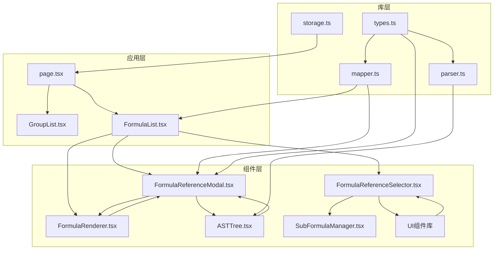
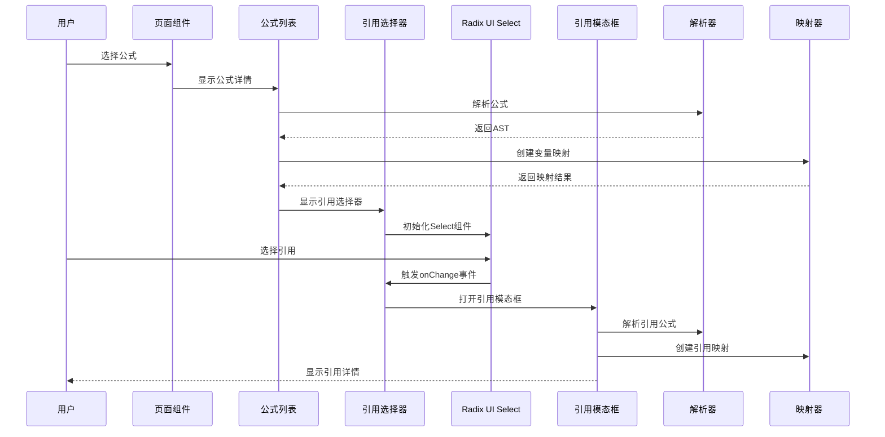
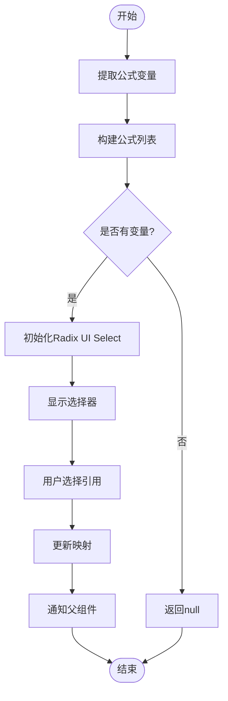
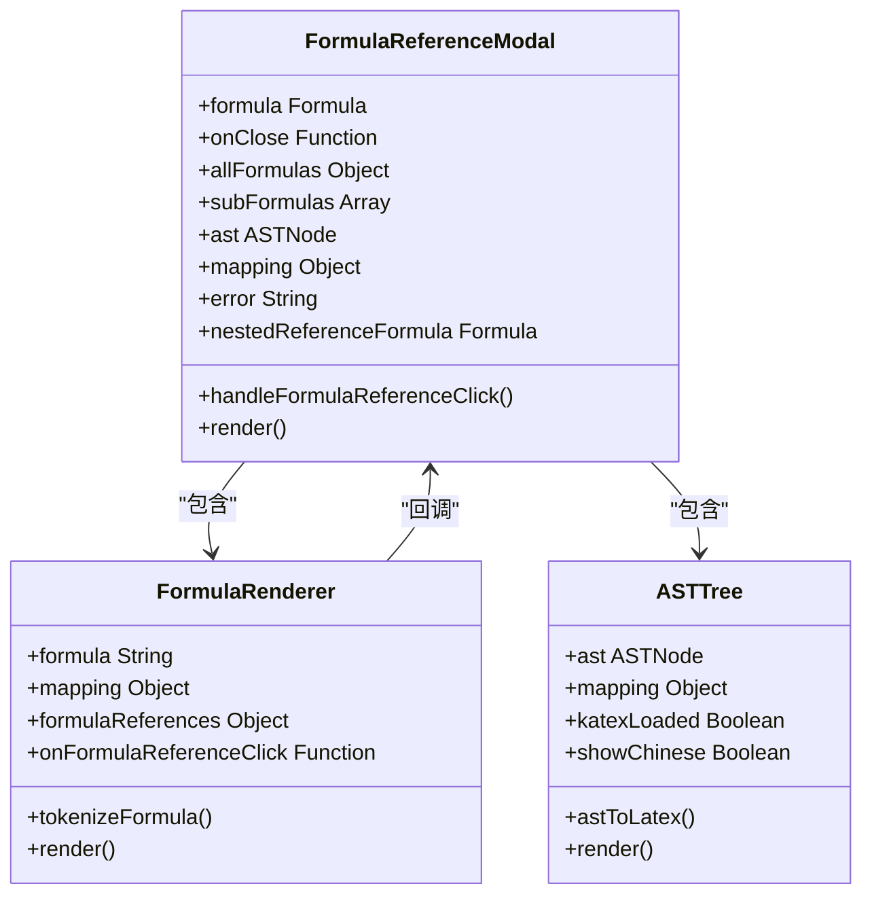
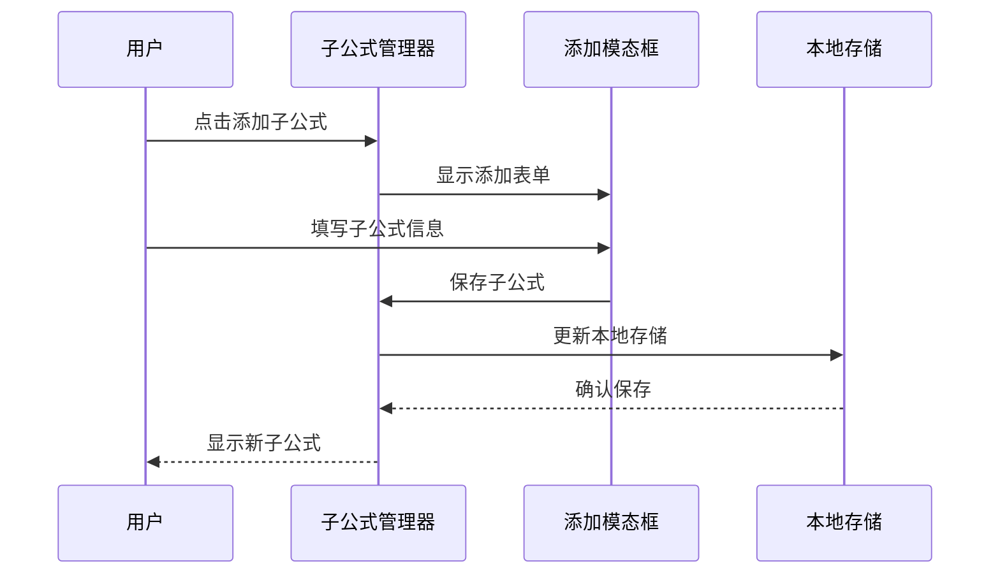
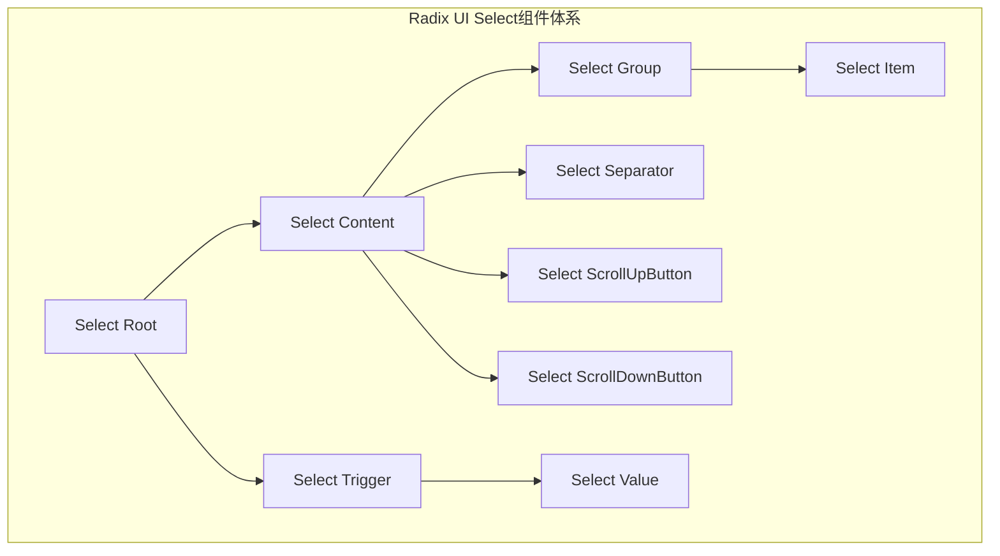
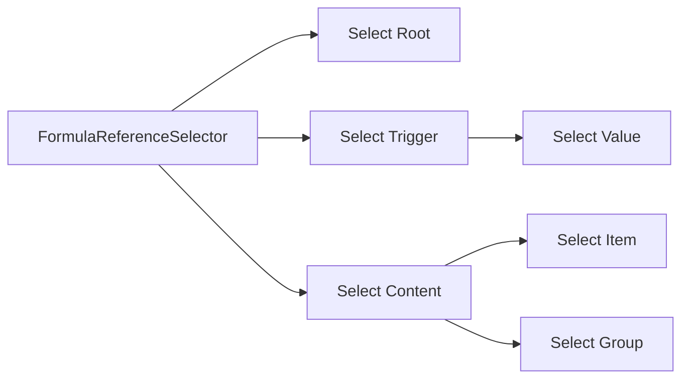
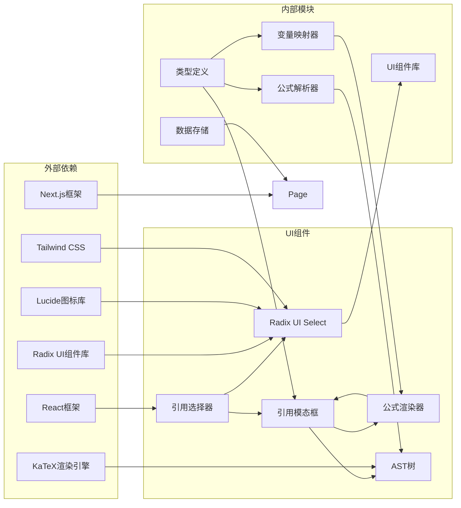

# 公式引用选择器

<cite>
**本文档引用的文件**
- [FormulaReferenceSelector.tsx](file://src/components/FormulaReferenceSelector.tsx)
- [FormulaReferenceModal.tsx](file://src/components/FormulaReferenceModal.tsx)
- [FormulaList.tsx](file://src/components/FormulaList.tsx)
- [FormulaRenderer.tsx](file://src/components/FormulaRenderer.tsx)
- [SubFormulaManager.tsx](file://src/components/SubFormulaManager.tsx)
- [page.tsx](file://src/app/page.tsx)
- [parser.ts](file://src/lib/parser.ts)
- [mapper.ts](file://src/lib/mapper.ts)
- [types.ts](file://src/lib/types.ts)
- [storage.ts](file://src/lib/storage.ts)
- [ASTTree.tsx](file://src/components/ASTTree.tsx)
- [GroupList.tsx](file://src/components/GroupList.tsx)
- [select.tsx](file://src/components/ui/select.tsx)
</cite>

## 更新摘要
**变更内容**
- 更新了公式引用选择器实现，从原生select升级为基于Radix UI的Select组件
- 新增了Radix UI Select组件的详细使用说明和配置
- 更新了UI组件架构图以反映新的组件结构
- 增强了用户体验和视觉效果的描述

## 目录
1. [简介](#简介)
2. [项目结构](#项目结构)
3. [核心组件](#核心组件)
4. [架构概览](#架构概览)
5. [详细组件分析](#详细组件分析)
6. [Radix UI Select组件详解](#radix-ui-select组件详解)
7. [依赖关系分析](#依赖关系分析)
8. [性能考虑](#性能考虑)
9. [故障排除指南](#故障排除指南)
10. [结论](#结论)

## 简介

公式引用选择器是一个强大的公式管理系统，允许用户在公式中建立变量引用关系。该系统提供了完整的公式引用功能，包括公式列表获取、过滤机制、选择逻辑、引用关系建立、循环引用检测以及引用模态框的使用方法。

**重大更新**：系统已从原生HTML select元素升级为基于Radix UI的Select组件，提供了更优秀的用户体验、无障碍访问支持和视觉一致性。

系统支持两种类型的公式引用：
- **单选模式**：为每个变量选择一个外部公式或子公式进行引用
- **多选模式**：通过子公式管理器创建和管理多个子公式引用

## 项目结构

该项目采用模块化的React组件架构，主要分为以下几个层次：

**图表来源**
- [page.tsx:14-798](file://src/app/page.tsx#L14-L798)
- [FormulaList.tsx:1-387](file://src/components/FormulaList.tsx#L1-L387)
- [FormulaReferenceSelector.tsx:1-185](file://src/components/FormulaReferenceSelector.tsx#L1-L185)

**章节来源**
- [page.tsx:14-798](file://src/app/page.tsx#L14-L798)
- [GroupList.tsx:1-294](file://src/components/GroupList.tsx#L1-L294)

## 核心组件

### 公式引用选择器 (FormulaReferenceSelector)

公式引用选择器是引用功能的核心组件，负责为公式中的变量建立引用关系。它提供了直观的用户界面来选择变量对应的公式。

**主要功能特性：**
- 自动提取公式中的变量
- 支持子公式和外部公式的混合选择
- 实时显示变量与公式的对应关系
- 提供清晰的视觉反馈
- **新增**：基于Radix UI的现代化Select组件

**更新**：现在使用Radix UI的Select组件替代原生HTML select，提供更好的键盘导航、无障碍访问和视觉一致性。

**章节来源**
- [FormulaReferenceSelector.tsx:14-185](file://src/components/FormulaReferenceSelector.tsx#L14-L185)

### 公式引用模态框 (FormulaReferenceModal)

公式引用模态框提供了公式的详细视图和交互功能，支持嵌套引用和深度浏览。

**核心功能：**
- 展示变量映射关系
- 提供公式渲染预览
- 支持嵌套引用导航
- 显示AST结构树

**章节来源**
- [FormulaReferenceModal.tsx:18-180](file://src/components/FormulaReferenceModal.tsx#L18-L180)

### 公式渲染器 (FormulaRenderer)

公式渲染器负责将公式转换为美观的可视化界面，支持变量高亮和引用点击功能。

**技术特点：**
- 基于KaTeX的数学公式渲染
- 变量颜色编码系统
- 引用点击事件处理
- 响应式布局设计

**章节来源**
- [FormulaRenderer.tsx:27-169](file://src/components/FormulaRenderer.tsx#L27-L169)

## 架构概览

系统采用分层架构设计，确保各组件职责明确且相互解耦：

**图表来源**
- [page.tsx:422-450](file://src/app/page.tsx#L422-L450)
- [FormulaList.tsx:169-192](file://src/components/FormulaList.tsx#L169-L192)
- [FormulaReferenceSelector.tsx:39-47](file://src/components/FormulaReferenceSelector.tsx#L39-L47)

## 详细组件分析

### 公式引用选择器工作流程

**图表来源**
- [FormulaReferenceSelector.tsx:21-47](file://src/components/FormulaReferenceSelector.tsx#L21-L47)

**章节来源**
- [FormulaReferenceSelector.tsx:115-185](file://src/components/FormulaReferenceSelector.tsx#L115-L185)

### 公式引用建立机制

系统支持两种引用类型：

#### 外部公式引用
- 通过 `formulaId` 标识外部公式
- 支持跨分组引用
- 实时验证引用有效性

#### 子公式引用
- 使用 `sub_formulaId` 标识子公式
- 以 `sub_` 前缀区分
- 支持复杂嵌套引用

**章节来源**
- [FormulaReferenceModal.tsx:50-82](file://src/components/FormulaReferenceModal.tsx#L50-L82)
- [FormulaList.tsx:194-228](file://src/components/FormulaList.tsx#L194-L228)

### 引用模态框功能详解

**图表来源**
- [FormulaReferenceModal.tsx:10-16](file://src/components/FormulaReferenceModal.tsx#L10-L16)
- [FormulaRenderer.tsx:6-11](file://src/components/FormulaRenderer.tsx#L6-L11)
- [ASTTree.tsx:6-9](file://src/components/ASTTree.tsx#L6-L9)

**章节来源**
- [FormulaReferenceModal.tsx:18-179](file://src/components/FormulaReferenceModal.tsx#L18-L179)

### 子公式管理系统

子公式管理器提供了完整的子公式生命周期管理：

**图表来源**
- [SubFormulaManager.tsx:26-63](file://src/components/SubFormulaManager.tsx#L26-L63)

**章节来源**
- [SubFormulaManager.tsx:12-201](file://src/components/SubFormulaManager.tsx#L12-L201)

## Radix UI Select组件详解

### 组件架构

Radix UI Select组件提供了现代化的选择器解决方案，具有以下核心特性：

**图表来源**
- [select.tsx:9-161](file://src/components/ui/select.tsx#L9-L161)

### 主要组件功能

#### Select Root
- 作为整个Select组件的根容器
- 管理全局状态和上下文
- 处理键盘导航和焦点管理

#### Select Trigger
- 用户交互的主要入口点
- 显示当前选中的值
- 处理下拉菜单的打开/关闭
- 支持自定义样式类名

#### Select Content
- 下拉菜单的内容容器
- 提供滚动区域和动画效果
- 支持弹出位置计算
- 包含滚动按钮

#### Select Item
- 单个选项的渲染组件
- 显示选项内容和选中状态指示器
- 支持键盘导航和点击选择
- 提供可访问性支持

### 集成到公式引用选择器

在FormulaReferenceSelector中，Radix UI Select组件被精心集成以提供最佳用户体验：

**图表来源**
- [FormulaReferenceSelector.tsx:92-149](file://src/components/FormulaReferenceSelector.tsx#L92-L149)

### 优势特性

1. **无障碍访问**：完全符合WCAG标准，支持屏幕阅读器
2. **键盘导航**：完整的键盘操作支持
3. **动画效果**：流畅的展开/收起动画
4. **样式定制**：高度可定制的CSS变量支持
5. **性能优化**：虚拟滚动支持大量选项
6. **响应式设计**：自动适配不同屏幕尺寸

**章节来源**
- [select.tsx:1-161](file://src/components/ui/select.tsx#L1-L161)
- [FormulaReferenceSelector.tsx:92-149](file://src/components/FormulaReferenceSelector.tsx#L92-L149)

## 依赖关系分析

系统的核心依赖关系如下：

**图表来源**
- [ASTTree.tsx:120-142](file://src/components/ASTTree.tsx#L120-L142)
- [FormulaReferenceSelector.tsx:1-12](file://src/components/FormulaReferenceSelector.tsx#L1-L12)

**章节来源**
- [parser.ts:1-159](file://src/lib/parser.ts#L1-L159)
- [mapper.ts:1-89](file://src/lib/mapper.ts#L1-L89)

## 性能考虑

### 缓存策略

系统采用了多层次的缓存机制来优化性能：

1. **变量提取缓存**：使用 `useMemo` 缓存变量提取结果
2. **公式列表缓存**：缓存合并后的公式列表
3. **解析结果缓存**：避免重复解析相同公式
4. **Select组件缓存**：Radix UI Select组件的状态缓存

### 优化技巧

1. **懒加载渲染**：只在需要时解析和渲染公式
2. **虚拟滚动**：对于大量公式的场景使用虚拟滚动
3. **防抖搜索**：搜索功能使用防抖减少重渲染
4. **增量更新**：只更新发生变化的数据
5. **Select组件优化**：Radix UI Select的高性能实现

### 内存管理

- 及时清理不再使用的状态
- 合理使用 `useEffect` 清理函数
- 避免内存泄漏的闭包引用
- **新增**：Radix UI组件的自动内存管理

## 故障排除指南

### 常见问题及解决方案

#### 公式解析错误
**症状**：公式显示解析错误
**原因**：公式语法不符合规范
**解决方案**：
1. 检查括号是否匹配
2. 确认运算符使用正确
3. 验证变量命名规则

#### 引用循环检测
**症状**：引用关系导致无限递归
**解决方案**：
1. 在引用建立时检测循环依赖
2. 提供循环引用警告
3. 允许用户手动断开循环链

#### 性能问题
**症状**：页面响应缓慢
**原因**：大量公式同时渲染
**解决方案**：
1. 实施虚拟滚动
2. 延迟加载非关键内容
3. 优化重渲染逻辑

#### Radix UI Select问题
**症状**：Select组件显示异常或功能失效
**原因**：组件配置错误或样式冲突
**解决方案**：
1. 检查组件导入路径
2. 验证CSS类名冲突
3. 确认Radix UI Provider正确配置
4. 检查焦点管理和键盘导航

**章节来源**
- [parser.ts:120-157](file://src/lib/parser.ts#L120-L157)
- [FormulaList.tsx:169-192](file://src/components/FormulaList.tsx#L169-L192)

## 结论

公式引用选择器系统提供了一个完整、高效且用户友好的公式引用管理解决方案。通过模块化的架构设计、智能的缓存策略和完善的错误处理机制，系统能够满足复杂的公式引用需求。

**主要优势：**
- 直观的用户界面和交互体验
- **新增**：基于Radix UI的现代化Select组件，提供更好的无障碍访问和视觉一致性
- 强大的引用管理和循环检测
- 高性能的渲染和缓存机制
- 完善的错误处理和故障恢复

**未来改进方向：**
- 增加引用关系的可视化图表
- 实现引用版本控制和历史追踪
- 支持批量引用操作和模板功能
- 优化移动端用户体验
- **新增**：进一步扩展Radix UI组件的功能和定制能力

**Radix UI升级带来的价值：**
- 提升了组件的可访问性和用户体验
- 提供了更好的键盘导航支持
- 增强了视觉一致性和品牌体验
- 为未来的功能扩展奠定了坚实基础