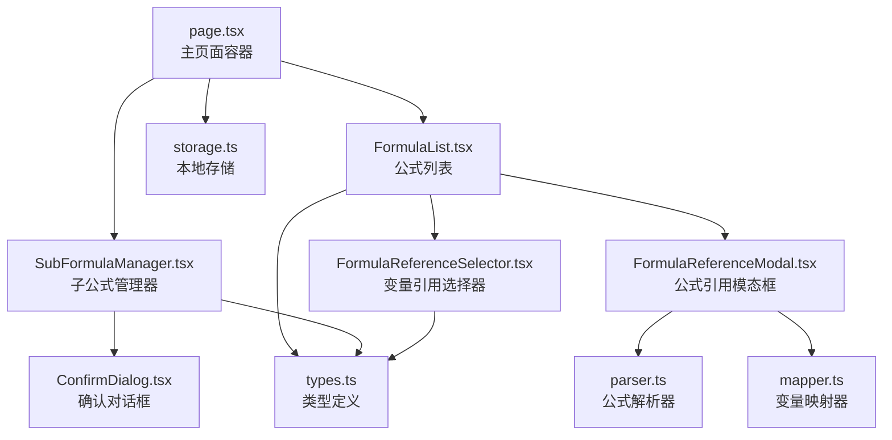
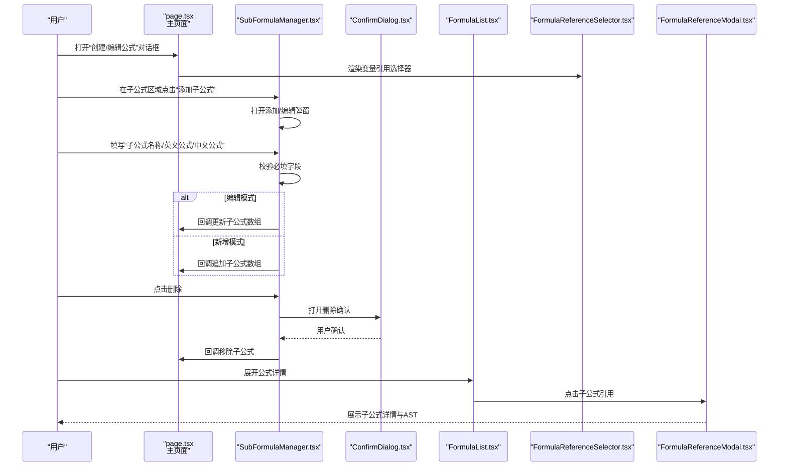
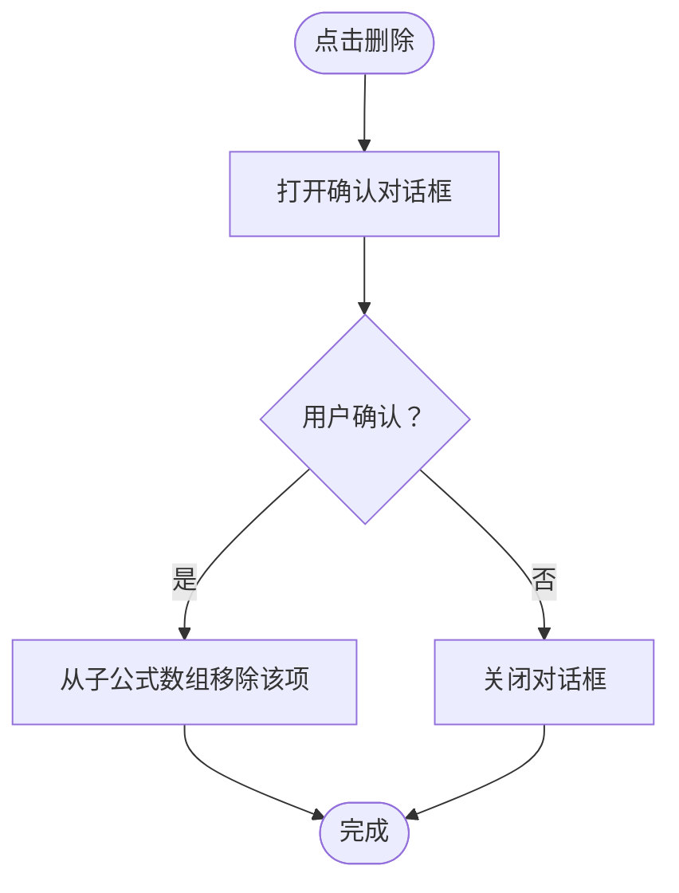
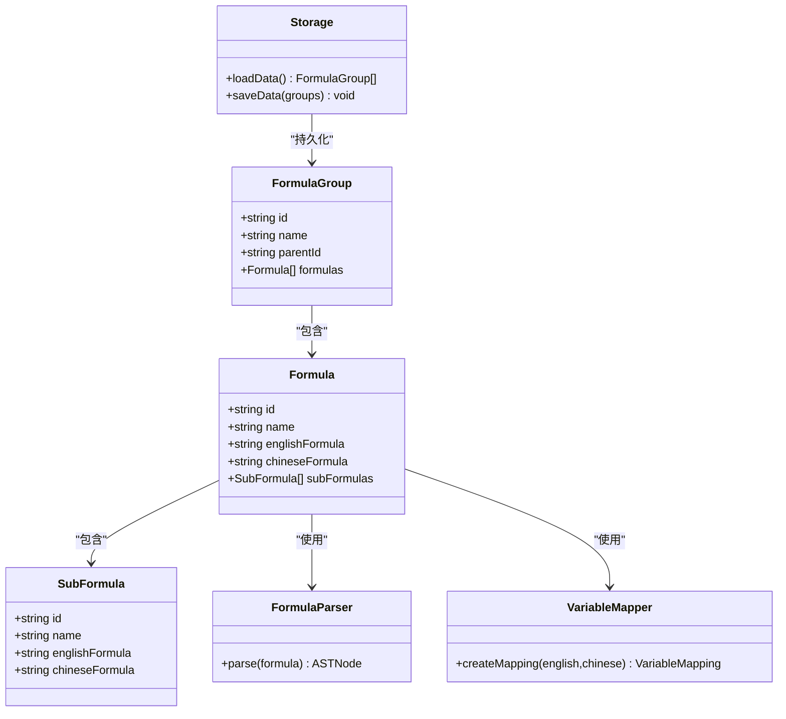

# 子公式管理

<cite>
**本文档引用的文件**
- [SubFormulaManager.tsx](file://src/components/SubFormulaManager.tsx)
- [types.ts](file://src/lib/types.ts)
- [page.tsx](file://src/app/page.tsx)
- [FormulaList.tsx](file://src/components/FormulaList.tsx)
- [FormulaReferenceSelector.tsx](file://src/components/FormulaReferenceSelector.tsx)
- [FormulaReferenceModal.tsx](file://src/components/FormulaReferenceModal.tsx)
- [ConfirmDialog.tsx](file://src/components/ConfirmDialog.tsx)
- [parser.ts](file://src/lib/parser.ts)
- [mapper.ts](file://src/lib/mapper.ts)
- [storage.ts](file://src/lib/storage.ts)
- [importExport.ts](file://src/lib/importExport.ts)
</cite>

## 目录
1. [简介](#简介)
2. [项目结构](#项目结构)
3. [核心组件](#核心组件)
4. [架构总览](#架构总览)
5. [详细组件分析](#详细组件分析)
6. [依赖分析](#依赖分析)
7. [性能考虑](#性能考虑)
8. [故障排查指南](#故障排查指南)
9. [结论](#结论)
10. [附录](#附录)

## 简介
本指南面向“子公式管理”功能，提供从创建、编辑到删除的完整操作说明，并结合代码实现解析其数据模型、验证规则、交互流程与依赖关系。读者无需深入技术背景即可按步骤完成子公式的生命周期管理。

## 项目结构
子公式管理位于应用的主页面中，作为“创建/编辑公式”对话框的一个子模块出现，同时在“公式列表”的展开项中可被引用与查看。

图表来源
- [page.tsx:631-737](file://src/app/page.tsx#L631-L737)
- [SubFormulaManager.tsx:1-201](file://src/components/SubFormulaManager.tsx#L1-L201)
- [FormulaList.tsx:1-387](file://src/components/FormulaList.tsx#L1-L387)
- [FormulaReferenceSelector.tsx:1-132](file://src/components/FormulaReferenceSelector.tsx#L1-L132)
- [FormulaReferenceModal.tsx:1-180](file://src/components/FormulaReferenceModal.tsx#L1-L180)
- [ConfirmDialog.tsx:1-54](file://src/components/ConfirmDialog.tsx#L1-L54)
- [storage.ts:1-50](file://src/lib/storage.ts#L1-L50)
- [parser.ts:1-159](file://src/lib/parser.ts#L1-L159)
- [mapper.ts:1-89](file://src/lib/mapper.ts#L1-L89)
- [types.ts:1-51](file://src/lib/types.ts#L1-L51)

章节来源
- [page.tsx:631-737](file://src/app/page.tsx#L631-L737)
- [SubFormulaManager.tsx:1-201](file://src/components/SubFormulaManager.tsx#L1-L201)
- [FormulaList.tsx:1-387](file://src/components/FormulaList.tsx#L1-L387)
- [FormulaReferenceSelector.tsx:1-132](file://src/components/FormulaReferenceSelector.tsx#L1-L132)
- [FormulaReferenceModal.tsx:1-180](file://src/components/FormulaReferenceModal.tsx#L1-L180)
- [ConfirmDialog.tsx:1-54](file://src/components/ConfirmDialog.tsx#L1-L54)
- [storage.ts:1-50](file://src/lib/storage.ts#L1-L50)
- [parser.ts:1-159](file://src/lib/parser.ts#L1-L159)
- [mapper.ts:1-89](file://src/lib/mapper.ts#L1-L89)
- [types.ts:1-51](file://src/lib/types.ts#L1-L51)

## 核心组件
- SubFormulaManager：负责子公式的增删改查与表单交互，提供添加/编辑弹窗与删除确认。
- FormulaReferenceSelector：在创建/编辑公式时，为变量选择引用的子公式或外部公式。
- FormulaReferenceModal：展示子公式或外部公式详情（变量映射、公式展示、AST树）。
- ConfirmDialog：通用确认对话框，用于删除等危险操作。
- types：定义 SubFormula、Formula、FormulaGroup 等核心数据结构。
- parser/mapper：解析英文公式为AST并生成变量映射，供展示与引用。
- storage：封装本地存储的加载/保存与ID生成逻辑。

章节来源
- [SubFormulaManager.tsx:1-201](file://src/components/SubFormulaManager.tsx#L1-L201)
- [FormulaReferenceSelector.tsx:1-132](file://src/components/FormulaReferenceSelector.tsx#L1-L132)
- [FormulaReferenceModal.tsx:1-180](file://src/components/FormulaReferenceModal.tsx#L1-L180)
- [ConfirmDialog.tsx:1-54](file://src/components/ConfirmDialog.tsx#L1-L54)
- [types.ts:1-51](file://src/lib/types.ts#L1-L51)
- [parser.ts:1-159](file://src/lib/parser.ts#L1-L159)
- [mapper.ts:1-89](file://src/lib/mapper.ts#L1-L89)
- [storage.ts:1-50](file://src/lib/storage.ts#L1-L50)

## 架构总览
子公式管理贯穿“创建/编辑公式对话框”与“公式列表展开详情”。用户在创建/编辑公式时，通过 SubFormulaManager 维护子公式集合；在公式详情中，子公式可通过 FormulaReferenceSelector 与 FormulaReferenceModal 进行引用与查看。

图表来源
- [page.tsx:631-737](file://src/app/page.tsx#L631-L737)
- [SubFormulaManager.tsx:26-74](file://src/components/SubFormulaManager.tsx#L26-L74)
- [FormulaList.tsx:194-228](file://src/components/FormulaList.tsx#L194-L228)
- [FormulaReferenceSelector.tsx:39-47](file://src/components/FormulaReferenceSelector.tsx#L39-L47)
- [FormulaReferenceModal.tsx:84-87](file://src/components/FormulaReferenceModal.tsx#L84-L87)
- [ConfirmDialog.tsx:16-25](file://src/components/ConfirmDialog.tsx#L16-L25)

## 详细组件分析

### 子公式创建流程
- 表单字段
  - 子公式名称：用于显示与标识，必填。
  - 英文公式：用于解析AST与变量映射，必填。
  - 中文公式：用于中文变量映射，必填。
- 验证规则
  - 三字段均不能为空白。
  - 若为编辑模式，将保留原ID；否则生成新ID。
- 命名规范
  - 建议使用简洁明确的描述性名称，便于在公式引用中识别。
  - 英文公式应遵循变量命名规范（字母开头，允许数字），避免特殊字符干扰解析。
- 交互流程
  - 点击“添加子公式”，打开弹窗，清空表单。
  - 填写完成后点击“保存”，触发校验与回调更新父级公式表单的子公式数组。

章节来源
- [SubFormulaManager.tsx:20-63](file://src/components/SubFormulaManager.tsx#L20-L63)
- [page.tsx:711-715](file://src/app/page.tsx#L711-L715)

### 子公式编辑功能
- 修改公式内容
  - 在编辑模式下，表单会预填当前子公式的三个字段。
  - 修改后保存，父级公式表单接收更新后的子公式数组。
- 更新显示名称
  - 名称字段直接更新，不影响内部ID。
- 保持唯一性
  - 子公式本身不强制全局唯一，但建议在业务上保证同一公式内的名称唯一，避免混淆。
  - 若需要跨公式引用，建议通过变量映射与引用选择器进行关联，而非依赖名称。

章节来源
- [SubFormulaManager.tsx:32-63](file://src/components/SubFormulaManager.tsx#L32-L63)
- [FormulaReferenceSelector.tsx:39-47](file://src/components/FormulaReferenceSelector.tsx#L39-L47)

### 子公式删除机制
- 删除确认对话框
  - 点击删除按钮后，弹出通用确认对话框，标题与消息根据上下文动态设置。
- 数据清理
  - 确认后，从父级公式表单的子公式数组中移除对应项。
- 依赖关系处理
  - 子公式删除不会自动清理引用关系；若其他公式引用了该子公式，需在变量映射中手动解除。
  - 在公式详情中，引用子公式时会优先使用子公式数组中的条目，若子公式不存在则引用失效。

图表来源
- [SubFormulaManager.tsx:65-74](file://src/components/SubFormulaManager.tsx#L65-L74)
- [ConfirmDialog.tsx:16-25](file://src/components/ConfirmDialog.tsx#L16-L25)

章节来源
- [SubFormulaManager.tsx:65-74](file://src/components/SubFormulaManager.tsx#L65-L74)
- [ConfirmDialog.tsx:16-25](file://src/components/ConfirmDialog.tsx#L16-L25)

### 子公式在公式中的引用与展示
- 变量映射
  - FormulaReferenceSelector 会从英文公式中提取变量，并允许为每个变量选择引用的子公式或外部公式。
  - 选择“子公式”时，值以特定前缀标识，以便 FormulaList 在解析引用时区分来源。
- 公式展示与AST
  - FormulaReferenceModal 展示变量映射、公式展示与AST树，支持嵌套引用跳转。
- 依赖关系
  - 子公式删除后，若仍有变量映射指向该子公式，引用将失效或显示为未定义。

章节来源
- [FormulaReferenceSelector.tsx:39-47](file://src/components/FormulaReferenceSelector.tsx#L39-L47)
- [FormulaList.tsx:194-228](file://src/components/FormulaList.tsx#L194-L228)
- [FormulaReferenceModal.tsx:49-82](file://src/components/FormulaReferenceModal.tsx#L49-L82)

## 依赖分析
- 类型与数据模型
  - SubFormula 定义于 types.ts，包含 id、name、englishFormula、chineseFormula。
  - Formula 与 FormulaGroup 同样定义于 types.ts，支撑公式与分组的组织结构。
- 解析与映射
  - parser.ts 提供英文公式到AST的解析能力。
  - mapper.ts 提供变量提取与中英文映射生成。
- 本地存储
  - storage.ts 提供加载/保存与ID生成，确保数据持久化。
- 交互组件
  - SubFormulaManager 与 ConfirmDialog 协作完成增删改查与确认。
  - FormulaReferenceSelector 与 FormulaReferenceModal 协作完成变量引用与详情展示。

图表来源
- [types.ts:27-50](file://src/lib/types.ts#L27-L50)
- [parser.ts:3-22](file://src/lib/parser.ts#L3-L22)
- [mapper.ts:3-70](file://src/lib/mapper.ts#L3-L70)
- [storage.ts:5-25](file://src/lib/storage.ts#L5-L25)

章节来源
- [types.ts:27-50](file://src/lib/types.ts#L27-L50)
- [parser.ts:3-22](file://src/lib/parser.ts#L3-L22)
- [mapper.ts:3-70](file://src/lib/mapper.ts#L3-L70)
- [storage.ts:5-25](file://src/lib/storage.ts#L5-L25)

## 性能考虑
- 渲染优化
  - FormulaReferenceSelector 使用 useMemo 缓存变量提取与公式列表，减少重复计算。
  - FormulaList 在展开时才解析AST与生成映射，收起时清空状态，避免不必要的渲染。
- 解析成本
  - AST解析与变量映射在展开时触发，建议控制公式复杂度，避免超长公式导致解析耗时。
- 存储与导入导出
  - 导出为JSON文件，导入时进行格式校验与结构验证，避免大文件导入造成阻塞。

章节来源
- [FormulaReferenceSelector.tsx:21-34](file://src/components/FormulaReferenceSelector.tsx#L21-L34)
- [FormulaList.tsx:169-192](file://src/components/FormulaList.tsx#L169-L192)
- [importExport.ts:43-75](file://src/lib/importExport.ts#L43-L75)

## 故障排查指南
- 子公式保存失败
  - 现象：点击保存后无反应或弹出提示。
  - 排查：确认三字段均非空；检查英文公式是否符合变量命名与括号匹配规则。
- 删除确认无效
  - 现象：点击删除后无任何提示或未删除。
  - 排查：确认 ConfirmDialog 正常渲染；检查父级回调是否正确传递。
- 引用失效
  - 现象：在公式详情中点击子公式引用无响应或显示异常。
  - 排查：确认子公式仍存在于当前公式表单的 subFormulas 数组中；检查变量映射键值是否正确。
- 导入/导出异常
  - 现象：导入失败或导出文件不可用。
  - 排查：检查JSON格式与版本字段；确认网络请求成功或文件读取正常。

章节来源
- [SubFormulaManager.tsx:42-46](file://src/components/SubFormulaManager.tsx#L42-L46)
- [ConfirmDialog.tsx:16-25](file://src/components/ConfirmDialog.tsx#L16-L25)
- [FormulaList.tsx:194-228](file://src/components/FormulaList.tsx#L194-L228)
- [importExport.ts:80-119](file://src/lib/importExport.ts#L80-L119)

## 结论
子公式管理通过清晰的表单校验、直观的确认对话框与完善的引用展示，实现了从创建到删除的闭环。配合变量映射与AST解析，用户可以高效地组织与维护复杂的公式体系。建议在实际使用中遵循命名规范与结构设计，定期清理不再使用的子公式，以维持良好的可维护性。

## 附录

### 最佳实践
- 命名约定
  - 子公式名称应简洁明确，便于在变量映射中快速识别。
  - 英文公式变量采用统一命名风格（如驼峰），避免歧义。
- 公式结构设计
  - 将通用逻辑拆分为子公式，减少重复与耦合。
  - 控制公式长度与嵌套深度，提升解析与渲染性能。
- 维护策略
  - 删除子公式前，先在变量映射中解除引用。
  - 定期导出备份，防止误删或数据丢失。
  - 使用分组与层级结构组织公式，提高查找效率。

### 常见问题解答
- 如何确保子公式名称唯一？
  - 在同一公式内保持名称唯一；跨公式引用通过变量映射与引用选择器实现。
- 删除子公式会影响哪些地方？
  - 影响当前公式表单的变量映射与引用；若其他公式引用该子公式，需手动解除。
- 如何验证英文公式是否正确？
  - 在公式详情中查看AST树与变量映射，若解析报错，修正公式语法。