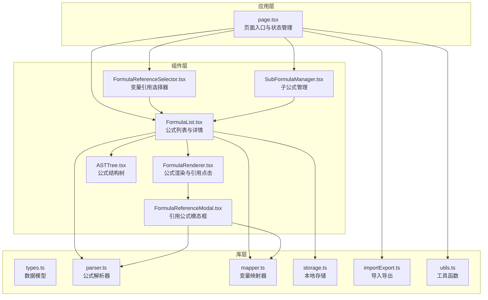
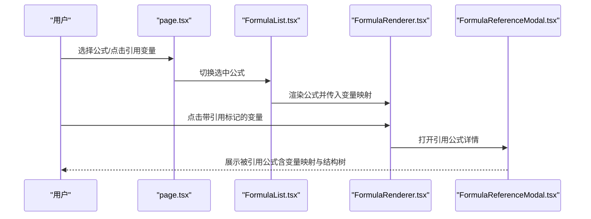
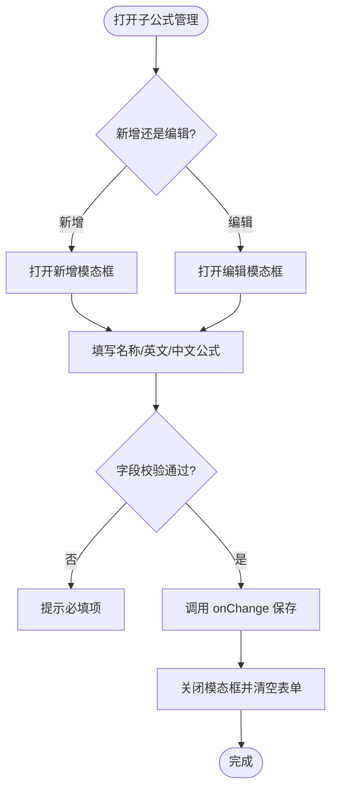
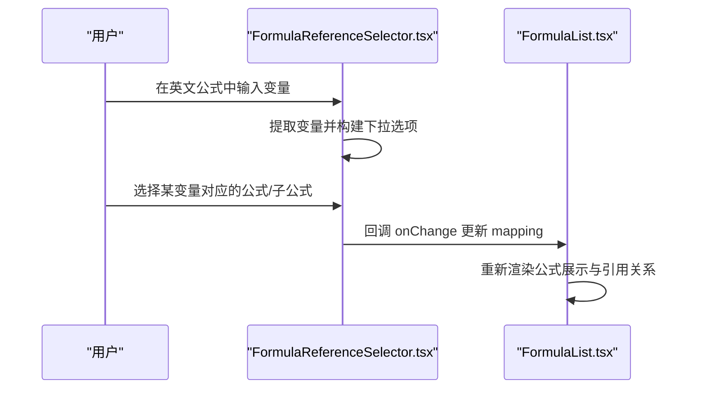
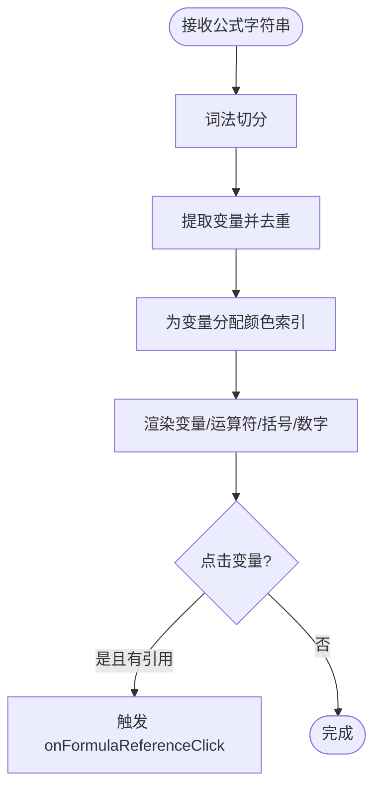
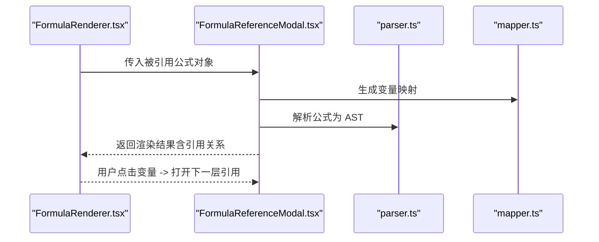
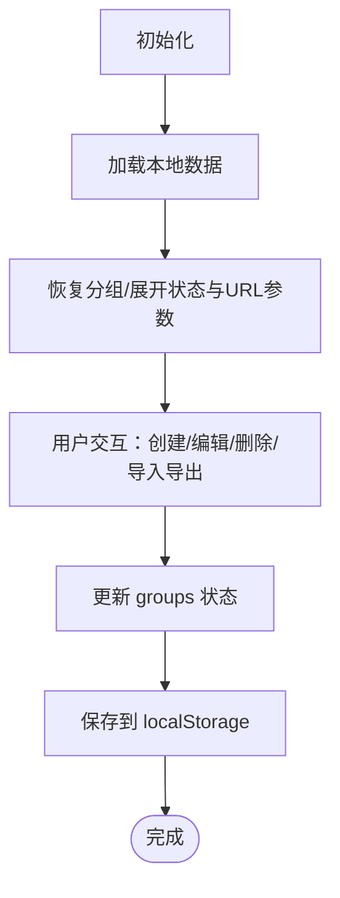
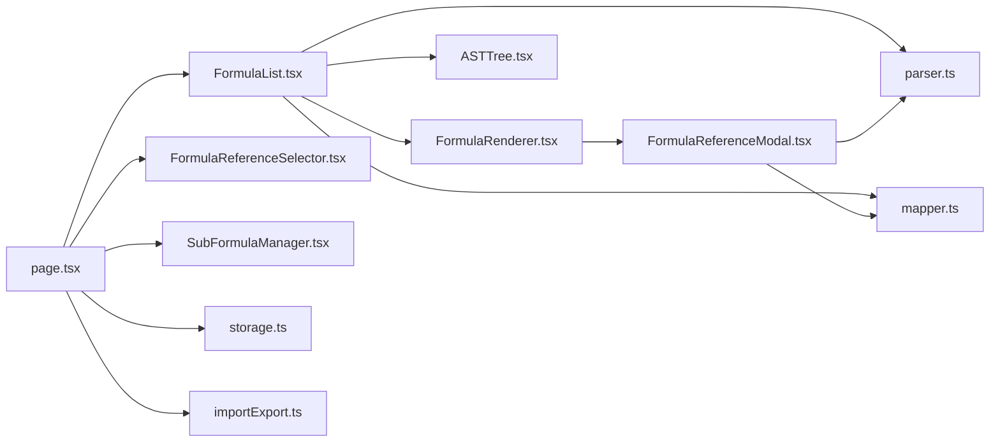

# 高级功能

<cite>
**本文档引用的文件**
- [page.tsx](file://src/app/page.tsx)
- [FormulaList.tsx](file://src/components/FormulaList.tsx)
- [FormulaRenderer.tsx](file://src/components/FormulaRenderer.tsx)
- [FormulaReferenceSelector.tsx](file://src/components/FormulaReferenceSelector.tsx)
- [FormulaReferenceModal.tsx](file://src/components/FormulaReferenceModal.tsx)
- [SubFormulaManager.tsx](file://src/components/SubFormulaManager.tsx)
- [ASTTree.tsx](file://src/components/ASTTree.tsx)
- [parser.ts](file://src/lib/parser.ts)
- [mapper.ts](file://src/lib/mapper.ts)
- [types.ts](file://src/lib/types.ts)
- [storage.ts](file://src/lib/storage.ts)
- [importExport.ts](file://src/lib/importExport.ts)
- [utils.ts](file://src/lib/utils.ts)
</cite>

## 目录
1. [简介](#简介)
2. [项目结构](#项目结构)
3. [核心组件](#核心组件)
4. [架构总览](#架构总览)
5. [详细组件分析](#详细组件分析)
6. [依赖关系分析](#依赖关系分析)
7. [性能考虑](#性能考虑)
8. [故障排查指南](#故障排查指南)
9. [结论](#结论)
10. [附录](#附录)

## 简介
本指南聚焦于“高级功能”，围绕以下能力提供系统化的使用与实践指导：
- 子公式管理：创建、编辑、删除、嵌套关系与继承机制
- 公式引用选择器：变量引用、跨公式引用、引用关系维护
- 高级变量映射：复杂映射规则、动态映射、批量操作
- 公式模板与快捷操作：模板化创建、快速引用、批量配置
- 性能优化与大数据量处理：缓存策略、懒加载、分页与虚拟化思路
- 扩展功能：分组体系、导入导出、URL 导入、嵌套引用链路

## 项目结构
该项目采用 Next.js 前端工程，核心逻辑集中在 lib 层（类型定义、解析器、映射器、存储），UI 组件位于 components 目录，页面入口在 app 目录。



图表来源
- [page.tsx:14-798](file://src/app/page.tsx#L14-L798)
- [FormulaList.tsx:1-387](file://src/components/FormulaList.tsx#L1-L387)
- [FormulaRenderer.tsx:1-169](file://src/components/FormulaRenderer.tsx#L1-L169)
- [FormulaReferenceSelector.tsx:1-132](file://src/components/FormulaReferenceSelector.tsx#L1-L132)
- [FormulaReferenceModal.tsx:1-180](file://src/components/FormulaReferenceModal.tsx#L1-L180)
- [SubFormulaManager.tsx:1-201](file://src/components/SubFormulaManager.tsx#L1-L201)
- [ASTTree.tsx](file://src/components/ASTTree.tsx)
- [parser.ts:1-159](file://src/lib/parser.ts#L1-L159)
- [mapper.ts:1-89](file://src/lib/mapper.ts#L1-L89)
- [types.ts:1-51](file://src/lib/types.ts#L1-L51)
- [storage.ts:1-50](file://src/lib/storage.ts#L1-L50)
- [importExport.ts](file://src/lib/importExport.ts)
- [utils.ts:1-7](file://src/lib/utils.ts#L1-L7)

章节来源
- [page.tsx:14-798](file://src/app/page.tsx#L14-L798)

## 核心组件
- 页面与状态管理：负责分组、公式、URL 参数同步、导入导出、创建/编辑/删除等主流程
- 公式列表与详情：展开/折叠、变量映射、公式展示、AST 结构树、引用模态框
- 公式渲染器：变量高亮、颜色区分、引用点击、工具提示
- 引用选择器：变量到公式/子公式的映射配置
- 子公式管理：增删改查、表单校验、确认对话框
- 解析器与映射器：词法分析、语法解析、变量提取与映射
- 存储与导入导出：本地持久化、JSON 导入导出、URL 导入

章节来源
- [page.tsx:14-798](file://src/app/page.tsx#L14-L798)
- [FormulaList.tsx:1-387](file://src/components/FormulaList.tsx#L1-L387)
- [FormulaRenderer.tsx:1-169](file://src/components/FormulaRenderer.tsx#L1-L169)
- [FormulaReferenceSelector.tsx:1-132](file://src/components/FormulaReferenceSelector.tsx#L1-L132)
- [SubFormulaManager.tsx:1-201](file://src/components/SubFormulaManager.tsx#L1-L201)
- [parser.ts:1-159](file://src/lib/parser.ts#L1-L159)
- [mapper.ts:1-89](file://src/lib/mapper.ts#L1-L89)
- [storage.ts:1-50](file://src/lib/storage.ts#L1-L50)
- [importExport.ts](file://src/lib/importExport.ts)

## 架构总览
系统采用“页面驱动的状态管理 + 组件化 UI + 库层工具”的分层设计。页面负责顶层状态与路由同步，组件负责具体交互与展示，库层提供解析、映射、存储等通用能力。



图表来源
- [page.tsx:14-798](file://src/app/page.tsx#L14-L798)
- [FormulaList.tsx:151-387](file://src/components/FormulaList.tsx#L151-L387)
- [FormulaRenderer.tsx:27-169](file://src/components/FormulaRenderer.tsx#L27-L169)
- [FormulaReferenceModal.tsx:18-180](file://src/components/FormulaReferenceModal.tsx#L18-L180)

## 详细组件分析

### 子公式管理（SubFormulaManager）
- 功能要点
  - 新增/编辑/删除子公式，表单校验（名称、英文公式、中文公式均非空）
  - 使用确认对话框防止误删
  - 通过回调 onChange 推送更新后的子公式数组
- 嵌套关系与继承机制
  - 子公式以独立实体存在于公式对象的 subFormulas 字段
  - 引用选择器中，子公式以 optgroup 形式列出，值前缀为 sub_，便于区分与解析
  - 渲染器与引用模态框在解析引用时，根据前缀判断来源（子公式 vs 外部公式）



图表来源
- [SubFormulaManager.tsx:12-201](file://src/components/SubFormulaManager.tsx#L12-L201)

章节来源
- [SubFormulaManager.tsx:12-201](file://src/components/SubFormulaManager.tsx#L12-L201)
- [FormulaReferenceSelector.tsx:75-96](file://src/components/FormulaReferenceSelector.tsx#L75-L96)
- [FormulaList.tsx:194-228](file://src/components/FormulaList.tsx#L194-L228)

### 公式引用选择器（FormulaReferenceSelector）
- 功能要点
  - 自动从英文公式提取变量集合（去重）
  - 下拉列表包含：子公式（optgroup）、外部公式（按分组分组）
  - 选择后通过回调 onChange 更新 variableFormulaMapping
  - 支持清除选择（空值）
- 引用关系维护
  - 保存格式：变量 -> 公式ID（子公式ID以 sub_ 前缀标识）
  - 渲染器与引用模态框据此构建引用映射，实现点击跳转与层级展开



图表来源
- [FormulaReferenceSelector.tsx:14-132](file://src/components/FormulaReferenceSelector.tsx#L14-L132)
- [FormulaList.tsx:194-228](file://src/components/FormulaList.tsx#L194-L228)

章节来源
- [FormulaReferenceSelector.tsx:14-132](file://src/components/FormulaReferenceSelector.tsx#L14-L132)
- [FormulaList.tsx:194-228](file://src/components/FormulaList.tsx#L194-L228)

### 公式渲染器（FormulaRenderer）
- 功能要点
  - 词法切分为变量/运算符/括号/数字
  - 为每个变量分配颜色，保持同一变量颜色一致
  - 若变量存在引用，显示引用标记并支持点击跳转
  - 点击引用变量触发 onFormulaReferenceClick，传入对应公式或子公式对象
- 颜色与样式
  - 使用一组预设颜色主题，提升可读性与区分度



图表来源
- [FormulaRenderer.tsx:27-169](file://src/components/FormulaRenderer.tsx#L27-L169)

章节来源
- [FormulaRenderer.tsx:27-169](file://src/components/FormulaRenderer.tsx#L27-L169)

### 引用公式模态框（FormulaReferenceModal）
- 功能要点
  - 解析被引用公式，生成变量映射与 AST
  - 支持嵌套引用：点击引用变量再次打开模态框，形成引用链
  - 与 FormulaList 的引用解析逻辑一致，区分子公式与外部公式
- 使用场景
  - 查看被引用公式的详细信息、变量映射与结构树
  - 快速定位上游公式，辅助理解复杂公式依赖



图表来源
- [FormulaReferenceModal.tsx:18-180](file://src/components/FormulaReferenceModal.tsx#L18-L180)
- [parser.ts:12-22](file://src/lib/parser.ts#L12-L22)
- [mapper.ts:52-87](file://src/lib/mapper.ts#L52-L87)

章节来源
- [FormulaReferenceModal.tsx:18-180](file://src/components/FormulaReferenceModal.tsx#L18-L180)
- [parser.ts:12-22](file://src/lib/parser.ts#L12-L22)
- [mapper.ts:52-87](file://src/lib/mapper.ts#L52-L87)

### 解析器与映射器
- 解析器（FormulaParser）
  - 词法分析：支持 + - * / 以及多种括号（含中文全角）
  - 语法解析：递归下降，支持四则运算优先级与括号
  - 错误处理：不完整表达式、括号不匹配、未知字符等
- 映射器（VariableMapper）
  - 提取英文变量：正则匹配单词边界
  - 提取中文变量：按运算符与括号分割，过滤纯数字与空串
  - 创建映射：按序建立英文变量到中文变量的键值对，并标注中文变量是否多于英文变量

```mermaid
classDiagram
class FormulaParser {
+parse(formula) ASTNode
+tokenize(formula) Token[]
-parseExpression() ASTNode
-parseTerm() ASTNode
-parseFactor() ASTNode
}
class VariableMapper {
+extractEnglishVariables(formula) string[]
+extractChineseVariables(formula) string[]
+createMapping(englishFormula, chineseFormula) VariableMapping
+formatMapping(mappingResult) {items, hasMoreChinese}
}
FormulaParser --> ASTNode : "生成"
VariableMapper --> VariableMapping : "生成"
```

图表来源
- [parser.ts:3-159](file://src/lib/parser.ts#L3-L159)
- [mapper.ts:3-89](file://src/lib/mapper.ts#L3-L89)
- [types.ts:6-50](file://src/lib/types.ts#L6-L50)

章节来源
- [parser.ts:3-159](file://src/lib/parser.ts#L3-L159)
- [mapper.ts:3-89](file://src/lib/mapper.ts#L3-L89)
- [types.ts:6-50](file://src/lib/types.ts#L6-L50)

### 页面与状态管理（page.tsx）
- 主要职责
  - 加载/保存分组与公式数据至本地存储
  - 管理分组选择、公式选择、URL 参数同步
  - 提供创建/编辑/删除公式、分组的交互流程
  - 支持导入导出与从 URL 导入
- 关键流程
  - 初始化：从 localStorage 恢复分组与展开状态；根据 URL 参数展开指定公式
  - 交互：创建/更新公式时，写入 variableFormulaMapping 与 subFormulas
  - 导入：覆盖当前数据，更新状态并保存



图表来源
- [page.tsx:85-134](file://src/app/page.tsx#L85-L134)
- [page.tsx:207-363](file://src/app/page.tsx#L207-L363)
- [storage.ts:5-25](file://src/lib/storage.ts#L5-L25)

章节来源
- [page.tsx:85-134](file://src/app/page.tsx#L85-L134)
- [page.tsx:207-363](file://src/app/page.tsx#L207-L363)
- [storage.ts:5-25](file://src/lib/storage.ts#L5-L25)

## 依赖关系分析
- 组件间耦合
  - FormulaList 依赖 FormulaRenderer、ASTTree、FormulaReferenceModal
  - FormulaReferenceSelector 依赖 FormulaList 的变量映射回写
  - SubFormulaManager 与 FormulaReferenceSelector 共同服务于 FormulaList 的引用配置
- 库层依赖
  - 解析器与映射器被 FormulaList 与 FormulaReferenceModal 复用
  - 存储模块贯穿页面与组件，确保数据持久化
- 外部依赖
  - Next.js 生态（路由、Suspense、SSR/CSR）
  - TailwindCSS 与 UI 组件库（Radix UI、Lucide）



图表来源
- [page.tsx:14-798](file://src/app/page.tsx#L14-L798)
- [FormulaList.tsx:1-387](file://src/components/FormulaList.tsx#L1-L387)
- [FormulaRenderer.tsx:1-169](file://src/components/FormulaRenderer.tsx#L1-L169)
- [FormulaReferenceSelector.tsx:1-132](file://src/components/FormulaReferenceSelector.tsx#L1-L132)
- [FormulaReferenceModal.tsx:1-180](file://src/components/FormulaReferenceModal.tsx#L1-L180)
- [SubFormulaManager.tsx:1-201](file://src/components/SubFormulaManager.tsx#L1-L201)
- [parser.ts:1-159](file://src/lib/parser.ts#L1-L159)
- [mapper.ts:1-89](file://src/lib/mapper.ts#L1-L89)
- [storage.ts:1-50](file://src/lib/storage.ts#L1-L50)
- [importExport.ts](file://src/lib/importExport.ts)

章节来源
- [page.tsx:14-798](file://src/app/page.tsx#L14-L798)
- [FormulaList.tsx:1-387](file://src/components/FormulaList.tsx#L1-L387)
- [FormulaRenderer.tsx:1-169](file://src/components/FormulaRenderer.tsx#L1-L169)
- [FormulaReferenceSelector.tsx:1-132](file://src/components/FormulaReferenceSelector.tsx#L1-L132)
- [FormulaReferenceModal.tsx:1-180](file://src/components/FormulaReferenceModal.tsx#L1-L180)
- [SubFormulaManager.tsx:1-201](file://src/components/SubFormulaManager.tsx#L1-L201)
- [parser.ts:1-159](file://src/lib/parser.ts#L1-L159)
- [mapper.ts:1-89](file://src/lib/mapper.ts#L1-L89)
- [storage.ts:1-50](file://src/lib/storage.ts#L1-L50)
- [importExport.ts](file://src/lib/importExport.ts)

## 性能考虑
- 计算缓存
  - FormulaReferenceSelector 使用 useMemo 缓存变量提取与公式列表，避免重复计算
  - FormulaList 在展开时才解析 AST 与映射，收起时清理状态，减少不必要的渲染
- 渲染优化
  - FormulaRenderer 为变量分配颜色索引，避免每次渲染都进行昂贵计算
  - 使用 CSS 类名控制样式，减少内联样式的开销
- 大数据量处理建议
  - 列表虚拟化：对 FormulaList 使用虚拟滚动，仅渲染可视区域
  - 分页加载：按分组或公式数量设置分页，延迟加载深层引用
  - 懒加载引用模态框：仅在点击时解析与渲染被引用公式
- 存储与导入导出
  - 导入导出采用一次性 JSON 文件，建议限制单文件大小与条目数量
  - 对超大数据集，考虑分批导入或增量更新策略

章节来源
- [FormulaReferenceSelector.tsx:21-34](file://src/components/FormulaReferenceSelector.tsx#L21-L34)
- [FormulaList.tsx:169-192](file://src/components/FormulaList.tsx#L169-L192)
- [FormulaRenderer.tsx:42-45](file://src/components/FormulaRenderer.tsx#L42-L45)

## 故障排查指南
- 解析错误
  - 现象：公式展示区域出现“解析错误”提示
  - 原因：表达式不完整、括号不匹配、包含不可识别字符
  - 处理：检查英文公式语法，确保括号成对、无多余字符
- 引用无效
  - 现象：变量引用显示为空或未生效
  - 原因：变量名不匹配、引用公式不存在、子公式 ID 前缀错误
  - 处理：确认变量名与英文公式一致；检查子公式 ID 是否以 sub_ 前缀；验证外部公式是否存在
- 删除误操作
  - 现象：误删公式导致引用断链
  - 处理：使用确认对话框；必要时通过导入导出恢复数据
- 导入失败
  - 现象：导入 JSON 或 URL 失败
  - 处理：检查文件格式与内容结构；确认网络可达；查看错误提示

章节来源
- [FormulaList.tsx:170-192](file://src/components/FormulaList.tsx#L170-L192)
- [FormulaReferenceSelector.tsx:39-47](file://src/components/FormulaReferenceSelector.tsx#L39-L47)
- [FormulaReferenceModal.tsx:30-45](file://src/components/FormulaReferenceModal.tsx#L30-L45)
- [page.tsx:374-420](file://src/app/page.tsx#L374-L420)

## 结论
本项目通过清晰的分层架构与组件化设计，提供了完整的公式变量映射与可视化能力。子公式管理、引用选择器与渲染器协同工作，实现了从“创建—配置—引用—展示”的闭环。结合缓存与懒加载策略，可在中大型数据规模下保持良好体验。建议在生产环境中进一步引入虚拟化与分页、完善错误边界与日志记录，并持续优化导入导出流程以适配更复杂的业务场景。

## 附录
- 公式模板与快捷操作
  - 模板化创建：在创建公式时，先输入英文公式与中文公式，再通过引用选择器快速绑定变量到子公式或外部公式
  - 快捷操作：利用引用点击直接跳转到被引用公式，支持嵌套引用链路，便于快速定位与核对
- 扩展功能使用场景
  - 分组体系：通过父子分组组织公式，支持按路径筛选与导出
  - 导入导出：支持本地文件与 URL 两种导入方式，便于团队协作与数据迁移
  - URL 导入：适合演示环境或远程配置中心，一键拉取最新公式集

章节来源
- [page.tsx:477-542](file://src/app/page.tsx#L477-L542)
- [page.tsx:739-786](file://src/app/page.tsx#L739-L786)
- [FormulaReferenceSelector.tsx:75-96](file://src/components/FormulaReferenceSelector.tsx#L75-L96)