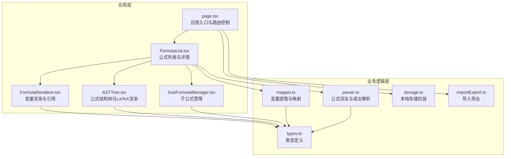
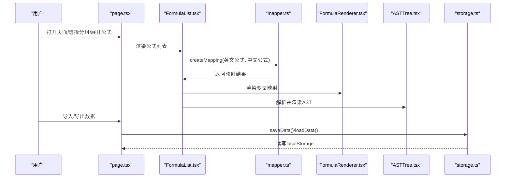
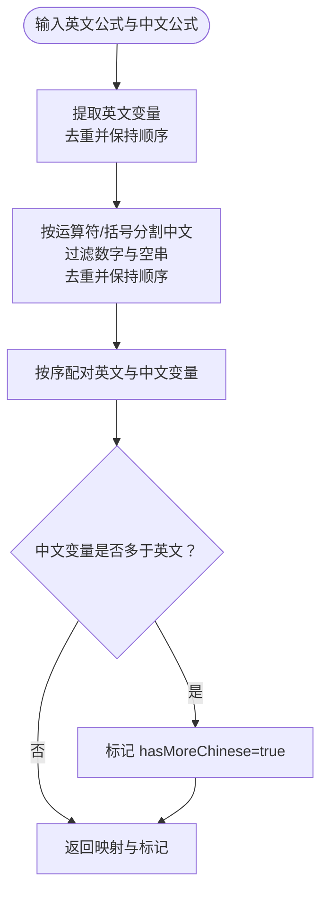
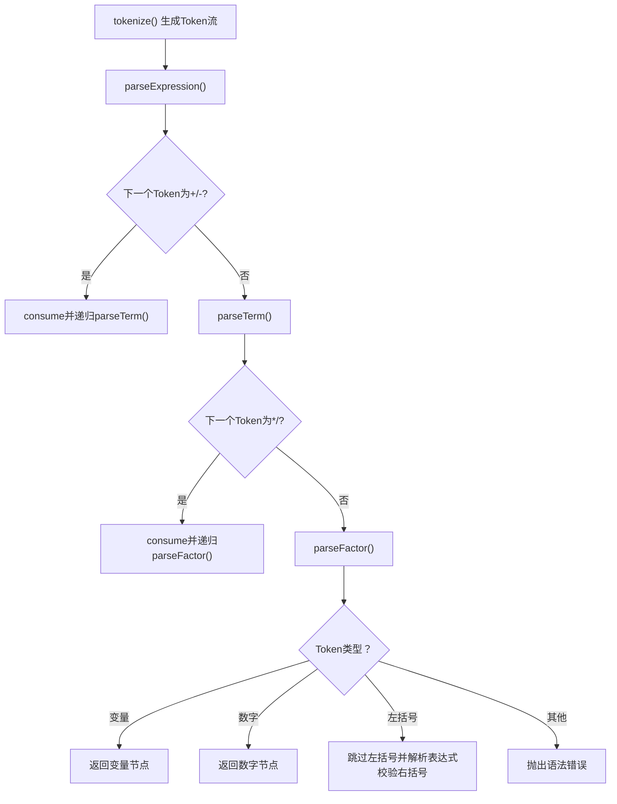
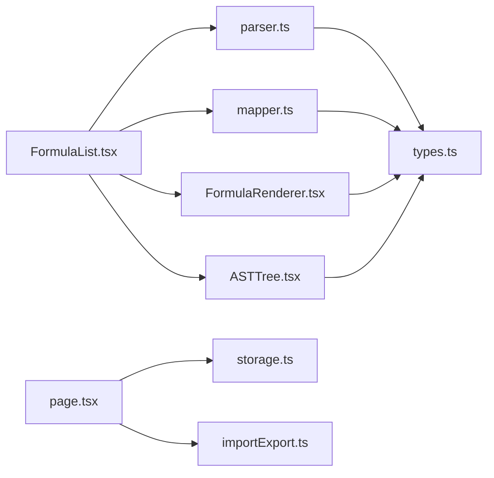

# 高级变量映射

<cite>
**本文档引用的文件**
- [mapper.ts](file://src/lib/mapper.ts)
- [parser.ts](file://src/lib/parser.ts)
- [types.ts](file://src/lib/types.ts)
- [storage.ts](file://src/lib/storage.ts)
- [importExport.ts](file://src/lib/importExport.ts)
- [FormulaList.tsx](file://src/components/FormulaList.tsx)
- [FormulaRenderer.tsx](file://src/components/FormulaRenderer.tsx)
- [ASTTree.tsx](file://src/components/ASTTree.tsx)
- [SubFormulaManager.tsx](file://src/components/SubFormulaManager.tsx)
- [page.tsx](file://src/app/page.tsx)
- [FormulaReferenceSelector.tsx](file://src/components/FormulaReferenceSelector.tsx)
- [FormulaReferenceModal.tsx](file://src/components/FormulaReferenceModal.tsx)
- [GroupList.tsx](file://src/components/GroupList.tsx)
- [GroupSelector.tsx](file://src/components/GroupSelector.tsx)
- [FormulaReferenceModal.tsx](file://src/components/FormulaReferenceModal.tsx)
- [FormulaReferenceSelector.tsx](file://src/components/FormulaReferenceSelector.tsx)
- [utils.ts](file://src/lib/utils.ts)
</cite>

## 目录
1. [简介](#简介)
2. [项目结构](#项目结构)
3. [核心组件](#核心组件)
4. [架构总览](#架构总览)
5. [详细组件分析](#详细组件分析)
6. [依赖关系分析](#依赖关系分析)
7. [性能考量](#性能考量)
8. [故障排除指南](#故障排除指南)
9. [结论](#结论)
10. [附录](#附录)

## 简介
本项目是一个“高级变量映射”工具，专注于将英文公式中的变量与中文语境下的变量进行映射，并通过可视化方式呈现公式结构与变量关系。系统支持：
- 正则表达式与词法分析提取变量
- 条件映射与动态替换
- 实时更新与本地持久化
- 批量导入/导出与从 URL 导入
- 子公式与跨公式引用
- 变量映射模板与管理
- 冲突处理、错误恢复与数据一致性保障

## 项目结构
项目采用 Next.js 前端框架，核心逻辑集中在 src/lib 下的类型定义、解析器、映射器与存储模块；UI 组件位于 src/components；入口页面位于 src/app/page.tsx。

图表来源
- [page.tsx:1-798](file://src/app/page.tsx#L1-L798)
- [FormulaList.tsx:1-387](file://src/components/FormulaList.tsx#L1-L387)
- [FormulaRenderer.tsx:1-169](file://src/components/FormulaRenderer.tsx#L1-L169)
- [ASTTree.tsx:1-179](file://src/components/ASTTree.tsx#L1-L179)
- [SubFormulaManager.tsx:1-201](file://src/components/SubFormulaManager.tsx#L1-L201)
- [mapper.ts:1-89](file://src/lib/mapper.ts#L1-L89)
- [parser.ts:1-159](file://src/lib/parser.ts#L1-L159)
- [types.ts:1-51](file://src/lib/types.ts#L1-L51)
- [storage.ts:1-50](file://src/lib/storage.ts#L1-L50)
- [importExport.ts:1-120](file://src/lib/importExport.ts#L1-L120)

章节来源
- [page.tsx:1-798](file://src/app/page.tsx#L1-L798)
- [mapper.ts:1-89](file://src/lib/mapper.ts#L1-L89)
- [parser.ts:1-159](file://src/lib/parser.ts#L1-L159)
- [types.ts:1-51](file://src/lib/types.ts#L1-L51)
- [storage.ts:1-50](file://src/lib/storage.ts#L1-L50)
- [importExport.ts:1-120](file://src/lib/importExport.ts#L1-L120)

## 核心组件
- 变量映射器：从英文与中文公式中提取变量并建立映射，支持去重与“多余中文变量”标记。
- 公式解析器：将公式字符串转为 Token 流，再构建 AST，支持括号匹配与运算符优先级。
- 类型系统：统一定义 Token、ASTNode、VariableMapping、Formula、FormulaGroup 等核心类型。
- 存储与导入导出：基于 localStorage 的持久化与 JSON 格式的数据导入导出。
- UI 展示：公式列表、变量渲染、AST 结构树、子公式管理等组件协同工作。

章节来源
- [mapper.ts:1-89](file://src/lib/mapper.ts#L1-L89)
- [parser.ts:1-159](file://src/lib/parser.ts#L1-L159)
- [types.ts:1-51](file://src/lib/types.ts#L1-L51)
- [storage.ts:1-50](file://src/lib/storage.ts#L1-L50)
- [importExport.ts:1-120](file://src/lib/importExport.ts#L1-L120)

## 架构总览
系统采用“前端单页应用 + 本地存储”的轻量架构。用户在页面中创建/编辑公式，系统即时解析并渲染变量映射与 AST 结构树；数据通过 JSON 文件进行导入导出，支持从 URL 直接导入。

图表来源
- [page.tsx:1-798](file://src/app/page.tsx#L1-L798)
- [FormulaList.tsx:1-387](file://src/components/FormulaList.tsx#L1-L387)
- [mapper.ts:1-89](file://src/lib/mapper.ts#L1-L89)
- [FormulaRenderer.tsx:1-169](file://src/components/FormulaRenderer.tsx#L1-L169)
- [ASTTree.tsx:1-179](file://src/components/ASTTree.tsx#L1-L179)
- [storage.ts:1-50](file://src/lib/storage.ts#L1-L50)

## 详细组件分析

### 变量映射器（VariableMapper）
- 功能要点
  - 提取英文变量：使用正则表达式匹配连续字母数字序列，去重并保持顺序。
  - 提取中文变量：按运算符与括号分割，过滤纯数字与空串，去重并保持顺序。
  - 创建映射：按序配对英文与中文变量，若中文变量不足则标注“未定义”。
  - 格式化输出：将映射转换为标准条目列表，包含“多余中文变量”标记。

- 关键算法流程

图表来源
- [mapper.ts:4-87](file://src/lib/mapper.ts#L4-L87)

章节来源
- [mapper.ts:1-89](file://src/lib/mapper.ts#L1-L89)

### 公式解析器（FormulaParser）
- 功能要点
  - 词法分析：识别变量、数字、运算符与括号，抛出不可识别字符异常。
  - 语法解析：递归下降解析，支持加减乘除与括号，确保括号匹配。
  - 错误处理：表达式不完整、括号不匹配、意外 token 等场景抛出明确错误信息。

- 解析流程（简化）

图表来源
- [parser.ts:24-157](file://src/lib/parser.ts#L24-L157)

章节来源
- [parser.ts:1-159](file://src/lib/parser.ts#L1-L159)

### 类型系统（types.ts）
- 关键类型
  - Token/ASTNode：描述词法与语法节点
  - VariableMapping/MappingsItem：映射记录与条目
  - Formula/FormulaGroup/SubFormula：公式、分组与子公式模型
- 设计要点
  - 明确区分变量映射与公式引用映射（variableFormulaMapping）
  - 支持子公式标识前缀（sub_），便于区分外部公式与内部子公式

章节来源
- [types.ts:1-51](file://src/lib/types.ts#L1-L51)

### 存储与导入导出（storage.ts, importExport.ts）
- 本地存储
  - loadData/saveData：基于 localStorage 的序列化读写
  - createGroup/createFormula：生成带时间戳与随机串的唯一 ID
- 导入导出
  - exportData/downloadExportData：导出为 JSON 并触发下载
  - importData/importFromFile/importFromUrl：校验数据结构、捕获 JSON/网络错误并抛出可读异常

章节来源
- [storage.ts:1-50](file://src/lib/storage.ts#L1-L50)
- [importExport.ts:1-120](file://src/lib/importExport.ts#L1-L120)

### UI 组件协作（FormulaList, FormulaRenderer, ASTTree, SubFormulaManager）
- FormulaList
  - 展开公式时调用 VariableMapper 与 FormulaParser，渲染变量映射与 AST
  - 支持公式引用映射（外部公式与子公式），点击变量可打开引用详情
- FormulaRenderer
  - 将公式按 Token 渲染为彩色变量块，支持 Tooltip 与点击引用
- ASTTree
  - 将 AST 转换为 LaTeX 表达式，支持中英文切换与变量替换
- SubFormulaManager
  - 管理子公式增删改，支持表单校验与本地状态维护

章节来源
- [FormulaList.tsx:1-387](file://src/components/FormulaList.tsx#L1-L387)
- [FormulaRenderer.tsx:1-169](file://src/components/FormulaRenderer.tsx#L1-L169)
- [ASTTree.tsx:1-179](file://src/components/ASTTree.tsx#L1-L179)
- [SubFormulaManager.tsx:1-201](file://src/components/SubFormulaManager.tsx#L1-L201)

### 应用入口与路由（page.tsx）
- 路由与 URL 同步：根据 URL 参数控制展开的公式，离开时清理参数
- 本地缓存：分组选择与侧边栏折叠状态持久化
- 数据管理：导出、导入（文件/URL）、覆盖确认与错误提示
- 公式 CRUD：创建/编辑/删除，支持分组移动与重名检测

章节来源
- [page.tsx:1-798](file://src/app/page.tsx#L1-L798)

## 依赖关系分析
- 组件耦合
  - FormulaList 依赖 mapper 与 parser，同时依赖 UI 渲染组件
  - FormulaRenderer 与 ASTTree 依赖 types 定义
  - page.tsx 作为协调者，连接存储与导入导出模块
- 外部依赖
  - KaTeX 用于 LaTeX 渲染（ASTTree 动态加载样式与模块）
  - localStorage 用于数据持久化

图表来源
- [parser.ts:1-159](file://src/lib/parser.ts#L1-L159)
- [mapper.ts:1-89](file://src/lib/mapper.ts#L1-L89)
- [types.ts:1-51](file://src/lib/types.ts#L1-L51)
- [FormulaRenderer.tsx:1-169](file://src/components/FormulaRenderer.tsx#L1-L169)
- [ASTTree.tsx:1-179](file://src/components/ASTTree.tsx#L1-L179)
- [FormulaList.tsx:1-387](file://src/components/FormulaList.tsx#L1-L387)
- [page.tsx:1-798](file://src/app/page.tsx#L1-L798)
- [storage.ts:1-50](file://src/lib/storage.ts#L1-L50)
- [importExport.ts:1-120](file://src/lib/importExport.ts#L1-L120)

## 性能考量
- 解析与渲染
  - 词法分析与语法解析的时间复杂度为 O(n)，n 为公式长度
  - AST 转 LaTeX 与渲染为 O(n)，变量替换为 O(k·n)，k 为变量数量
- 交互优化
  - 仅在展开公式时进行解析与渲染，避免不必要的计算
  - 变量颜色分配与引用映射在渲染阶段一次性完成
- 存储与导入导出
  - localStorage 读写为同步操作，建议控制数据规模；大体量数据可考虑分片或服务端存储
  - 导入/导出为内存操作，注意大文件的内存占用与浏览器限制

[本节为通用性能讨论，无需特定文件来源]

## 故障排除指南
- 表达式解析错误
  - 症状：展开公式时报错“表达式解析不完整/括号不匹配/语法错误”
  - 排查：检查公式中是否存在未闭合括号、非法字符或运算符拼写
  - 参考：[parser.ts:17-157](file://src/lib/parser.ts#L17-L157)
- 变量映射为空
  - 症状：变量映射区域为空
  - 排查：确认英文公式中存在合法变量（字母开头的连续字符），中文公式中存在非数字的片段
  - 参考：[mapper.ts:4-50](file://src/lib/mapper.ts#L4-L50)
- 导入失败
  - 症状：导入文件/URL 报错“JSON 格式错误/数据格式不正确/网络请求失败”
  - 排查：确认 JSON 结构符合 ExportData 规范，URL 可访问且返回文本
  - 参考：[importExport.ts:43-120](file://src/lib/importExport.ts#L43-L120)
- 数据丢失
  - 症状：刷新页面后数据消失
  - 排查：确认浏览器允许 localStorage，或尝试清除缓存后重新导入
  - 参考：[storage.ts:5-25](file://src/lib/storage.ts#L5-L25)
- URL 参数不同步
  - 症状：浏览器前进/后退后展开状态不同步
  - 排查：确认路由更新逻辑与 URL 参数监听生效
  - 参考：[page.tsx:25-120](file://src/app/page.tsx#L25-L120)

章节来源
- [parser.ts:17-157](file://src/lib/parser.ts#L17-L157)
- [mapper.ts:4-50](file://src/lib/mapper.ts#L4-L50)
- [importExport.ts:43-120](file://src/lib/importExport.ts#L43-L120)
- [storage.ts:5-25](file://src/lib/storage.ts#L5-L25)
- [page.tsx:25-120](file://src/app/page.tsx#L25-L120)

## 结论
本项目提供了完整的“高级变量映射”能力：从变量提取、映射建立、公式解析到可视化呈现，均以清晰的模块划分与稳健的错误处理实现。结合本地存储与 JSON 导入导出，满足个人与小团队的公式管理需求。未来可在以下方面扩展：
- 增强映射模板系统与批量操作（批量导入/导出/修改）
- 引入服务端存储与版本控制，提升协作与一致性
- 优化大数据量场景下的渲染与存储性能

[本节为总结性内容，无需特定文件来源]

## 附录

### 高级使用技巧
- 使用子公式管理器组织复杂公式，减少重复变量与提升可读性
- 在变量映射中为常用变量设置稳定中文名称，便于跨公式引用
- 利用 AST 结构树对比英文与中文变量，快速发现映射不一致问题
- 通过 URL 导入功能共享公式集，便于团队协作

[本节为通用技巧，无需特定文件来源]

### 批量操作建议（设计思路）
- 批量导入：在现有导入基础上，支持多组/多公式合并与冲突检测（重名、ID 冲突）
- 批量导出：按分组/层级导出，支持选择性导出与过滤
- 批量修改：提供 UI 选择器与脚本接口，支持批量更新变量映射与子公式

[本节为概念性设计，无需特定文件来源]

### 映射模板系统（设计思路）
- 预设模板：内置常见公式模板（如加减乘除、百分比、复合函数）
- 自定义模板：允许用户保存常用映射组合，支持命名与分类
- 模板管理：提供模板导入/导出、版本比较与一键应用

[本节为概念性设计，无需特定文件来源]