# 业务组件

<cite>
**本文档引用的文件**
- [src/app/page.tsx](file://src/app/page.tsx)
- [src/components/FormulaList.tsx](file://src/components/FormulaList.tsx)
- [src/components/ASTTree.tsx](file://src/components/ASTTree.tsx)
- [src/components/FormulaRenderer.tsx](file://src/components/FormulaRenderer.tsx)
- [src/components/GroupList.tsx](file://src/components/GroupList.tsx)
- [src/components/GroupSelector.tsx](file://src/components/GroupSelector.tsx)
- [src/components/SubFormulaManager.tsx](file://src/components/SubFormulaManager.tsx)
- [src/components/FormulaReferenceSelector.tsx](file://src/components/FormulaReferenceSelector.tsx)
- [src/components/FormulaReferenceModal.tsx](file://src/components/FormulaReferenceModal.tsx)
- [src/components/ConfirmDialog.tsx](file://src/components/ConfirmDialog.tsx)
- [src/components/Tooltip.tsx](file://src/components/Tooltip.tsx)
- [src/components/ui/button.tsx](file://src/components/ui/button.tsx)
- [src/lib/types.ts](file://src/lib/types.ts)
- [src/lib/parser.ts](file://src/lib/parser.ts)
- [src/lib/mapper.ts](file://src/lib/mapper.ts)
</cite>

## 目录
1. [简介](#简介)
2. [项目结构](#项目结构)
3. [核心组件](#核心组件)
4. [架构总览](#架构总览)
5. [详细组件分析](#详细组件分析)
6. [依赖分析](#依赖分析)
7. [性能考虑](#性能考虑)
8. [故障排查指南](#故障排查指南)
9. [结论](#结论)
10. [附录](#附录)

## 简介
本项目是一个“公式变量映射与可视化工具”，围绕公式、分组、子公式以及变量映射构建了完整的业务组件体系。用户可以创建分组管理公式，查看变量映射、公式展示与AST结构树，支持变量引用外部公式或子公式，并通过弹窗进行嵌套引用浏览。

## 项目结构
- 应用入口位于页面组件，负责状态管理、URL同步、数据持久化与对话框编排。
- 业务组件集中在 components 目录，涵盖公式列表、AST树、公式渲染、分组列表与选择器、子公式管理、引用选择器与引用模态框等。
- 类型定义与解析/映射逻辑位于 lib 目录，确保组件间数据契约一致与算法复用。

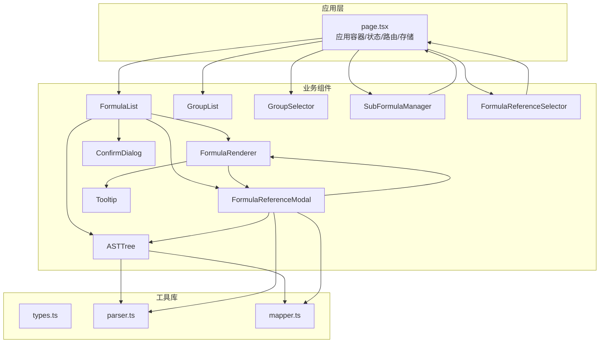

图表来源
- [src/app/page.tsx:14-707](file://src/app/page.tsx#L14-L707)
- [src/components/FormulaList.tsx:1-387](file://src/components/FormulaList.tsx#L1-L387)
- [src/components/ASTTree.tsx:1-179](file://src/components/ASTTree.tsx#L1-L179)
- [src/components/FormulaRenderer.tsx:1-169](file://src/components/FormulaRenderer.tsx#L1-L169)
- [src/components/GroupList.tsx:1-294](file://src/components/GroupList.tsx#L1-L294)
- [src/components/GroupSelector.tsx:1-197](file://src/components/GroupSelector.tsx#L1-L197)
- [src/components/SubFormulaManager.tsx:1-201](file://src/components/SubFormulaManager.tsx#L1-L201)
- [src/components/FormulaReferenceSelector.tsx:1-132](file://src/components/FormulaReferenceSelector.tsx#L1-L132)
- [src/components/FormulaReferenceModal.tsx:1-180](file://src/components/FormulaReferenceModal.tsx#L1-L180)
- [src/components/ConfirmDialog.tsx:1-54](file://src/components/ConfirmDialog.tsx#L1-L54)
- [src/components/Tooltip.tsx:1-48](file://src/components/Tooltip.tsx#L1-L48)
- [src/lib/types.ts:1-51](file://src/lib/types.ts#L1-L51)
- [src/lib/parser.ts:1-159](file://src/lib/parser.ts#L1-L159)
- [src/lib/mapper.ts:1-89](file://src/lib/mapper.ts#L1-L89)

章节来源
- [src/app/page.tsx:14-707](file://src/app/page.tsx#L14-L707)

## 核心组件
- FormulaList：展示分组下的公式列表，支持搜索、展开查看详情、删除确认、编辑跳转。
- ASTTree：将AST节点转换为LaTeX并渲染，支持中英文切换与变量映射说明。
- FormulaRenderer：将公式字符串分词为变量/运算符/数字/括号，高亮变量并支持点击引用。
- GroupList：树形展示分组，支持展开/折叠、增删改、统计公式数量。
- GroupSelector：面包屑式分组选择器，支持逐级展开与直接选择。
- SubFormulaManager：维护公式内部的子公式集合，支持增删改查。
- FormulaReferenceSelector：基于变量提取结果，为变量绑定外部公式或子公式引用。
- FormulaReferenceModal：展示引用公式的变量映射、公式展示与AST树，支持嵌套引用弹窗。

章节来源
- [src/components/FormulaList.tsx:12-139](file://src/components/FormulaList.tsx#L12-L139)
- [src/components/ASTTree.tsx:6-112](file://src/components/ASTTree.tsx#L6-L112)
- [src/components/FormulaRenderer.tsx:6-32](file://src/components/FormulaRenderer.tsx#L6-L32)
- [src/components/GroupList.tsx:7-23](file://src/components/GroupList.tsx#L7-L23)
- [src/components/GroupSelector.tsx:6-10](file://src/components/GroupSelector.tsx#L6-L10)
- [src/components/SubFormulaManager.tsx:7-12](file://src/components/SubFormulaManager.tsx#L7-L12)
- [src/components/FormulaReferenceSelector.tsx:6-20](file://src/components/FormulaReferenceSelector.tsx#L6-L20)
- [src/components/FormulaReferenceModal.tsx:10-28](file://src/components/FormulaReferenceModal.tsx#L10-L28)

## 架构总览
组件间数据流与交互概览如下：

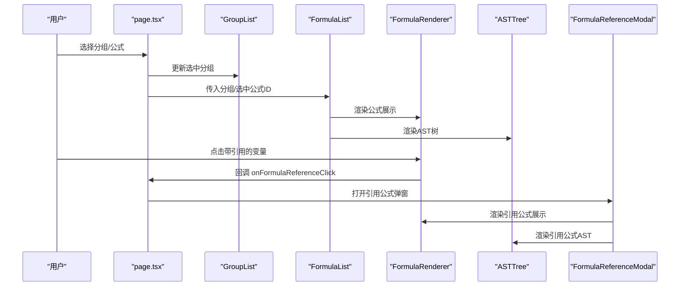

图表来源
- [src/app/page.tsx:537-544](file://src/app/page.tsx#L537-L544)
- [src/components/FormulaList.tsx:322-330](file://src/components/FormulaList.tsx#L322-L330)
- [src/components/FormulaRenderer.tsx:58-92](file://src/components/FormulaRenderer.tsx#L58-L92)
- [src/components/FormulaReferenceModal.tsx:135-140](file://src/components/FormulaReferenceModal.tsx#L135-L140)

## 详细组件分析

### FormulaList 组件
- 功能职责
  - 展示分组树下的公式列表，支持搜索过滤与分组筛选。
  - 展开公式项时解析变量映射、生成AST并渲染公式展示与AST树。
  - 提供编辑、删除、引用弹窗等交互。
- 关键API
  - Props
    - groups: FormulaGroup[]
    - selectedGroupId: string | null
    - selectedFormulaId: string | null
    - onSelectFormula: (id) => void
    - onDeleteFormula: (id) => void
    - onEditFormula: (formula) => void
  - 状态
    - searchQuery: 输入框值
    - formulaMap: 全量公式映射（id/name -> Formula）
  - 事件
    - onFormulaReferenceClick: 点击变量引用回调
- 数据流
  - 从 groups 构建 allFormulasWithGroup，再按选中分组与搜索条件过滤。
  - 展开时使用 VariableMapper.createMapping 与 FormulaParser.parse 生成 mapping 与 ast。
- 交互流程

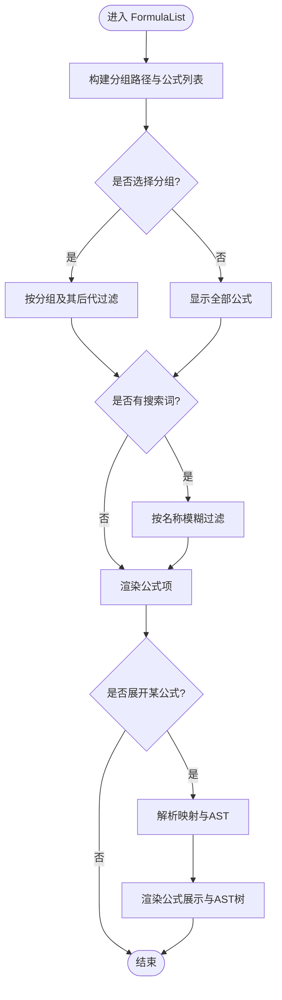

图表来源
- [src/components/FormulaList.tsx:32-79](file://src/components/FormulaList.tsx#L32-L79)
- [src/components/FormulaList.tsx:169-192](file://src/components/FormulaList.tsx#L169-L192)

章节来源
- [src/components/FormulaList.tsx:12-139](file://src/components/FormulaList.tsx#L12-L139)
- [src/components/FormulaList.tsx:141-387](file://src/components/FormulaList.tsx#L141-L387)

### ASTTree 组件
- 功能职责
  - 将AST节点递归转为LaTeX表达式，动态加载KaTeX样式。
  - 支持中英文切换，中文模式下将英文变量替换为中文映射。
  - 提供变量说明展示。
- 关键API
  - Props
    - ast: ASTNode
    - mapping: Record<string,string>
  - 状态
    - katexLoaded: 样式加载状态
    - showChinese: 中英文切换
- 渲染流程

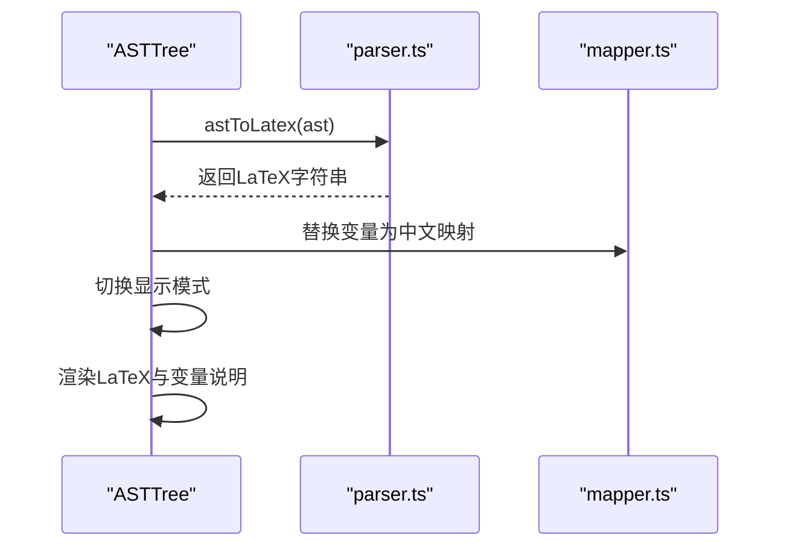

图表来源
- [src/components/ASTTree.tsx:27-74](file://src/components/ASTTree.tsx#L27-L74)
- [src/lib/parser.ts:78-157](file://src/lib/parser.ts#L78-L157)
- [src/lib/mapper.ts:52-70](file://src/lib/mapper.ts#L52-L70)

章节来源
- [src/components/ASTTree.tsx:6-112](file://src/components/ASTTree.tsx#L6-L112)
- [src/components/ASTTree.tsx:114-179](file://src/components/ASTTree.tsx#L114-L179)

### FormulaRenderer 组件
- 功能职责
  - 对公式字符串进行词法切分，识别变量、运算符、数字、括号。
  - 为变量分配颜色并生成带悬浮提示的标签，支持点击引用。
- 关键API
  - Props
    - formula: string
    - mapping: Record<string,string>
    - formulaReferences?: Record<string,{...}>
    - onFormulaReferenceClick?: (formula|subFormula) => void
  - 状态
    - tokens: 切分后的Token数组
    - variableColorIndex: 变量到颜色索引的映射
- 交互流程

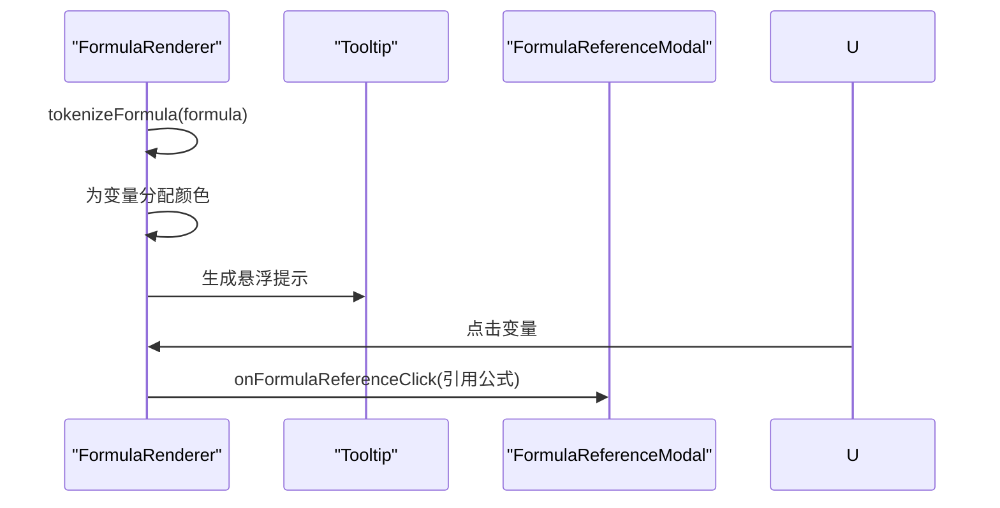

图表来源
- [src/components/FormulaRenderer.tsx:118-168](file://src/components/FormulaRenderer.tsx#L118-L168)
- [src/components/FormulaRenderer.tsx:58-92](file://src/components/FormulaRenderer.tsx#L58-L92)
- [src/components/FormulaReferenceModal.tsx:84-87](file://src/components/FormulaReferenceModal.tsx#L84-L87)

章节来源
- [src/components/FormulaRenderer.tsx:6-32](file://src/components/FormulaRenderer.tsx#L6-L32)
- [src/components/FormulaRenderer.tsx:118-169](file://src/components/FormulaRenderer.tsx#L118-L169)

### GroupList 组件
- 功能职责
  - 树形展示分组，支持展开/折叠、增删改、统计公式总数。
  - 自动展开选中分组的父链。
- 关键API
  - Props
    - groups: FormulaGroup[]
    - selectedGroupId: string | null
    - onSelectGroup(groupId)
    - onCreateGroup(parentId|null)
    - onDeleteGroup(groupId)
    - onEditGroup(groupId,newName)
  - 状态
    - expandedGroups: Set<string>
    - isEditModalOpen/editName/editingGroup
    - deleteConfirm
- 交互流程

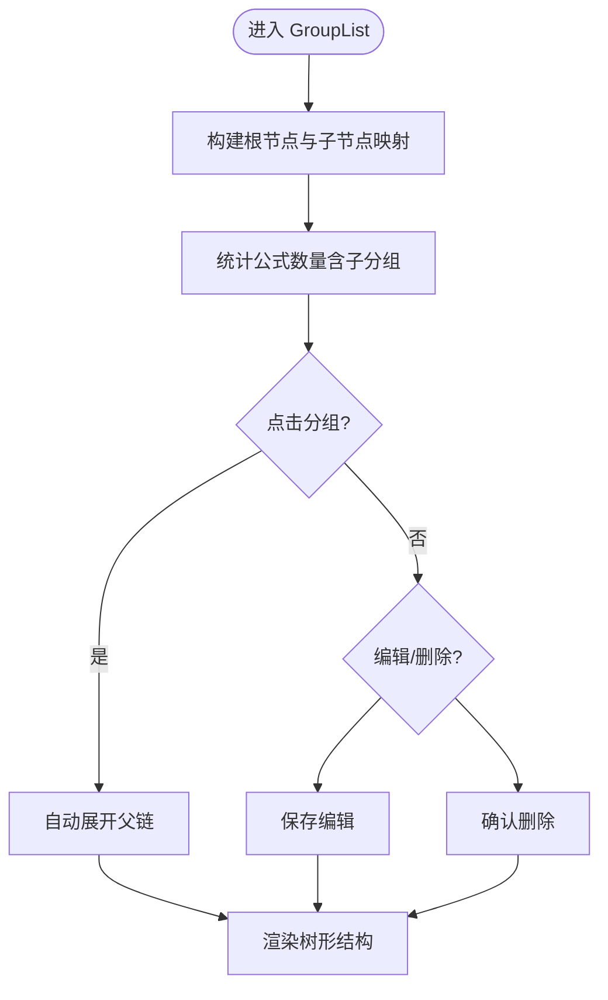

图表来源
- [src/components/GroupList.tsx:33-111](file://src/components/GroupList.tsx#L33-L111)
- [src/components/GroupList.tsx:113-196](file://src/components/GroupList.tsx#L113-L196)

章节来源
- [src/components/GroupList.tsx:7-23](file://src/components/GroupList.tsx#L7-L23)
- [src/components/GroupList.tsx:16-294](file://src/components/GroupList.tsx#L16-L294)

### GroupSelector 组件
- 功能职责
  - 面包屑式分组选择器，支持逐级展开与直接选择末级分组。
- 关键API
  - Props
    - groups: FormulaGroup[]
    - groupId: string | null
    - onChange(parentId|null, childId|null)
  - 状态
    - isOpen/currentPath
- 交互流程

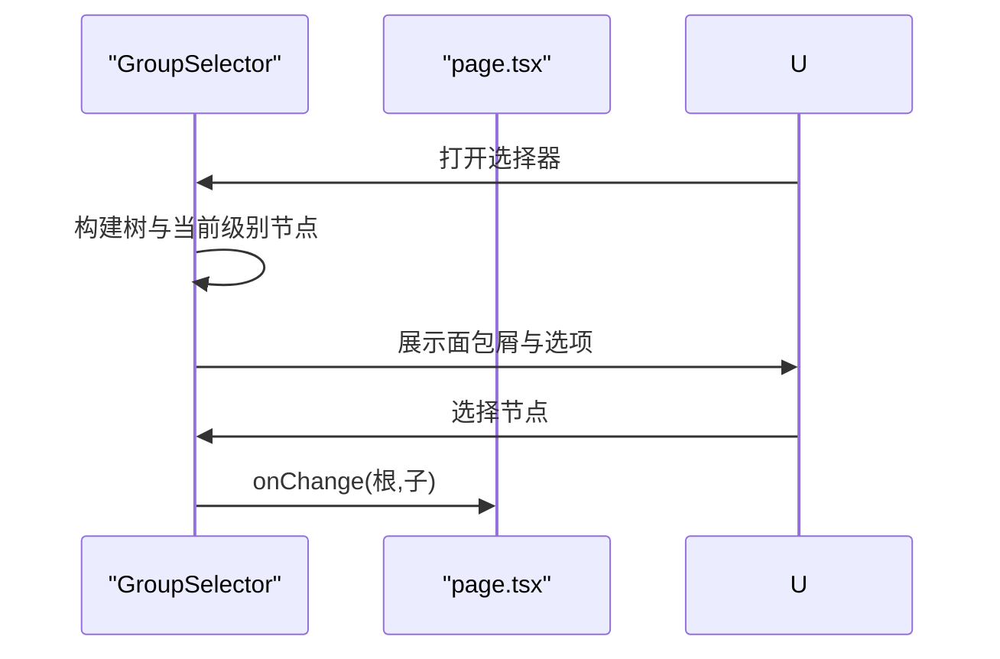

图表来源
- [src/components/GroupSelector.tsx:17-107](file://src/components/GroupSelector.tsx#L17-L107)
- [src/app/page.tsx:648-658](file://src/app/page.tsx#L648-L658)

章节来源
- [src/components/GroupSelector.tsx:6-10](file://src/components/GroupSelector.tsx#L6-L10)
- [src/components/GroupSelector.tsx:17-197](file://src/components/GroupSelector.tsx#L17-L197)

### SubFormulaManager 组件
- 功能职责
  - 维护公式内部子公式集合，支持新增、编辑、删除与保存。
- 关键API
  - Props
    - subFormulas: SubFormula[]
    - onChange(SubFormula[])
  - 状态
    - isAddModalOpen/editingSubFormula/form
    - deleteConfirm
- 交互流程

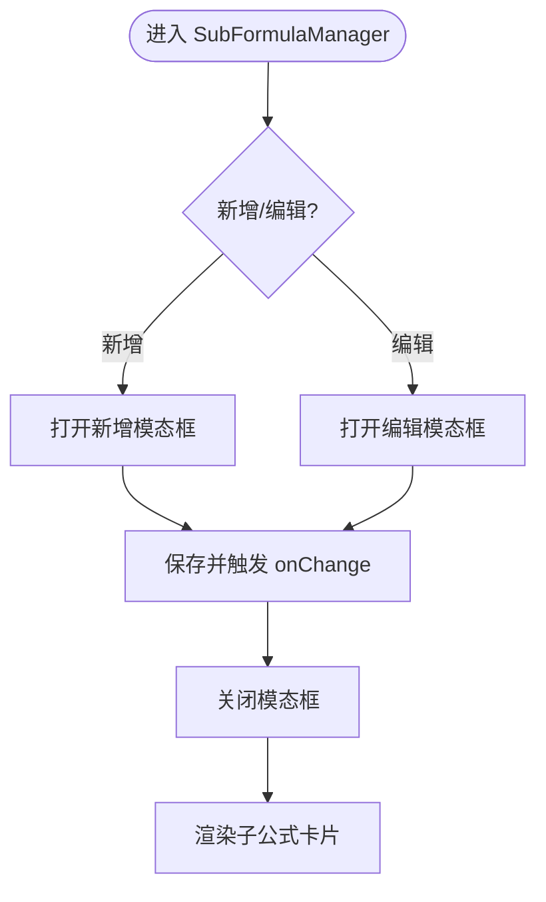

图表来源
- [src/components/SubFormulaManager.tsx:26-74](file://src/components/SubFormulaManager.tsx#L26-L74)
- [src/components/SubFormulaManager.tsx:129-185](file://src/components/SubFormulaManager.tsx#L129-L185)

章节来源
- [src/components/SubFormulaManager.tsx:7-12](file://src/components/SubFormulaManager.tsx#L7-L12)
- [src/components/SubFormulaManager.tsx:12-201](file://src/components/SubFormulaManager.tsx#L12-L201)

### FormulaReferenceSelector 组件
- 功能职责
  - 基于英文公式提取变量，为每个变量提供下拉选择，绑定外部公式或子公式引用。
- 关键API
  - Props
    - groups: FormulaGroup[]
    - variableFormulaMapping: Record<string,string>
    - onChange(mapping)
    - englishFormula: string
    - subFormulas?: SubFormula[]
  - 状态
    - variables（memo）
    - allFormulas（memo）
- 交互流程

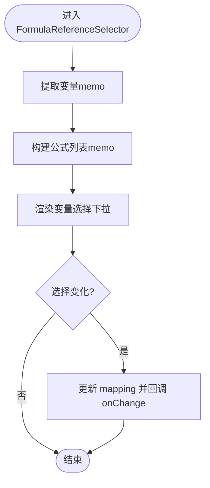

图表来源
- [src/components/FormulaReferenceSelector.tsx:21-34](file://src/components/FormulaReferenceSelector.tsx#L21-L34)
- [src/components/FormulaReferenceSelector.tsx:39-47](file://src/components/FormulaReferenceSelector.tsx#L39-L47)

章节来源
- [src/components/FormulaReferenceSelector.tsx:6-20](file://src/components/FormulaReferenceSelector.tsx#L6-L20)
- [src/components/FormulaReferenceSelector.tsx:115-132](file://src/components/FormulaReferenceSelector.tsx#L115-L132)

### FormulaReferenceModal 组件
- 功能职责
  - 展示引用公式的变量映射、公式展示与AST树；支持嵌套引用弹窗。
- 关键API
  - Props
    - formula: Formula|SubFormula
    - onClose()
    - allFormulas?: Record<string,Formula>
    - subFormulas?: SubFormula[]
    - onNestedReference?(formula)
  - 状态
    - ast/mapping/error
    - nestedReferenceFormula
- 交互流程

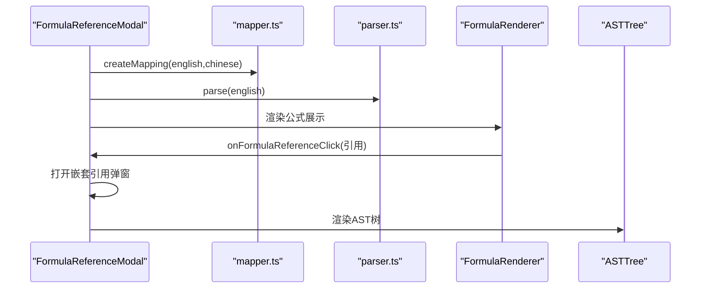

图表来源
- [src/components/FormulaReferenceModal.tsx:29-45](file://src/components/FormulaReferenceModal.tsx#L29-L45)
- [src/components/FormulaReferenceModal.tsx:84-87](file://src/components/FormulaReferenceModal.tsx#L84-L87)

章节来源
- [src/components/FormulaReferenceModal.tsx:10-28](file://src/components/FormulaReferenceModal.tsx#L10-L28)
- [src/components/FormulaReferenceModal.tsx:89-179](file://src/components/FormulaReferenceModal.tsx#L89-L179)

## 依赖分析
- 组件耦合
  - FormulaList 依赖 FormulaRenderer、ASTTree、FormulaReferenceModal、ConfirmDialog。
  - FormulaRenderer 依赖 Tooltip 与 FormulaReferenceModal。
  - ASTTree 依赖 parser.ts 与 mapper.ts。
  - FormulaReferenceSelector 依赖 types.ts 中的 FormulaGroup/Formula/SubFormula。
  - SubFormulaManager 与 FormulaReferenceSelector 在 page.tsx 中共同驱动 Formula 的子公式与变量引用。
- 外部依赖
  - 动态加载 KaTeX 样式（ASTTree）。
  - UI Button 组件（ConfirmDialog）。

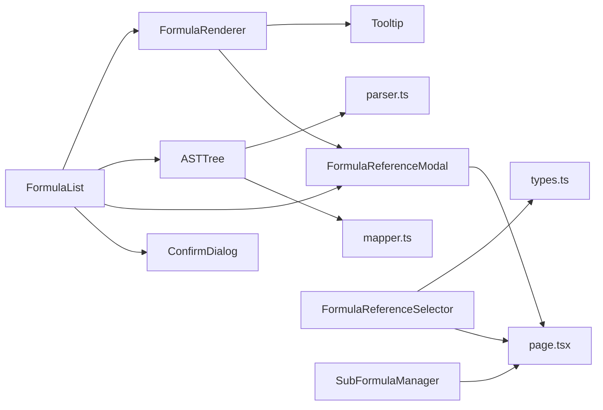

图表来源
- [src/components/FormulaList.tsx:4-10](file://src/components/FormulaList.tsx#L4-L10)
- [src/components/ASTTree.tsx:3-4](file://src/components/ASTTree.tsx#L3-L4)
- [src/components/FormulaRenderer.tsx:3-4](file://src/components/FormulaRenderer.tsx#L3-L4)
- [src/components/FormulaReferenceSelector.tsx:3-4](file://src/components/FormulaReferenceSelector.tsx#L3-L4)
- [src/components/SubFormulaManager.tsx:3-5](file://src/components/SubFormulaManager.tsx#L3-L5)
- [src/components/FormulaReferenceModal.tsx:3-7](file://src/components/FormulaReferenceModal.tsx#L3-L7)
- [src/lib/parser.ts:1-2](file://src/lib/parser.ts#L1-L2)
- [src/lib/mapper.ts:1-2](file://src/lib/mapper.ts#L1-L2)
- [src/lib/types.ts:27-50](file://src/lib/types.ts#L27-L50)

章节来源
- [src/components/FormulaList.tsx:1-11](file://src/components/FormulaList.tsx#L1-L11)
- [src/components/ASTTree.tsx:1-14](file://src/components/ASTTree.tsx#L1-L14)
- [src/components/FormulaRenderer.tsx:1-5](file://src/components/FormulaRenderer.tsx#L1-L5)
- [src/components/FormulaReferenceSelector.tsx:1-12](file://src/components/FormulaReferenceSelector.tsx#L1-L12)
- [src/components/SubFormulaManager.tsx:1-6](file://src/components/SubFormulaManager.tsx#L1-L6)
- [src/components/FormulaReferenceModal.tsx:1-8](file://src/components/FormulaReferenceModal.tsx#L1-L8)
- [src/lib/parser.ts:1-2](file://src/lib/parser.ts#L1-L2)
- [src/lib/mapper.ts:1-2](file://src/lib/mapper.ts#L1-L2)
- [src/lib/types.ts:1-51](file://src/lib/types.ts#L1-L51)

## 性能考虑
- 计算缓存
  - FormulaReferenceSelector 使用 useMemo 缓存变量提取与公式列表，避免重复计算。
  - FormulaList 的 FormulaItem 在展开时才解析映射与AST，收起时清理状态，减少不必要的渲染。
- 渲染优化
  - ASTTree 动态加载 KaTeX 样式，避免首屏阻塞。
  - FormulaRenderer 为变量分配颜色索引，按唯一变量顺序渲染，提升可读性。
- 状态管理
  - page.tsx 中对 URL 参数与本地缓存进行统一管理，减少重复请求与无效更新。
- 建议
  - 对超大公式或复杂AST，可考虑分步渲染或虚拟滚动。
  - 对频繁切换中英文的场景，可缓存LaTeX渲染结果。

[本节为通用建议，无需特定文件引用]

## 故障排查指南
- 解析错误
  - ASTTree/LatexRenderer/KaTeX 渲染失败会显示错误提示，检查公式语法与变量映射。
- 删除确认
  - GroupList/FormulaList 使用 ConfirmDialog 进行二次确认，避免误删。
- 边界情况
  - FormulaReferenceSelector 在无变量时返回 null，避免无意义渲染。
  - FormulaReferenceModal 对 SubFormula 与 Formula 的引用区分处理，防止ID前缀错误导致的引用丢失。

章节来源
- [src/components/ASTTree.tsx:124-142](file://src/components/ASTTree.tsx#L124-L142)
- [src/components/FormulaList.tsx:170-192](file://src/components/FormulaList.tsx#L170-L192)
- [src/components/FormulaReferenceSelector.tsx:36-38](file://src/components/FormulaReferenceSelector.tsx#L36-L38)
- [src/components/FormulaReferenceModal.tsx:52-82](file://src/components/FormulaReferenceModal.tsx#L52-L82)
- [src/components/ConfirmDialog.tsx:5-25](file://src/components/ConfirmDialog.tsx#L5-L25)

## 结论
本项目通过清晰的组件划分与稳定的类型定义，实现了从分组管理到公式渲染与引用可视化的完整闭环。各组件职责明确、交互自然，配合工具库实现了解析与映射的可复用能力。建议在后续迭代中关注大数据量场景的渲染优化与错误提示的国际化扩展。

[本节为总结，无需特定文件引用]

## 附录

### 组件API速查表
- FormulaList
  - Props: groups, selectedGroupId, selectedFormulaId, onSelectFormula, onDeleteFormula, onEditFormula
  - 事件: onFormulaReferenceClick（来自 FormulaRenderer）
- ASTTree
  - Props: ast, mapping
  - 状态: katexLoaded, showChinese
- FormulaRenderer
  - Props: formula, mapping, formulaReferences?, onFormulaReferenceClick?
  - 状态: tokens, variableColorIndex
- GroupList
  - Props: groups, selectedGroupId, onSelectGroup, onCreateGroup, onDeleteGroup, onEditGroup
  - 状态: expandedGroups, isEditModalOpen, deleteConfirm
- GroupSelector
  - Props: groups, groupId, onChange
  - 状态: isOpen, currentPath
- SubFormulaManager
  - Props: subFormulas, onChange
  - 状态: isAddModalOpen, editingSubFormula, form, deleteConfirm
- FormulaReferenceSelector
  - Props: groups, variableFormulaMapping, onChange, englishFormula, subFormulas?
  - 状态: variables（memo）、allFormulas（memo）
- FormulaReferenceModal
  - Props: formula, onClose, allFormulas?, subFormulas?, onNestedReference?
  - 状态: ast, mapping, error, nestedReferenceFormula

章节来源
- [src/components/FormulaList.tsx:12-28](file://src/components/FormulaList.tsx#L12-L28)
- [src/components/ASTTree.tsx:6-13](file://src/components/ASTTree.tsx#L6-L13)
- [src/components/FormulaRenderer.tsx:6-11](file://src/components/FormulaRenderer.tsx#L6-L11)
- [src/components/GroupList.tsx:7-14](file://src/components/GroupList.tsx#L7-L14)
- [src/components/GroupSelector.tsx:6-10](file://src/components/GroupSelector.tsx#L6-L10)
- [src/components/SubFormulaManager.tsx:7-10](file://src/components/SubFormulaManager.tsx#L7-L10)
- [src/components/FormulaReferenceSelector.tsx:6-12](file://src/components/FormulaReferenceSelector.tsx#L6-L12)
- [src/components/FormulaReferenceModal.tsx:10-16](file://src/components/FormulaReferenceModal.tsx#L10-L16)

### 数据模型与类型定义
- Token: 词法单元（运算符/变量/数字/括号）
- ASTNode: 抽象语法树节点（变量/数字/运算符）
- VariableMapping: 变量映射结果（mapping、englishVars、chineseVars、hasMoreChinese）
- Formula: 公式实体（含变量到公式ID的映射与子公式列表）
- SubFormula: 子公式实体
- FormulaGroup: 分组实体（含父ID与公式列表）

章节来源
- [src/lib/types.ts:1-51](file://src/lib/types.ts#L1-L51)

### 使用示例与集成指导
- 在页面容器中引入 GroupList、FormulaList、GroupSelector、FormulaReferenceSelector、SubFormulaManager，并通过回调更新状态。
- 通过 FormulaRenderer 的 onFormulaReferenceClick 与 FormulaReferenceModal 实现引用弹窗联动。
- 通过 ConfirmDialog 提供删除确认，避免误操作。
- 通过 Tooltip 提升变量悬浮提示体验。

章节来源
- [src/app/page.tsx:506-544](file://src/app/page.tsx#L506-L544)
- [src/app/page.tsx:648-673](file://src/app/page.tsx#L648-L673)
- [src/components/FormulaRenderer.tsx:58-92](file://src/components/FormulaRenderer.tsx#L58-L92)
- [src/components/FormulaReferenceModal.tsx:84-87](file://src/components/FormulaReferenceModal.tsx#L84-L87)
- [src/components/ConfirmDialog.tsx:16-25](file://src/components/ConfirmDialog.tsx#L16-L25)