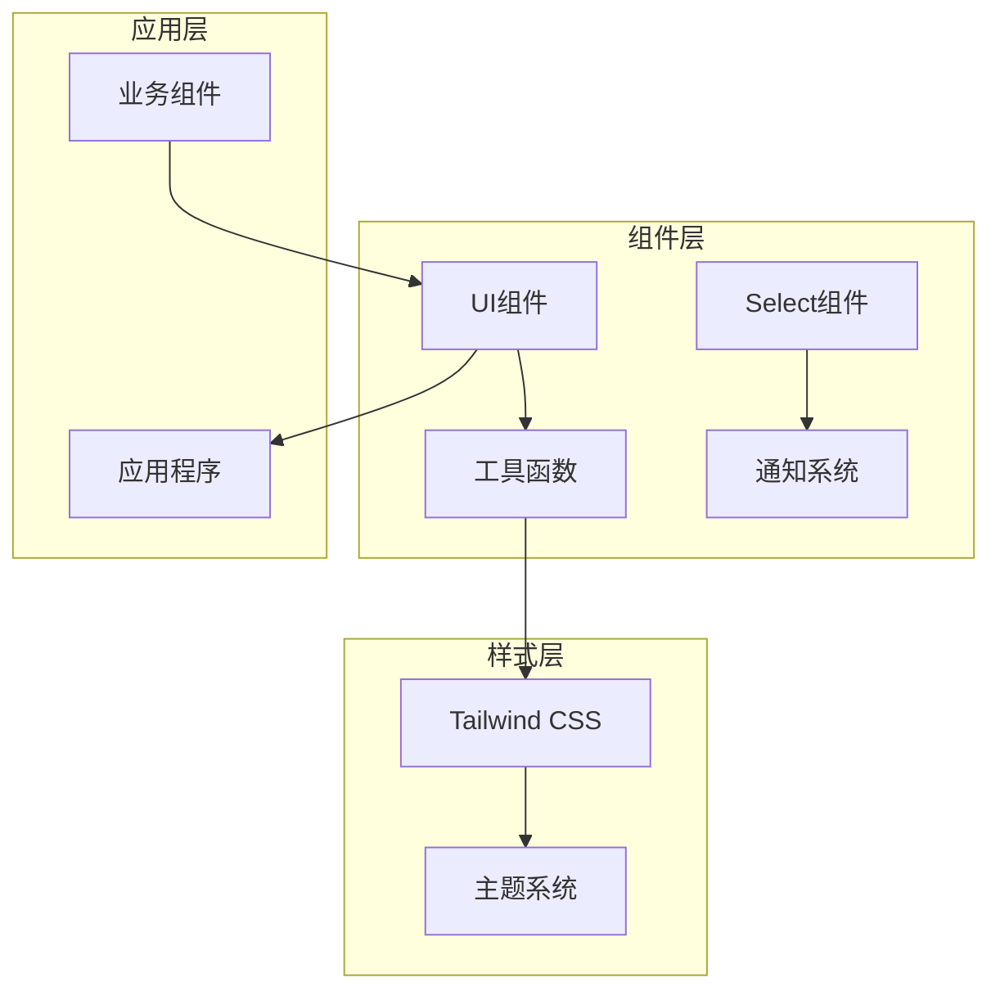
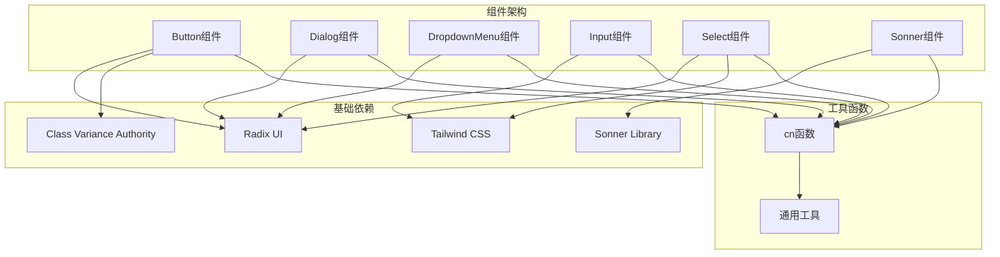
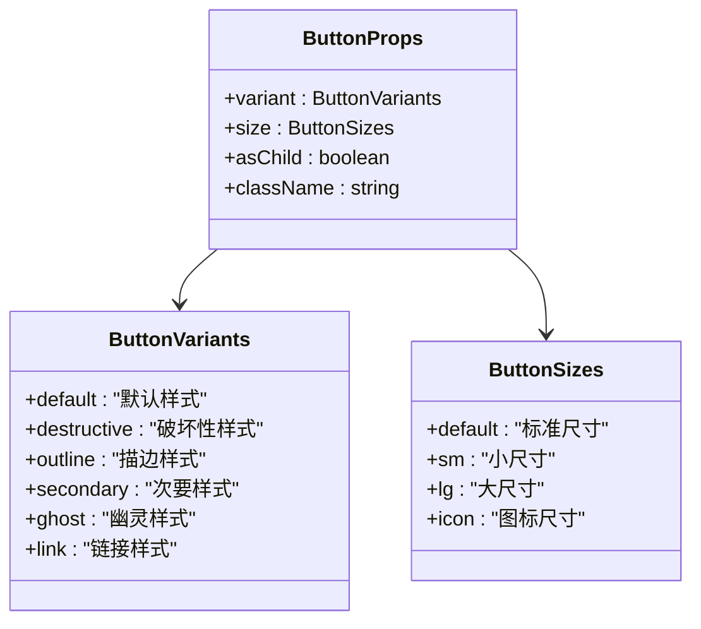
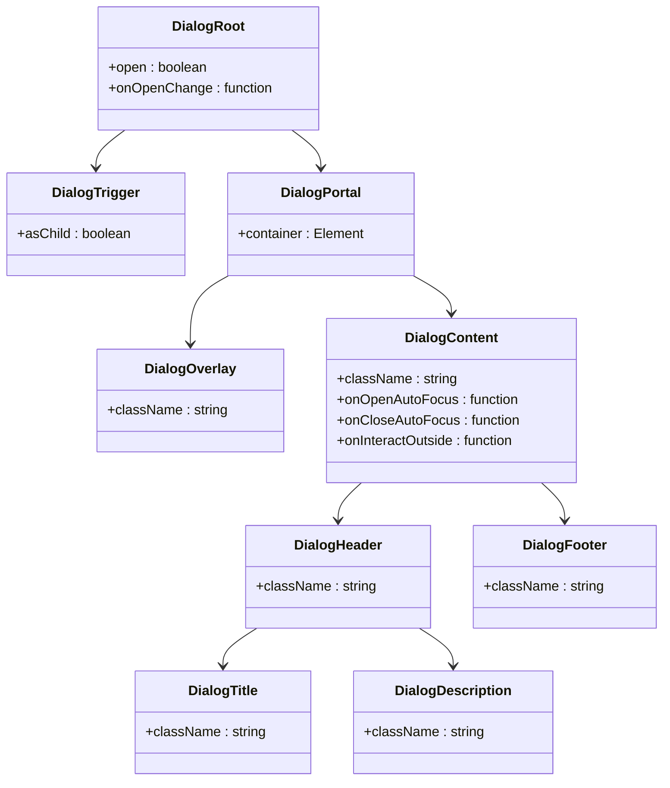
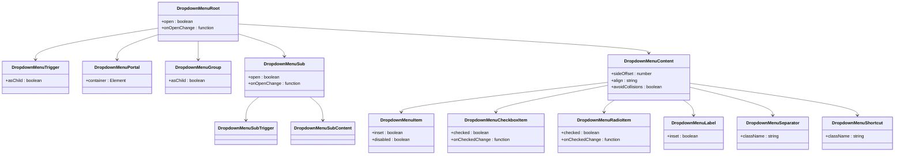
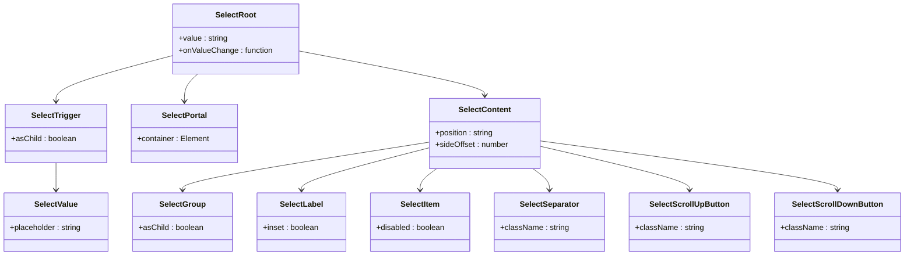
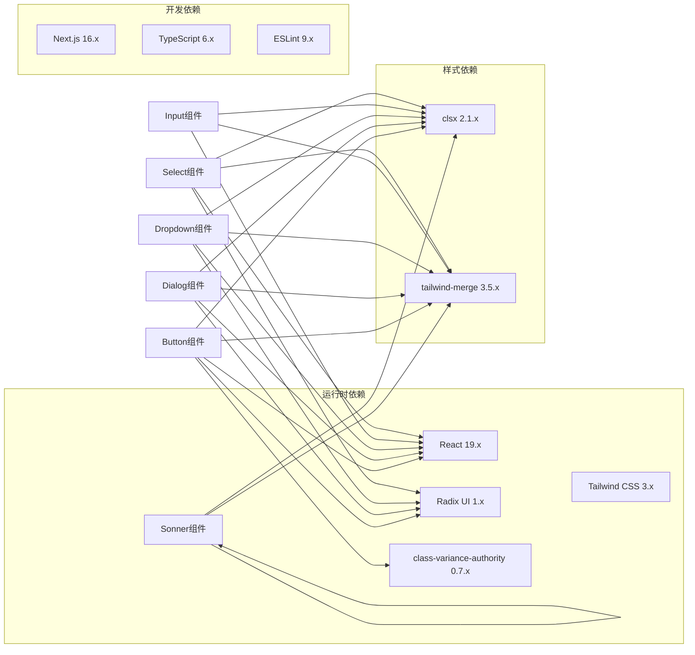
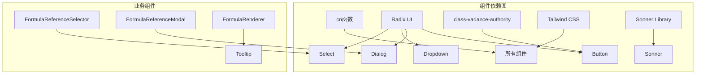

# 基础UI组件

<cite>
**本文档引用的文件**
- [button.tsx](file://src/components/ui/button.tsx)
- [dialog.tsx](file://src/components/ui/dialog.tsx)
- [dropdown-menu.tsx](file://src/components/ui/dropdown-menu.tsx)
- [input.tsx](file://src/components/ui/input.tsx)
- [select.tsx](file://src/components/ui/select.tsx)
- [sonner.tsx](file://src/components/ui/sonner.tsx)
- [utils.ts](file://src/lib/utils.ts)
- [tailwind.config.js](file://tailwind.config.js)
- [globals.css](file://src/app/globals.css)
- [layout.tsx](file://src/app/layout.tsx)
- [FormulaReferenceSelector.tsx](file://src/components/FormulaReferenceSelector.tsx)
- [package.json](file://package.json)
</cite>

## 更新摘要
**变更内容**
- 新增Select组件，提供现代化的选择器功能
- 新增Sonner通知系统，提升用户交互体验
- 更新组件使用示例，展示Select组件在公式引用选择中的应用
- 扩展依赖分析，包含新增的Radix UI Select和Sonner依赖

## 目录
1. [简介](#简介)
2. [项目结构](#项目结构)
3. [核心组件](#核心组件)
4. [架构概览](#架构概览)
5. [详细组件分析](#详细组件分析)
6. [依赖分析](#依赖分析)
7. [性能考虑](#性能考虑)
8. [故障排除指南](#故障排除指南)
9. [结论](#结论)

## 简介

本项目是一个公式变量映射与可视化工具，提供了六个基础UI组件：Button（按钮）、Dialog（对话框）、DropdownMenu（下拉菜单）、Input（输入框）、Select（选择器）和Sonner（通知系统）。这些组件基于Radix UI构建，采用Tailwind CSS进行样式定制，并通过class-variance-authority实现变体系统。

组件设计理念：
- **可访问性优先**：完全基于语义化的HTML元素，支持键盘导航和屏幕阅读器
- **主题一致性**：统一的颜色系统和间距规范
- **响应式设计**：适配不同屏幕尺寸
- **可扩展性**：支持自定义样式和变体
- **现代化体验**：提供现代化的选择器和通知系统

## 项目结构

项目采用Next.js框架，UI组件位于`src/components/ui/`目录下，样式配置在根目录配置文件中。新增的Select组件和Sonner通知系统为项目提供了更丰富的用户交互能力。



**图表来源**
- [select.tsx:1-161](file://src/components/ui/select.tsx#L1-L161)
- [sonner.tsx:1-34](file://src/components/ui/sonner.tsx#L1-L34)

**章节来源**
- [select.tsx:1-161](file://src/components/ui/select.tsx#L1-L161)
- [sonner.tsx:1-34](file://src/components/ui/sonner.tsx#L1-L34)

## 核心组件

### 组件总览

| 组件名称 | 功能特性 | 主要用途 |
|---------|----------|----------|
| Button | 支持多种变体和尺寸，可作为容器组件 | 表单提交、操作按钮、导航链接 |
| Dialog | 完整的对话框解决方案，支持模态和非模态 | 确认对话框、信息展示、设置面板 |
| DropdownMenu | 复杂的下拉菜单系统，支持嵌套和分组 | 菜单导航、设置选项、操作选择 |
| Input | 基础输入控件，支持类型和状态管理 | 文本输入、表单字段、搜索框 |
| Select | 现代化选择器，支持分组和滚动 | 下拉选择、公式引用、选项配置 |
| Sonner | 现代化通知系统，支持多种通知类型 | 错误提示、成功反馈、信息通知 |

### 设计系统

组件共享以下设计原则：
- **颜色系统**：基于CSS变量的主题系统，支持明暗模式切换
- **间距规范**：统一的边距和内边距标准
- **圆角半径**：一致的边角圆润度
- **动画效果**：平滑的过渡和状态变化
- **一致性**：所有组件遵循相同的交互模式和视觉语言

**章节来源**
- [globals.css:1-60](file://src/app/globals.css#L1-L60)
- [tailwind.config.js:17-57](file://tailwind.config.js#L17-L57)

## 架构概览



**图表来源**
- [select.tsx:3-7](file://src/components/ui/select.tsx#L3-L7)
- [sonner.tsx:3](file://src/components/ui/sonner.tsx#L3)
- [utils.ts:4-6](file://src/lib/utils.ts#L4-L6)

## 详细组件分析

### Button组件

Button组件是项目中最复杂的组件，实现了完整的变体系统和容器模式。

#### 设计理念

Button组件采用"容器模式"（Slot Pattern），允许将任何元素包装为按钮：
- `asChild`属性控制是否使用子元素作为按钮
- 支持原生button元素的所有属性
- 自动处理图标和文本的对齐

#### 变体系统



**图表来源**
- [button.tsx:7-35](file://src/components/ui/button.tsx#L7-L35)
- [button.tsx:37-41](file://src/components/ui/button.tsx#L37-L41)

#### 属性定义

| 属性名 | 类型 | 默认值 | 描述 |
|--------|------|--------|------|
| variant | 'default' \| 'destructive' \| 'outline' \| 'secondary' \| 'ghost' \| 'link' | 'default' | 按钮外观变体 |
| size | 'default' \| 'sm' \| 'lg' \| 'icon' | 'default' | 按钮尺寸变体 |
| asChild | boolean | false | 是否使用子元素作为按钮 |
| className | string | undefined | 自定义CSS类名 |

#### 事件回调

Button组件继承自原生HTMLButtonElement，支持所有标准事件：
- onClick
- onMouseEnter
- onMouseLeave
- onFocus
- onBlur
- onKeyDown

#### 样式变体详解

1. **default**：主色调背景，白色文字，带阴影
2. **destructive**：红色背景，白色文字，用于危险操作
3. **outline**：描边样式，背景透明，适合次要操作
4. **secondary**：次要色调，较浅的背景色
5. **ghost**：透明背景，悬停时显示背景色
6. **link**：纯文字链接样式，带下划线

#### 尺寸选项

- **default**：高度24px，内边距适中
- **sm**：高度20px，紧凑布局
- **lg**：高度28px，适合主要操作
- **icon**：正方形图标按钮，适合工具栏

**章节来源**
- [button.tsx:7-58](file://src/components/ui/button.tsx#L7-L58)

### Dialog组件

Dialog组件提供了完整的对话框解决方案，基于Radix UI的对话框原语。

#### 组件层次结构



**图表来源**
- [dialog.tsx:9-122](file://src/components/ui/dialog.tsx#L9-L122)

#### 组件功能

1. **模态控制**：自动管理焦点和背景锁定
2. **动画系统**：基于CSS动画的状态转换
3. **无障碍支持**：完整的ARIA标签和键盘导航
4. **响应式布局**：自适应不同屏幕尺寸

#### API参考

| 组件名 | 属性 | 类型 | 描述 |
|--------|------|------|------|
| Dialog | children, open, onOpenChange | ReactNode, boolean, function | 根组件 |
| DialogTrigger | asChild, children | boolean, ReactNode | 触发器组件 |
| DialogPortal | container | Element | 容器组件 |
| DialogOverlay | className, children | string, ReactNode | 背景遮罩 |
| DialogContent | className, children, sideOffset | string, ReactNode, number | 对话框内容 |
| DialogHeader | className, children | string, ReactNode | 头部区域 |
| DialogFooter | className, children | string, ReactNode | 底部区域 |
| DialogTitle | className, children | string, ReactNode | 标题文本 |
| DialogDescription | className, children | string, ReactNode | 描述文本 |

#### 使用示例

```typescript
// 基础对话框
<Dialog>
  <DialogTrigger>打开对话框</DialogTrigger>
  <DialogContent>
    <DialogHeader>
      <DialogTitle>标题</DialogTitle>
      <DialogDescription>描述信息</DialogDescription>
    </DialogHeader>
    <DialogFooter>
      <Button variant="outline">取消</Button>
      <Button>确认</Button>
    </DialogFooter>
  </DialogContent>
</Dialog>
```

**章节来源**
- [dialog.tsx:1-123](file://src/components/ui/dialog.tsx#L1-L123)

### DropdownMenu组件

DropdownMenu组件提供了复杂而灵活的下拉菜单系统，支持嵌套菜单和多种项目类型。

#### 功能特性

1. **多级菜单**：支持子菜单和嵌套结构
2. **项目类型**：普通项目、复选框项目、单选项目
3. **分组管理**：逻辑分组和标签显示
4. **快捷键支持**：键盘导航和快捷键显示

#### 组件体系



**图表来源**
- [dropdown-menu.tsx:9-201](file://src/components/ui/dropdown-menu.tsx#L9-L201)

#### 项目类型

1. **普通项目**：基本的菜单项，支持插入偏移
2. **复选框项目**：带勾选状态的项目
3. **单选项目**：单选组中的项目
4. **标签项目**：分组标签，支持插入偏移
5. **分隔符**：视觉分隔线
6. **快捷键**：右对齐的快捷键显示

#### API参考

| 组件名 | 属性 | 类型 | 描述 |
|--------|------|------|------|
| DropdownMenu | children, open, onOpenChange | ReactNode, boolean, function | 根组件 |
| DropdownMenuTrigger | asChild, children | boolean, ReactNode | 触发器组件 |
| DropdownMenuContent | className, sideOffset, align, avoidCollisions | string, number, string, boolean | 内容容器 |
| DropdownMenuItem | className, inset, disabled | string, boolean, boolean | 普通项目 |
| DropdownMenuCheckboxItem | className, checked, onCheckedChange | string, boolean, function | 复选框项目 |
| DropdownMenuRadioItem | className, checked, onCheckedChange | string, boolean, function | 单选项目 |
| DropdownMenuLabel | className, inset | string, boolean | 标签项目 |
| DropdownMenuSeparator | className | string | 分隔符 |
| DropdownMenuShortcut | className | string | 快捷键 |

**章节来源**
- [dropdown-menu.tsx:1-202](file://src/components/ui/dropdown-menu.tsx#L1-L202)

### Input组件

Input组件是最简单的基础组件，专注于输入控件的核心功能。

#### 设计特点

1. **类型安全**：完整的HTMLInputElement属性支持
2. **样式统一**：与其他表单控件保持一致的外观
3. **状态管理**：自动处理禁用和聚焦状态
4. **响应式**：适配不同设备和屏幕尺寸

#### 属性定义

| 属性名 | 类型 | 默认值 | 描述 |
|--------|------|--------|------|
| type | string | 'text' | 输入类型（text, email, password等） |
| className | string | undefined | 自定义CSS类名 |
| defaultValue | string | undefined | 默认值 |
| value | string | undefined | 当前值 |
| onChange | function | undefined | 值变化回调 |
| placeholder | string | undefined | 占位符文本 |
| disabled | boolean | false | 是否禁用 |
| readOnly | boolean | false | 是否只读 |

#### 样式系统

Input组件使用Tailwind CSS类名组合：
- 基础边框：`border border-input`
- 背景状态：`bg-transparent`
- 字体样式：`text-base md:text-sm`
- 焦点状态：`focus-visible:outline-none focus-visible:ring-1 focus-visible:ring-ring`
- 禁用状态：`disabled:cursor-not-allowed disabled:opacity-50`

**章节来源**
- [input.tsx:1-26](file://src/components/ui/input.tsx#L1-L26)

### Select组件

Select组件是新增的现代化选择器组件，基于Radix UI Select构建，提供了丰富的选择功能。

#### 设计理念

Select组件提供了完整的下拉选择解决方案，支持分组、滚动和现代化的视觉效果：
- **分组支持**：支持逻辑分组和标签显示
- **滚动功能**：内置滚动按钮，支持大量选项
- **现代化样式**：基于Tailwind CSS的现代化设计
- **无障碍支持**：完整的键盘导航和屏幕阅读器支持

#### 组件体系



**图表来源**
- [select.tsx:9-160](file://src/components/ui/select.tsx#L9-L160)

#### 组件功能

1. **分组管理**：支持逻辑分组和标签显示
2. **滚动支持**：自动显示滚动按钮，处理大量选项
3. **现代化样式**：基于CSS变量的主题系统
4. **动画效果**：平滑的展开和收起动画
5. **无障碍支持**：完整的键盘导航和ARIA标签

#### API参考

| 组件名 | 属性 | 类型 | 描述 |
|--------|------|------|------|
| Select | children, value, onValueChange | ReactNode, string, function | 根组件 |
| SelectTrigger | asChild, children, className | boolean, ReactNode, string | 触发器组件 |
| SelectContent | className, children, position, sideOffset | string, ReactNode, string, number | 内容容器 |
| SelectGroup | asChild, children | boolean, ReactNode | 分组容器 |
| SelectLabel | className, inset, children | string, boolean, ReactNode | 分组标签 |
| SelectItem | className, disabled, children | string, boolean, ReactNode | 选项项目 |
| SelectSeparator | className | string | 分隔符 |
| SelectScrollUpButton | className | string | 向上滚动按钮 |
| SelectScrollDownButton | className | string | 向下滚动按钮 |
| SelectValue | className, placeholder, children | string, string, ReactNode | 选中值显示 |

#### 使用示例

```typescript
// 基础选择器
<Select value={value} onValueChange={setValue}>
  <SelectTrigger className="w-full">
    <SelectValue placeholder="选择选项" />
  </SelectTrigger>
  <SelectContent>
    <SelectItem value="option1">选项1</SelectItem>
    <SelectItem value="option2">选项2</SelectItem>
    <SelectItem value="option3">选项3</SelectItem>
  </SelectContent>
</Select>
```

**章节来源**
- [select.tsx:1-161](file://src/components/ui/select.tsx#L1-L161)

### Sonner通知系统

Sonner通知系统是新增的现代化通知组件，提供了丰富的通知类型和自定义选项。

#### 设计理念

Sonner通知系统提供了现代化的通知体验，支持多种通知类型和丰富的自定义选项：
- **多种通知类型**：成功、错误、信息、警告等
- **现代化样式**：基于CSS变量的主题系统
- **丰富的自定义**：支持自定义样式类名和动画效果
- **响应式设计**：适配不同屏幕尺寸和位置

#### 通知类型

1. **success**：成功通知，绿色主题
2. **error**：错误通知，红色主题
3. **info**：信息通知，蓝色主题
4. **warning**：警告通知，橙色主题
5. **default**：默认通知，灰色主题

#### 组件功能

1. **位置控制**：支持多种显示位置（top-center, bottom-right等）
2. **富文本支持**：支持HTML内容和富文本格式
3. **自定义样式**：支持自定义类名和样式覆盖
4. **动画效果**：平滑的进入和退出动画
5. **响应式布局**：自适应不同屏幕尺寸

#### API参考

| 属性名 | 类型 | 默认值 | 描述 |
|--------|------|--------|------|
| position | 'top-left' \| 'top-center' \| 'top-right' \| 'bottom-left' \| 'bottom-center' \| 'bottom-right' | 'bottom-right' | 通知显示位置 |
| toastOptions | Object | {} | 通知样式配置 |
| className | string | 'toaster group' | 自定义容器类名 |
| richColors | boolean | false | 启用丰富色彩效果 |
| toastClassName | string | '' | 自定义通知类名 |
| style | React.CSSProperties | {} | 自定义样式 |

#### 使用示例

```typescript
// 在应用根组件中引入
import { Toaster } from '@/components/ui/sonner'

export default function RootLayout({ children }) {
  return (
    <html>
      <body>
        {children}
        <Toaster position="top-center" richColors />
      </body>
    </html>
  )
}

// 在组件中使用
import { toast } from 'sonner'

// 成功通知
toast.success('操作成功')

// 错误通知
toast.error('操作失败')

// 自定义通知
toast.info('这是信息通知', {
  description: '详细描述信息',
  duration: 3000,
})
```

**章节来源**
- [sonner.tsx:1-34](file://src/components/ui/sonner.tsx#L1-L34)
- [layout.tsx:19](file://src/app/layout.tsx#L19)

## 依赖分析

### 核心依赖关系



**图表来源**
- [package.json:15-36](file://package.json#L15-L36)

### 组件间依赖



**图表来源**
- [utils.ts:4-6](file://src/lib/utils.ts#L4-L6)
- [FormulaReferenceSelector.tsx:5-12](file://src/components/FormulaReferenceSelector.tsx#L5-L12)

**章节来源**
- [package.json:15-48](file://package.json#L15-L48)

## 性能考虑

### 优化策略

1. **懒加载**：Dialog和DropdownMenu组件使用Portal模式，避免DOM层级过深
2. **内存管理**：组件使用forwardRef减少不必要的重新渲染
3. **样式优化**：使用Tailwind CSS的原子化类名，避免重复样式计算
4. **事件处理**：合理使用事件委托和防抖机制
5. **Select组件优化**：使用Portal模式和虚拟滚动处理大量选项
6. **通知系统优化**：Sonner使用高效的动画和内存管理

### 最佳实践

- **避免深层嵌套**：尽量保持组件树扁平化
- **合理使用变体**：不要过度使用复杂的变体组合
- **性能监控**：使用React DevTools监控组件渲染性能
- **内存泄漏防护**：及时清理事件监听器和定时器
- **Select组件使用**：对于大量选项使用虚拟滚动和分组管理
- **通知系统使用**：合理控制通知数量和持续时间

## 故障排除指南

### 常见问题

#### 1. 样式不生效

**症状**：组件显示异常或样式丢失

**解决方案**：
- 确保Tailwind CSS已正确配置
- 检查CSS变量是否正确设置
- 验证cn函数的类名合并逻辑
- 确认Radix UI和Sonner的样式依赖已正确安装

#### 2. 无障碍功能问题

**症状**：屏幕阅读器无法正确识别组件

**解决方案**：
- 确保提供适当的aria-label属性
- 检查tabIndex和键盘导航
- 验证焦点管理逻辑
- 为Select组件提供适当的ARIA标签

#### 3. 响应式布局问题

**症状**：移动端显示异常

**解决方案**：
- 检查断点设置
- 验证触摸交互
- 测试不同屏幕尺寸
- 确保Select组件的滚动功能正常工作

#### 4. Select组件问题

**症状**：选择器无法正常显示或选择

**解决方案**：
- 确保Select组件的子组件结构正确
- 检查value和onValueChange属性绑定
- 验证Portal容器的正确性
- 确认分组和选项的正确嵌套

#### 5. 通知系统问题

**症状**：通知无法显示或样式异常

**解决方案**：
- 确保Toaster组件在应用根组件中正确引入
- 检查position和richColors属性设置
- 验证CSS类名的正确性
- 确认Sonner库版本兼容性

**章节来源**
- [globals.css:29-49](file://src/app/globals.css#L29-L49)
- [tailwind.config.js:13-16](file://tailwind.config.js#L13-L16)

## 结论

本项目的基础UI组件系统展现了现代前端开发的最佳实践：

1. **架构清晰**：基于Radix UI的可靠组件库
2. **设计一致**：统一的样式系统和交互模式
3. **可扩展性强**：灵活的变体系统和主题支持
4. **可访问性完善**：完整的无障碍功能支持
5. **现代化体验**：新增的Select组件和Sonner通知系统提升了用户体验

组件系统为公式变量映射与可视化工具提供了坚实的基础，支持复杂公式的编辑、展示和管理需求。通过合理的组件组合和样式定制，可以构建出专业级的用户体验。

新增的Select组件和Sonner通知系统进一步增强了项目的现代化程度：
- **Select组件**：提供了专业的选择器功能，支持分组、滚动和现代化样式
- **Sonner通知系统**：提供了丰富的通知类型和自定义选项，提升了用户反馈体验

建议在实际使用中：
- 严格遵循组件的API规范
- 合理使用变体和尺寸选项
- 注重可访问性和响应式设计
- 建立完善的组件测试体系
- 充分利用新增的Select和通知系统功能