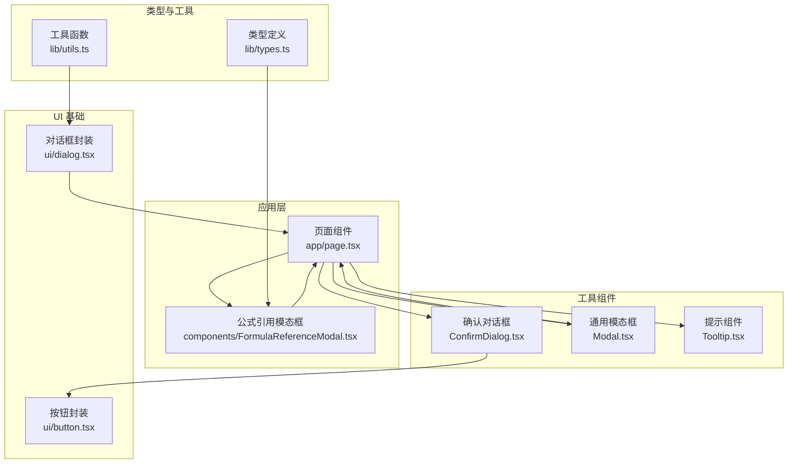
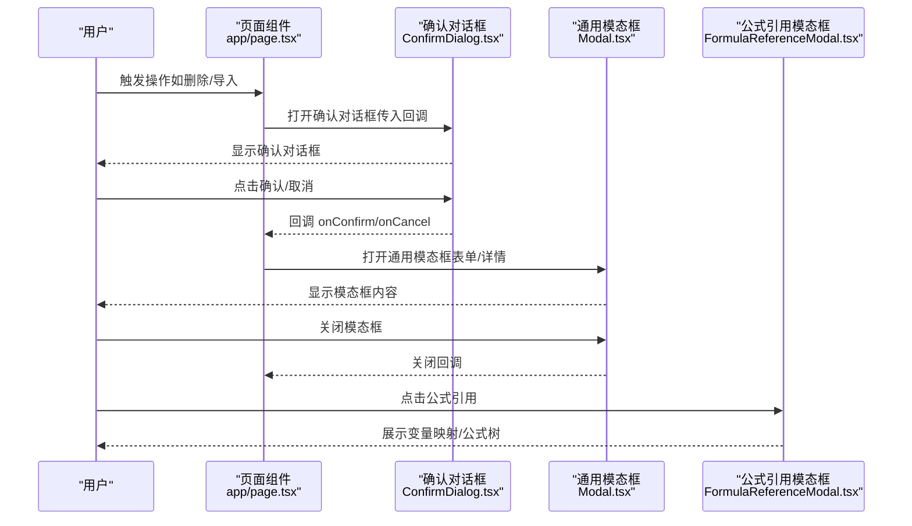
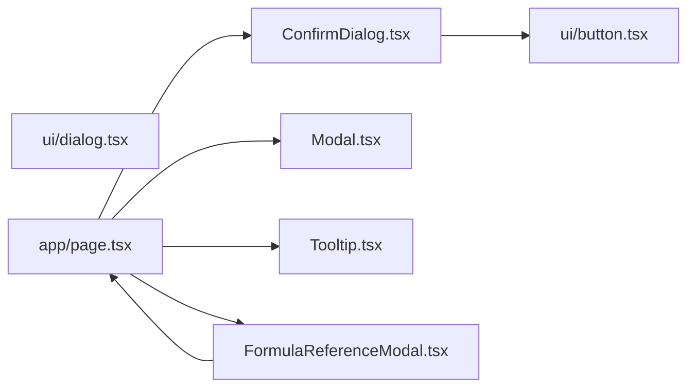

# 工具组件

<cite>
**本文档引用的文件**
- [ConfirmDialog.tsx](file://src/components/ConfirmDialog.tsx)
- [Modal.tsx](file://src/components/Modal.tsx)
- [Tooltip.tsx](file://src/components/Tooltip.tsx)
- [dialog.tsx](file://src/components/ui/dialog.tsx)
- [button.tsx](file://src/components/ui/button.tsx)
- [page.tsx](file://src/app/page.tsx)
- [FormulaReferenceModal.tsx](file://src/components/FormulaReferenceModal.tsx)
- [types.ts](file://src/lib/types.ts)
- [utils.ts](file://src/lib/utils.ts)
- [package.json](file://package.json)
</cite>

## 目录
1. [简介](#简介)
2. [项目结构](#项目结构)
3. [核心组件](#核心组件)
4. [架构总览](#架构总览)
5. [组件详细分析](#组件详细分析)
6. [依赖关系分析](#依赖关系分析)
7. [性能考量](#性能考量)
8. [故障排查指南](#故障排查指南)
9. [结论](#结论)
10. [附录](#附录)

## 简介
本文件面向“公式变量映射与可视化工具”的前端工具组件，系统化梳理并说明以下通用组件：
- ConfirmDialog：确认对话框，用于危险或重要操作的二次确认
- Modal：通用模态框容器，承载复杂表单与信息面板
- Tooltip：轻量提示组件，提供悬停提示能力

同时，文档涵盖组件设计目的、使用场景、实现原理、API 参考、样式定制与主题适配、可访问性与用户体验优化、最佳实践与常见模式、以及性能考虑与优化建议。文中所有技术细节均基于仓库现有源码进行分析与总结。

## 项目结构
工具组件位于 src/components 下，采用按功能分层组织：
- 工具组件：ConfirmDialog.tsx、Modal.tsx、Tooltip.tsx
- UI 基础组件：ui/dialog.tsx、ui/button.tsx
- 应用入口与使用场景：app/page.tsx
- 组件间协作示例：components/FormulaReferenceModal.tsx
- 类型定义：lib/types.ts
- 工具函数：lib/utils.ts
- 依赖声明：package.json

图表来源
- [page.tsx:1-798](file://src/app/page.tsx#L1-L798)
- [ConfirmDialog.tsx:1-54](file://src/components/ConfirmDialog.tsx#L1-L54)
- [Modal.tsx:1-23](file://src/components/Modal.tsx#L1-L23)
- [Tooltip.tsx:1-48](file://src/components/Tooltip.tsx#L1-L48)
- [FormulaReferenceModal.tsx:1-180](file://src/components/FormulaReferenceModal.tsx#L1-L180)
- [dialog.tsx:1-123](file://src/components/ui/dialog.tsx#L1-L123)
- [button.tsx:1-58](file://src/components/ui/button.tsx#L1-L58)
- [types.ts:1-51](file://src/lib/types.ts#L1-L51)
- [utils.ts:1-7](file://src/lib/utils.ts#L1-L7)

章节来源
- [page.tsx:1-798](file://src/app/page.tsx#L1-L798)
- [ConfirmDialog.tsx:1-54](file://src/components/ConfirmDialog.tsx#L1-L54)
- [Modal.tsx:1-23](file://src/components/Modal.tsx#L1-L23)
- [Tooltip.tsx:1-48](file://src/components/Tooltip.tsx#L1-L48)
- [FormulaReferenceModal.tsx:1-180](file://src/components/FormulaReferenceModal.tsx#L1-L180)
- [dialog.tsx:1-123](file://src/components/ui/dialog.tsx#L1-L123)
- [button.tsx:1-58](file://src/components/ui/button.tsx#L1-L58)
- [types.ts:1-51](file://src/lib/types.ts#L1-L51)
- [utils.ts:1-7](file://src/lib/utils.ts#L1-L7)

## 核心组件
本节对三个工具组件进行概览式说明，后续章节将深入 API、实现与使用模式。

- ConfirmDialog（确认对话框）
  - 设计目的：在关键操作前提供明确的二次确认，避免误操作
  - 使用场景：删除分组/公式、导入覆盖确认、危险操作提示
  - 实现要点：自绘遮罩层、居中对话框、按钮变体支持（默认/危险）

- Modal（通用模态框）
  - 设计目的：作为复杂内容的容器，承载表单、详情面板等
  - 使用场景：新建/编辑公式、URL 导入、分组创建等
  - 实现要点：外层遮罩点击关闭、标题区与内容区分离

- Tooltip（提示组件）
  - 设计目的：为交互元素提供简短说明，提升可用性
  - 使用场景：按钮、图标、输入框等元素的悬停提示
  - 实现要点：鼠标进入/离开事件计算定位、固定定位与动画

章节来源
- [ConfirmDialog.tsx:1-54](file://src/components/ConfirmDialog.tsx#L1-L54)
- [Modal.tsx:1-23](file://src/components/Modal.tsx#L1-L23)
- [Tooltip.tsx:1-48](file://src/components/Tooltip.tsx#L1-L48)

## 架构总览
工具组件与应用层的交互关系如下：

图表来源
- [page.tsx:1-798](file://src/app/page.tsx#L1-L798)
- [ConfirmDialog.tsx:1-54](file://src/components/ConfirmDialog.tsx#L1-L54)
- [Modal.tsx:1-23](file://src/components/Modal.tsx#L1-L23)
- [FormulaReferenceModal.tsx:1-180](file://src/components/FormulaReferenceModal.tsx#L1-L180)

## 组件详细分析

### ConfirmDialog（确认对话框）
- 设计目的
  - 在执行可能造成不可逆影响的操作前，要求用户显式确认
  - 支持“危险”与“默认”两种视觉风格，便于区分操作风险等级

- 使用场景
  - 删除分组/公式
  - 导入数据覆盖确认
  - 危险操作的二次确认

- 实现原理
  - 使用固定定位与 z-index 控制层级
  - 外层遮罩点击触发取消回调
  - 内层对话框包含标题、消息与两个按钮区域
  - 按钮使用 UI 基础组件，支持变体切换

- API 参考
  - 属性
    - isOpen: boolean — 是否显示
    - title: string — 对话框标题
    - message: string — 提示消息
    - confirmText?: string — 确认按钮文本，默认“确定”
    - cancelText?: string — 取消按钮文本，默认“取消”
    - onConfirm: () => void — 确认回调
    - onCancel: () => void — 取消回调
    - variant?: 'danger' | 'default' — 按钮风格
  - 事件与行为
    - 点击遮罩触发 onCancel
    - 点击确认按钮触发 onConfirm
    - variant 为 'danger' 时，确认按钮使用破坏性样式

- 使用示例与集成指导
  - 在页面组件中维护 isOpen 状态与回调
  - 将 ConfirmDialog 作为条件渲染插入到页面布局中
  - 通过 variant 区分操作风险，提升用户决策清晰度

- 样式定制与主题适配
  - 基于 Tailwind 类名控制外观
  - 可通过覆盖类名或主题变量调整颜色与阴影
  - 与 UI 按钮组件联动，统一风格

- 可访问性与用户体验
  - 确保键盘可聚焦与回车确认
  - 提供明确的语义化标题与描述
  - 动画过渡自然，避免闪烁

- 性能与优化
  - 未显示时不渲染 DOM，减少内存占用
  - 回调函数应稳定，避免不必要的重渲染

- 最佳实践
  - 仅在必要时弹出确认对话框，避免过度打断
  - 明确操作后果，使用简洁易懂的语言
  - 优先使用默认风格；仅在真正危险操作时使用危险风格

章节来源
- [ConfirmDialog.tsx:1-54](file://src/components/ConfirmDialog.tsx#L1-L54)
- [button.tsx:1-58](file://src/components/ui/button.tsx#L1-L58)

### Modal（通用模态框）
- 设计目的
  - 作为复杂内容的容器，承载表单、详情面板、设置界面等
  - 提供统一的遮罩与关闭机制

- 使用场景
  - 新建/编辑公式
  - URL 导入
  - 分组创建
  - 任意需要浮层展示的场景

- 实现原理
  - 外层绝对定位遮罩，点击触发关闭
  - 内层卡片容器，包含标题与内容区域
  - 条件渲染：isOpen 为真时才挂载

- API 参考
  - 属性
    - isOpen: boolean — 是否显示
    - onClose: () => void — 关闭回调
    - title: string — 标题
    - children: React.ReactNode — 内容

- 使用示例与集成指导
  - 在页面组件中维护 isOpen 状态与 onClose 回调
  - 将 Modal 作为条件渲染插入布局
  - 在 children 中放置复杂表单或详情内容

- 样式定制与主题适配
  - 通过类名控制尺寸、圆角、阴影与背景色
  - 适配深浅主题，确保对比度满足可访问性要求

- 可访问性与用户体验
  - 点击遮罩关闭，符合用户预期
  - 内容滚动区域需合理设置最大高度
  - 关闭按钮具备清晰的 ARIA 标签

- 性能与优化
  - 未显示时不渲染，降低开销
  - 内容区域尽量懒加载，避免首屏阻塞

- 最佳实践
  - 保持内容简洁，避免过长滚动
  - 提供明确的关闭方式（按钮与遮罩）
  - 与 ConfirmDialog 协作，先确认再打开复杂模态

章节来源
- [Modal.tsx:1-23](file://src/components/Modal.tsx#L1-L23)
- [page.tsx:591-786](file://src/app/page.tsx#L591-L786)

### Tooltip（提示组件）
- 设计目的
  - 为交互元素提供简短说明，帮助用户理解功能
  - 不打断主流程，仅在悬停时出现

- 使用场景
  - 按钮、图标、输入框等元素的辅助说明
  - 表单字段的提示信息

- 实现原理
  - 使用 useState 管理可见性与位置
  - 鼠标进入时计算元素边界，计算提示框位置
  - 鼠标离开时隐藏提示
  - 使用固定定位与动画类名实现平滑出现/消失

- API 参考
  - 属性
    - content: string — 提示文本
    - children: React.ReactElement — 触发元素

- 使用示例与集成指导
  - 将 Tooltip 包裹在需要提示的元素外层
  - 确保 children 是可交互元素，避免无事件目标
  - 文本不宜过长，保持简洁明了

- 样式定制与主题适配
  - 通过类名控制背景色、文字颜色、圆角与阴影
  - 适配深色主题，确保对比度

- 可访问性与用户体验
  - 仅在悬停时出现，避免干扰屏幕阅读器
  - 可结合键盘焦点与屏幕阅读器提示增强可访问性

- 性能与优化
  - 事件绑定在父级元素上，避免重复绑定
  - 位置计算在进入时进行，离开时立即隐藏

- 最佳实践
  - 提示内容与交互元素紧密相关
  - 避免密集提示，防止信息过载

章节来源
- [Tooltip.tsx:1-48](file://src/components/Tooltip.tsx#L1-L48)

### 与 UI 基础组件的关系
- ConfirmDialog 依赖 UI 按钮组件，通过变体控制按钮风格
- Modal 作为独立容器，不依赖 UI 对话框组件
- Tooltip 为纯客户端组件，不依赖 UI 对话框组件

章节来源
- [ConfirmDialog.tsx:1-54](file://src/components/ConfirmDialog.tsx#L1-L54)
- [button.tsx:1-58](file://src/components/ui/button.tsx#L1-L58)

### 与应用层的协作
- 页面组件在合适时机打开/关闭 ConfirmDialog 与 Modal
- FormulaReferenceModal 作为复杂内容容器，内部可嵌套使用工具组件
- 类型定义与工具函数贯穿组件间的数据传递与样式合并

章节来源
- [page.tsx:1-798](file://src/app/page.tsx#L1-L798)
- [FormulaReferenceModal.tsx:1-180](file://src/components/FormulaReferenceModal.tsx#L1-L180)
- [types.ts:1-51](file://src/lib/types.ts#L1-L51)
- [utils.ts:1-7](file://src/lib/utils.ts#L1-L7)

## 依赖关系分析
- 组件依赖
  - ConfirmDialog 依赖 UI 按钮组件
  - Modal 为独立组件，不依赖 UI 对话框组件
  - Tooltip 为独立组件，不依赖 UI 对话框组件
- 外部依赖
  - UI 基础组件来自 Radix UI 与本地封装
  - 样式工具来自 Tailwind 与 class-variance-authority
- 潜在循环依赖
  - 工具组件之间无直接依赖，不存在循环
- 集成点
  - 页面组件作为协调者，负责状态管理与回调传递
  - 公式引用模态框作为复杂内容容器，可复用工具组件

图表来源
- [ConfirmDialog.tsx:1-54](file://src/components/ConfirmDialog.tsx#L1-L54)
- [button.tsx:1-58](file://src/components/ui/button.tsx#L1-L58)
- [Modal.tsx:1-23](file://src/components/Modal.tsx#L1-L23)
- [Tooltip.tsx:1-48](file://src/components/Tooltip.tsx#L1-L48)
- [dialog.tsx:1-123](file://src/components/ui/dialog.tsx#L1-L123)
- [page.tsx:1-798](file://src/app/page.tsx#L1-L798)
- [FormulaReferenceModal.tsx:1-180](file://src/components/FormulaReferenceModal.tsx#L1-L180)

章节来源
- [package.json:1-48](file://package.json#L1-L48)
- [ConfirmDialog.tsx:1-54](file://src/components/ConfirmDialog.tsx#L1-L54)
- [Modal.tsx:1-23](file://src/components/Modal.tsx#L1-L23)
- [Tooltip.tsx:1-48](file://src/components/Tooltip.tsx#L1-L48)
- [dialog.tsx:1-123](file://src/components/ui/dialog.tsx#L1-L123)
- [page.tsx:1-798](file://src/app/page.tsx#L1-L798)
- [FormulaReferenceModal.tsx:1-180](file://src/components/FormulaReferenceModal.tsx#L1-L180)

## 性能考量
- 渲染策略
  - 工具组件均采用条件渲染，未显示时不挂载 DOM，降低内存占用
- 事件处理
  - Tooltip 仅在进入/离开时计算位置，避免高频重排
- 动画与过渡
  - 使用 CSS 动画类名，避免 JavaScript 动画带来的性能开销
- 样式合并
  - 使用工具函数合并类名，减少无效样式叠加
- 可访问性
  - 提供键盘可达性与 ARIA 标签，提升可访问性体验

[本节为通用性能讨论，不直接分析具体文件]

## 故障排查指南
- 确认对话框无法关闭
  - 检查 isOpen 状态与 onCancel 回调是否正确传递
  - 确认遮罩点击事件是否被阻止冒泡
- 模态框内容不显示
  - 检查 isOpen 状态是否为真
  - 确认 children 是否正确传入
- 提示组件位置异常
  - 检查触发元素是否具有正确的边界信息
  - 确认固定定位上下文是否正确
- 样式错乱
  - 检查类名拼接与 Tailwind 配置
  - 确认主题变量是否正确覆盖

章节来源
- [ConfirmDialog.tsx:1-54](file://src/components/ConfirmDialog.tsx#L1-L54)
- [Modal.tsx:1-23](file://src/components/Modal.tsx#L1-L23)
- [Tooltip.tsx:1-48](file://src/components/Tooltip.tsx#L1-L48)

## 结论
工具组件在公式变量映射与可视化工具中承担了关键的交互与信息承载职责。ConfirmDialog 提升了关键操作的安全性，Modal 为复杂内容提供了统一容器，Tooltip 则增强了交互元素的可理解性。通过合理的 API 设计、样式定制与可访问性优化，这些组件能够有效提升用户体验与开发效率。建议在实际使用中遵循最佳实践，避免过度使用确认对话框，保持提示简洁明确，并根据业务场景选择合适的组件组合。

[本节为总结性内容，不直接分析具体文件]

## 附录
- 组件最佳实践清单
  - 确认对话框：仅在关键操作使用，明确风险等级，提供清晰文案
  - 模态框：内容简洁，提供明确关闭方式，避免过长滚动
  - 提示组件：内容简短，与交互元素紧密关联，避免信息过载
- 常见使用模式
  - 先 ConfirmDialog 后 Modal：先确认再打开复杂表单
  - Tooltip 辅助：为关键按钮与输入框提供简短说明
  - 组合使用：FormulaReferenceModal 中可嵌套使用工具组件

[本节为概念性内容，不直接分析具体文件]