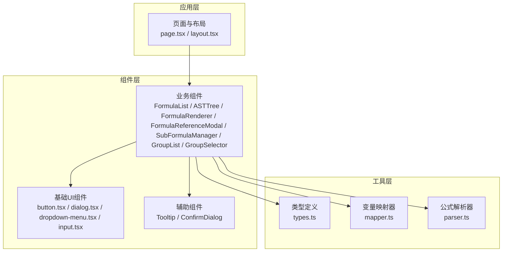
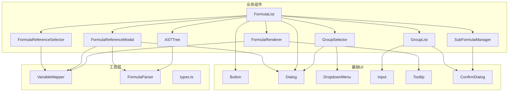
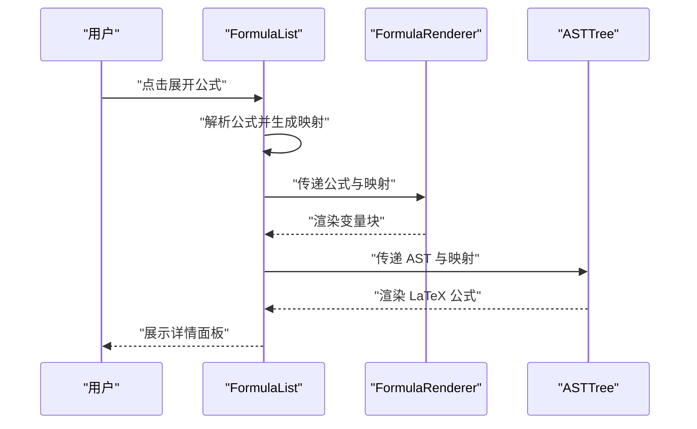
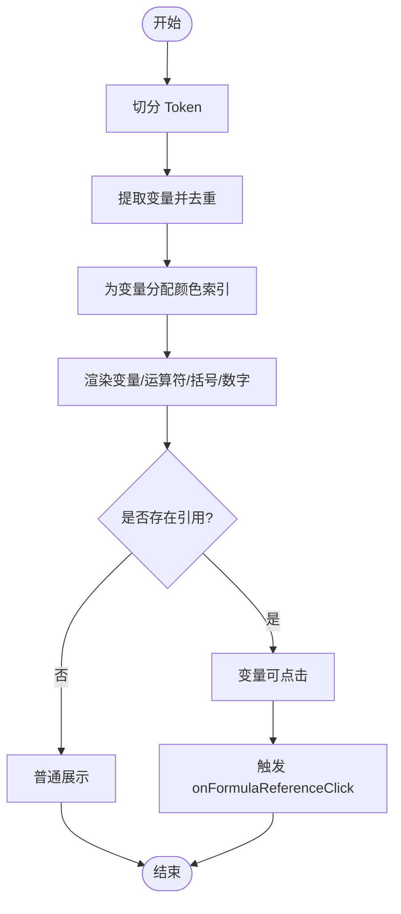
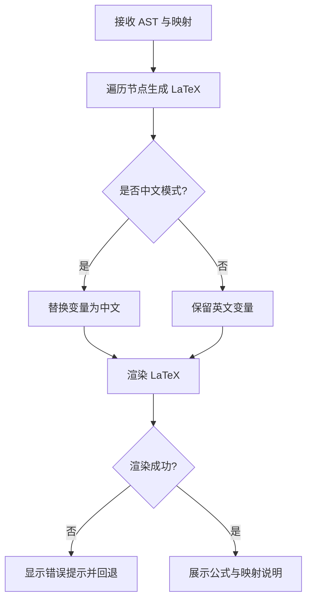
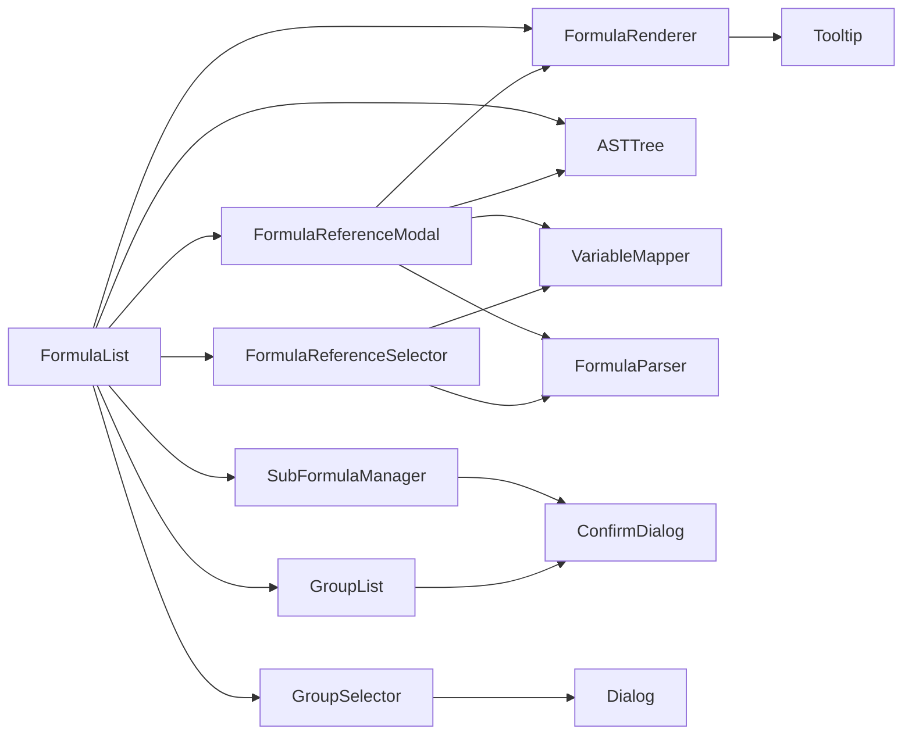

# 组件库

<cite>
**本文档引用的文件**
- [src/components/ui/button.tsx](file://src/components/ui/button.tsx)
- [src/components/ui/dialog.tsx](file://src/components/ui/dialog.tsx)
- [src/components/ui/dropdown-menu.tsx](file://src/components/ui/dropdown-menu.tsx)
- [src/components/ui/input.tsx](file://src/components/ui/input.tsx)
- [src/components/ASTTree.tsx](file://src/components/ASTTree.tsx)
- [src/components/FormulaList.tsx](file://src/components/FormulaList.tsx)
- [src/components/FormulaReferenceModal.tsx](file://src/components/FormulaReferenceModal.tsx)
- [src/components/FormulaReferenceSelector.tsx](file://src/components/FormulaReferenceSelector.tsx)
- [src/components/FormulaRenderer.tsx](file://src/components/FormulaRenderer.tsx)
- [src/components/SubFormulaManager.tsx](file://src/components/SubFormulaManager.tsx)
- [src/components/GroupList.tsx](file://src/components/GroupList.tsx)
- [src/components/GroupSelector.tsx](file://src/components/GroupSelector.tsx)
- [src/components/Tooltip.tsx](file://src/components/Tooltip.tsx)
- [src/components/ConfirmDialog.tsx](file://src/components/ConfirmDialog.tsx)
- [src/lib/types.ts](file://src/lib/types.ts)
- [src/lib/mapper.ts](file://src/lib/mapper.ts)
- [src/lib/parser.ts](file://src/lib/parser.ts)
</cite>

## 目录
1. [简介](#简介)
2. [项目结构](#项目结构)
3. [核心组件](#核心组件)
4. [架构总览](#架构总览)
5. [详细组件分析](#详细组件分析)
6. [依赖关系分析](#依赖关系分析)
7. [性能考量](#性能考量)
8. [故障排查指南](#故障排查指南)
9. [结论](#结论)
10. [附录](#附录)

## 简介
本组件库面向“公式变量映射与可视化工具”，提供从基础 UI 组件到业务组件的完整实现，覆盖公式解析、变量映射、公式渲染、AST 可视化、分组管理、引用选择与弹窗展示等功能。文档面向 UI 设计师与前端开发者，既提供 API 定义与使用示例，也涵盖设计原则、样式系统、响应式与无障碍支持、组合与自定义指导以及性能优化建议。

## 项目结构
项目采用按功能域划分的组织方式，核心目录如下：
- src/app：Next.js 应用入口与全局样式
- src/components：组件层，包含基础 UI 组件与业务组件
- src/lib：工具与类型定义，包含解析器、映射器、类型声明与通用工具

图表来源
- [src/app/page.tsx](file://src/app/page.tsx)
- [src/components/ui/button.tsx](file://src/components/ui/button.tsx)
- [src/components/FormulaList.tsx](file://src/components/FormulaList.tsx)
- [src/lib/types.ts](file://src/lib/types.ts)
- [src/lib/mapper.ts](file://src/lib/mapper.ts)
- [src/lib/parser.ts](file://src/lib/parser.ts)

章节来源
- [src/app/page.tsx](file://src/app/page.tsx)
- [src/app/layout.tsx](file://src/app/layout.tsx)
- [src/app/globals.css](file://src/app/globals.css)

## 核心组件
本节对基础 UI 组件与业务组件进行概览性说明，后续章节将深入 API、行为与使用方式。

- 基础 UI 组件
  - Button：支持多种变体与尺寸，支持透传原生按钮属性与作为语义容器
  - Dialog：基于 Radix UI 的对话框，包含触发器、门户、遮罩、内容区、标题与描述等
  - DropdownMenu：下拉菜单体系，支持子菜单、复选/单选项、标签、快捷键等
  - Input：输入框，支持类型与原生属性透传
- 业务组件
  - FormulaList：公式列表，支持搜索、分组筛选、展开查看详情、删除确认、编辑等
  - FormulaRenderer：将公式字符串渲染为带颜色变量与引用交互的可视化块
  - ASTTree：将 AST 节点渲染为 LaTeX 公式，支持中英文切换与变量映射说明
  - FormulaReferenceModal：公式引用弹窗，支持嵌套引用与错误提示
  - FormulaReferenceSelector：根据变量动态生成引用选择器，支持子公式与外部公式
  - SubFormulaManager：子公式增删改查与管理
  - GroupList：分组树形列表，支持展开/折叠、编辑/删除/新增子分组
  - GroupSelector：分组选择器，支持面包屑导航与层级选择
  - Tooltip：轻提示组件
  - ConfirmDialog：确认对话框

章节来源
- [src/components/ui/button.tsx](file://src/components/ui/button.tsx)
- [src/components/ui/dialog.tsx](file://src/components/ui/dialog.tsx)
- [src/components/ui/dropdown-menu.tsx](file://src/components/ui/dropdown-menu.tsx)
- [src/components/ui/input.tsx](file://src/components/ui/input.tsx)
- [src/components/FormulaList.tsx](file://src/components/FormulaList.tsx)
- [src/components/FormulaRenderer.tsx](file://src/components/FormulaRenderer.tsx)
- [src/components/ASTTree.tsx](file://src/components/ASTTree.tsx)
- [src/components/FormulaReferenceModal.tsx](file://src/components/FormulaReferenceModal.tsx)
- [src/components/FormulaReferenceSelector.tsx](file://src/components/FormulaReferenceSelector.tsx)
- [src/components/SubFormulaManager.tsx](file://src/components/SubFormulaManager.tsx)
- [src/components/GroupList.tsx](file://src/components/GroupList.tsx)
- [src/components/GroupSelector.tsx](file://src/components/GroupSelector.tsx)
- [src/components/Tooltip.tsx](file://src/components/Tooltip.tsx)
- [src/components/ConfirmDialog.tsx](file://src/components/ConfirmDialog.tsx)

## 架构总览
整体架构围绕“数据驱动的公式可视化”展开：业务组件负责状态管理与交互，工具层提供解析与映射能力，基础 UI 组件提供一致的交互与视觉体验。

图表来源
- [src/components/FormulaList.tsx](file://src/components/FormulaList.tsx)
- [src/components/FormulaRenderer.tsx](file://src/components/FormulaRenderer.tsx)
- [src/components/ASTTree.tsx](file://src/components/ASTTree.tsx)
- [src/components/FormulaReferenceModal.tsx](file://src/components/FormulaReferenceModal.tsx)
- [src/components/FormulaReferenceSelector.tsx](file://src/components/FormulaReferenceSelector.tsx)
- [src/components/SubFormulaManager.tsx](file://src/components/SubFormulaManager.tsx)
- [src/components/GroupList.tsx](file://src/components/GroupList.tsx)
- [src/components/GroupSelector.tsx](file://src/components/GroupSelector.tsx)
- [src/lib/mapper.ts](file://src/lib/mapper.ts)
- [src/lib/parser.ts](file://src/lib/parser.ts)
- [src/lib/types.ts](file://src/lib/types.ts)
- [src/components/Tooltip.tsx](file://src/components/Tooltip.tsx)
- [src/components/ConfirmDialog.tsx](file://src/components/ConfirmDialog.tsx)
- [src/components/ui/button.tsx](file://src/components/ui/button.tsx)
- [src/components/ui/dialog.tsx](file://src/components/ui/dialog.tsx)
- [src/components/ui/dropdown-menu.tsx](file://src/components/ui/dropdown-menu.tsx)
- [src/components/ui/input.tsx](file://src/components/ui/input.tsx)

## 详细组件分析

### 基础 UI 组件

#### Button 组件
- 属性
  - className: 字符串，用于追加样式类
  - variant: 变体，支持 default、destructive、outline、secondary、ghost、link
  - size: 尺寸，支持 default、sm、lg、icon
  - asChild: 是否以语义容器渲染
  - 原生 HTML Button 属性透传
- 事件
  - onClick、onFocus、onBlur 等原生事件透传
- 样式定制
  - 基于 class-variance-authority 的变体与尺寸组合
  - 支持通过 className 扩展或覆盖默认样式
- 使用示例
  - 基本按钮：设置 variant 与 size
  - 图标按钮：使用 size="icon" 并传入图标元素
  - 语义容器：asChild=true 时可包裹其他元素
- 最佳实践
  - 优先使用语义容器包裹内联元素，保持可访问性
  - 不要仅依赖颜色区分状态，同时提供文本提示

章节来源
- [src/components/ui/button.tsx](file://src/components/ui/button.tsx)

#### Dialog 组件
- 组成
  - Root/Portal/Overlay/Close/Trigger/Content/Header/Footer/Title/Description
- 属性
  - Overlay/Content/Title/Description 支持 className 与原生属性透传
  - Content 支持侧向动画与缩放动画
- 事件
  - Close 触发关闭
- 使用示例
  - 触发器绑定到任意元素，内容区包含标题与描述
- 最佳实践
  - 为 Close 按钮提供可读的 sr-only 文本
  - 使用 Portal 将内容挂载到 body，避免层级问题

章节来源
- [src/components/ui/dialog.tsx](file://src/components/ui/dialog.tsx)

#### DropdownMenu 组件
- 组成
  - Root/Trigger/Portal/Content/Sub/SubTrigger/SubContent/Group/RadioGroup
  - Item/CheckboxItem/RadioItem/Label/Separator/Shortcut
- 属性
  - SubTrigger 支持 inset
  - Item/CheckboxItem/RadioItem 支持 inset
  - Content 支持 sideOffset
- 事件
  - 交互由 Radix UI 状态控制，支持键盘导航
- 使用示例
  - 基本菜单项、分隔线、快捷键、复选/单选项
  - 子菜单与嵌套结构
- 最佳实践
  - 为快捷键提供清晰的文案
  - 使用 RadioGroup 实现互斥选择

章节来源
- [src/components/ui/dropdown-menu.tsx](file://src/components/ui/dropdown-menu.tsx)

#### Input 组件
- 属性
  - type: 输入类型
  - className: 样式扩展
  - 原生 HTML Input 属性透传
- 事件
  - onChange、onFocus、onBlur 等
- 使用示例
  - 搜索框、表单输入
- 最佳实践
  - 与表单控件配合时提供 label
  - 对必填字段提供验证提示

章节来源
- [src/components/ui/input.tsx](file://src/components/ui/input.tsx)

### 业务组件

#### FormulaList 组件
- 功能
  - 展示公式列表，支持搜索与分组筛选
  - 展开查看公式详情：变量映射、公式渲染、AST 树、错误提示
  - 编辑、删除、引用弹窗
- Props
  - groups: FormulaGroup[]
  - selectedGroupId: string | null
  - selectedFormulaId: string | null
  - onSelectFormula(_formulaId: string | null): void
  - onDeleteFormula(_formulaId: string): void
  - onEditFormula(_formula: Formula): void
- 事件
  - 点击展开/收起、编辑、删除、搜索
- 使用示例
  - 在页面中传入 groups 与回调，监听选中与删除事件
- 最佳实践
  - 合理缓存解析结果，避免重复解析
  - 对错误进行友好提示

图表来源
- [src/components/FormulaList.tsx](file://src/components/FormulaList.tsx)
- [src/components/FormulaRenderer.tsx](file://src/components/FormulaRenderer.tsx)
- [src/components/ASTTree.tsx](file://src/components/ASTTree.tsx)

章节来源
- [src/components/FormulaList.tsx](file://src/components/FormulaList.tsx)

#### FormulaRenderer 组件
- 功能
  - 将公式字符串切分为 token，渲染变量、运算符、括号与数字
  - 为变量分配颜色，支持引用提示与点击跳转
- Props
  - formula: string
  - mapping: Record<string, string>
  - formulaReferences?: Record<string, { name; englishFormula; chineseFormula; id; isSubFormula }>
  - onFormulaReferenceClick?(_formula: Formula | SubFormula): void
- 事件
  - 点击引用变量触发回调
- 使用示例
  - 在 FormulaList 或 FormulaReferenceModal 中使用
- 最佳实践
  - 为引用变量提供 Tooltip 提示
  - 保持颜色一致性，避免过多颜色造成干扰

图表来源
- [src/components/FormulaRenderer.tsx](file://src/components/FormulaRenderer.tsx)

章节来源
- [src/components/FormulaRenderer.tsx](file://src/components/FormulaRenderer.tsx)

#### ASTTree 组件
- 功能
  - 将 AST 节点转换为 LaTeX 字符串并渲染
  - 支持中英文切换与变量映射说明
- Props
  - ast: ASTNode
  - mapping: Record<string, string>
- 事件
  - 无
- 使用示例
  - 在 FormulaList 与 FormulaReferenceModal 中展示
- 最佳实践
  - 动态加载 KaTeX 样式，避免阻塞首屏
  - 对渲染错误进行降级处理

图表来源
- [src/components/ASTTree.tsx](file://src/components/ASTTree.tsx)

章节来源
- [src/components/ASTTree.tsx](file://src/components/ASTTree.tsx)

#### FormulaReferenceModal 组件
- 功能
  - 展示公式引用详情，支持嵌套引用弹窗
- Props
  - formula: Formula | SubFormula
  - onClose(): void
  - allFormulas?: Record<string, Formula>
  - subFormulas?: SubFormula[]
  - onNestedReference?(_formula: Formula | SubFormula): void
- 事件
  - 关闭、嵌套引用
- 使用示例
  - 在 FormulaRenderer 或 FormulaList 中触发
- 最佳实践
  - 嵌套引用时保持上下文清晰
  - 对解析错误进行统一提示

章节来源
- [src/components/FormulaReferenceModal.tsx](file://src/components/FormulaReferenceModal.tsx)

#### FormulaReferenceSelector 组件
- 功能
  - 根据公式中的变量动态生成引用选择器
  - 支持子公式与外部公式选择
- Props
  - groups: FormulaGroup[]
  - variableFormulaMapping: Record<string, string>
  - onChange(_mapping: Record<string, string>): void
  - englishFormula: string
  - subFormulas?: SubFormula[]
- 事件
  - 选择变更触发 onChange
- 使用示例
  - 在公式编辑页中使用
- 最佳实践
  - 使用 useMemo 缓存变量提取与公式列表
  - 对空变量场景返回 null

章节来源
- [src/components/FormulaReferenceSelector.tsx](file://src/components/FormulaReferenceSelector.tsx)

#### SubFormulaManager 组件
- 功能
  - 子公式增删改查与管理
- Props
  - subFormulas: SubFormula[]
  - onChange(_subFormulas: SubFormula[]): void
- 事件
  - 添加、编辑、删除、保存
- 使用示例
  - 在公式编辑页中使用
- 最佳实践
  - 必填字段校验与提示
  - 删除前进行二次确认

章节来源
- [src/components/SubFormulaManager.tsx](file://src/components/SubFormulaManager.tsx)

#### GroupList 组件
- 功能
  - 分组树形列表，支持展开/折叠、编辑/删除/新增子分组
- Props
  - groups: FormulaGroup[]
  - selectedGroupId: string | null
  - onSelectGroup(_groupId: string | null): void
  - onCreateGroup(_parentId: string | null): void
  - onDeleteGroup(_groupId: string): void
  - onEditGroup(_groupId: string, _newName: string): void
- 事件
  - 选择、展开、编辑、删除、新增
- 使用示例
  - 在页面左侧使用
- 最佳实践
  - 自动展开选中分组的父级路径
  - 删除时提示级联影响

章节来源
- [src/components/GroupList.tsx](file://src/components/GroupList.tsx)

#### GroupSelector 组件
- 功能
  - 分组选择器，支持面包屑导航与层级选择
- Props
  - groups: FormulaGroup[]
  - groupId: string | null
  - onChange(_parentGroupId: string | null, _groupId: string | null): void
- 事件
  - 打开、选择、返回上一级
- 使用示例
  - 在表单中选择所属分组
- 最佳实践
  - 保持路径清晰，避免过深层级
  - 默认值为空时提供占位提示

章节来源
- [src/components/GroupSelector.tsx](file://src/components/GroupSelector.tsx)

#### Tooltip 组件
- 功能
  - 轻提示组件，用于变量引用提示
- Props
  - content: string
  - children: ReactNode
- 事件
  - 无
- 使用示例
  - 包裹可提示元素
- 最佳实践
  - 内容简洁明确，避免过长文本

章节来源
- [src/components/Tooltip.tsx](file://src/components/Tooltip.tsx)

#### ConfirmDialog 组件
- 功能
  - 确认对话框，支持不同变体（如 danger）
- Props
  - isOpen: boolean
  - title: string
  - message: string
  - confirmText: string
  - cancelText: string
  - variant: string
  - onConfirm(): void
  - onCancel(): void
- 事件
  - 确认、取消
- 使用示例
  - 删除操作前的二次确认
- 最佳实践
  - 明确操作后果，提供明确的确认与取消文案

章节来源
- [src/components/ConfirmDialog.tsx](file://src/components/ConfirmDialog.tsx)

## 依赖关系分析
- 组件间依赖
  - FormulaList 依赖 FormulaRenderer、ASTTree、FormulaReferenceModal、FormulaReferenceSelector、SubFormulaManager、GroupList、GroupSelector、ConfirmDialog
  - FormulaRenderer 依赖 Tooltip
  - FormulaReferenceModal 依赖 FormulaRenderer、ASTTree、FormulaParser、VariableMapper
  - FormulaReferenceSelector 依赖 FormulaParser、VariableMapper
  - SubFormulaManager 依赖 ConfirmDialog
  - GroupList 依赖 ConfirmDialog
  - GroupSelector 依赖 Dialog
- 工具层依赖
  - VariableMapper 与 FormulaParser 依赖 types.ts 中的数据结构
- 外部依赖
  - 基础 UI 组件依赖 Radix UI 与 Lucide Icons
  - ASTTree 依赖 KaTeX（运行时动态加载）

图表来源
- [src/components/FormulaList.tsx](file://src/components/FormulaList.tsx)
- [src/components/FormulaRenderer.tsx](file://src/components/FormulaRenderer.tsx)
- [src/components/ASTTree.tsx](file://src/components/ASTTree.tsx)
- [src/components/FormulaReferenceModal.tsx](file://src/components/FormulaReferenceModal.tsx)
- [src/components/FormulaReferenceSelector.tsx](file://src/components/FormulaReferenceSelector.tsx)
- [src/components/SubFormulaManager.tsx](file://src/components/SubFormulaManager.tsx)
- [src/components/GroupList.tsx](file://src/components/GroupList.tsx)
- [src/components/GroupSelector.tsx](file://src/components/GroupSelector.tsx)
- [src/components/Tooltip.tsx](file://src/components/Tooltip.tsx)
- [src/components/ConfirmDialog.tsx](file://src/components/ConfirmDialog.tsx)
- [src/components/ui/dialog.tsx](file://src/components/ui/dialog.tsx)
- [src/lib/mapper.ts](file://src/lib/mapper.ts)
- [src/lib/parser.ts](file://src/lib/parser.ts)

章节来源
- [src/lib/types.ts](file://src/lib/types.ts)
- [src/lib/mapper.ts](file://src/lib/mapper.ts)
- [src/lib/parser.ts](file://src/lib/parser.ts)

## 性能考量
- 渲染性能
  - FormulaList 对展开状态进行条件渲染，避免不必要的解析与渲染
  - FormulaReferenceSelector 使用 useMemo 缓存变量提取与公式列表
  - FormulaRenderer 为变量分配颜色索引，避免重复计算
- 资源加载
  - ASTTree 动态加载 KaTeX 样式，减少首屏负担
- 状态管理
  - 使用受控组件与最小化状态更新，避免全量重渲染
- 建议
  - 对长列表使用虚拟滚动（如后续扩展）
  - 对复杂计算使用 Web Worker（如公式解析大规模场景）

## 故障排查指南
- 公式解析错误
  - 现象：FormulaList/FormulaReferenceModal 中显示解析错误
  - 排查：检查公式字符串是否包含非法字符或括号不匹配
  - 处理：捕获异常并显示错误信息，提供修复建议
- LaTeX 渲染失败
  - 现象：ASTTree 显示渲染失败或回退文本
  - 排查：检查 KaTeX 加载状态与公式合法性
  - 处理：降级显示原始文本并记录错误日志
- 引用无效
  - 现象：FormulaRenderer 点击引用无反应
  - 排查：确认 formulaReferences 中是否存在对应变量
  - 处理：检查变量映射与引用配置
- 删除确认
  - 现象：误删或未确认
  - 排查：确认 ConfirmDialog 的 isOpen 与回调逻辑
  - 处理：确保 onConfirm/onCancel 正确执行

章节来源
- [src/components/FormulaList.tsx](file://src/components/FormulaList.tsx)
- [src/components/FormulaReferenceModal.tsx](file://src/components/FormulaReferenceModal.tsx)
- [src/components/ASTTree.tsx](file://src/components/ASTTree.tsx)
- [src/components/FormulaRenderer.tsx](file://src/components/FormulaRenderer.tsx)
- [src/components/ConfirmDialog.tsx](file://src/components/ConfirmDialog.tsx)

## 结论
本组件库围绕“公式变量映射与可视化”提供了从基础 UI 到业务组件的完整实现，具备良好的可扩展性与可维护性。通过清晰的 API、合理的状态管理与工具层支持，能够满足复杂公式管理场景的需求。建议在实际项目中结合业务需求进行进一步的样式定制与性能优化。

## 附录

### 类型定义
- Token：token 类型与值
- ASTNode：抽象语法树节点
- VariableMapping：变量映射结果
- MappingItem：映射条目
- Formula：公式实体
- SubFormula：子公式实体
- FormulaGroup：公式分组

章节来源
- [src/lib/types.ts](file://src/lib/types.ts)

### 工具函数
- VariableMapper
  - extractEnglishVariables：提取英文变量
  - extractChineseVariables：提取中文变量
  - createMapping：生成变量映射
  - formatMapping：格式化映射结果
- FormulaParser
  - tokenize：词法分析
  - parse：语法解析
  - parseExpression/parseTerm/parseFactor：递归下降解析

章节来源
- [src/lib/mapper.ts](file://src/lib/mapper.ts)
- [src/lib/parser.ts](file://src/lib/parser.ts)