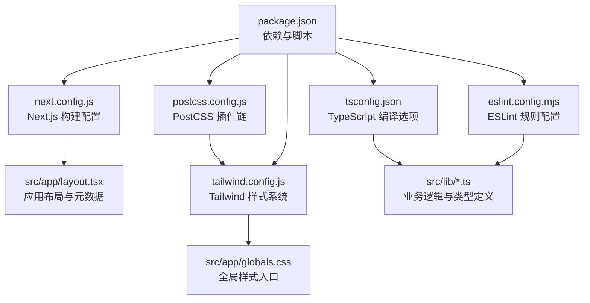

# 配置指南

<cite>
**本文引用的文件**
- [next.config.js](file://next.config.js)
- [tailwind.config.js](file://tailwind.config.js)
- [tsconfig.json](file://tsconfig.json)
- [eslint.config.mjs](file://eslint.config.mjs)
- [postcss.config.js](file://postcss.config.js)
- [package.json](file://package.json)
- [src/app/layout.tsx](file://src/app/layout.tsx)
- [src/app/globals.css](file://src/app/globals.css)
- [src/lib/mapper.ts](file://src/lib/mapper.ts)
- [src/lib/parser.ts](file://src/lib/parser.ts)
- [src/lib/types.ts](file://src/lib/types.ts)
- [src/components/ui/button.tsx](file://src/components/ui/button.tsx)
- [src/components/ui/dialog.tsx](file://src/components/ui/dialog.tsx)
</cite>

## 目录
1. [简介](#简介)
2. [项目结构](#项目结构)
3. [核心配置概览](#核心配置概览)
4. [Next.js 配置详解](#nextjs-配置详解)
5. [Tailwind CSS 配置详解](#tailwind-css-配置详解)
6. [TypeScript 配置详解](#typescript-配置详解)
7. [ESLint 配置详解](#eslint-配置详解)
8. [PostCSS 与构建流程](#postcss-与构建流程)
9. [环境变量与运行脚本](#环境变量与运行脚本)
10. [开发与生产环境差异](#开发与生产环境差异)
11. [配置优化与性能调优](#配置优化与性能调优)
12. [故障排查与常见问题](#故障排查与常见问题)
13. [结论](#结论)

## 简介
本指南面向公式变量映射与可视化工具项目，系统梳理并解释各配置文件的作用、参数与最佳实践，覆盖 Next.js、Tailwind CSS、TypeScript、ESLint、PostCSS 的配置要点，以及开发与生产环境的差异化配置策略。通过本指南，开发者可以快速理解并按需调整项目配置，以满足功能扩展与性能优化的需求。

## 项目结构
该项目采用 Next.js 应用结构，核心配置集中在根目录的配置文件中，样式通过 Tailwind CSS 与 PostCSS 组合实现，TypeScript 提供类型安全，ESLint 负责代码规范与质量控制。

图表来源
- [next.config.js:1-7](file://next.config.js#L1-L7)
- [tailwind.config.js:1-76](file://tailwind.config.js#L1-L76)
- [tsconfig.json:1-42](file://tsconfig.json#L1-L42)
- [eslint.config.mjs:1-30](file://eslint.config.mjs#L1-L30)
- [postcss.config.js:1-7](file://postcss.config.js#L1-L7)
- [package.json:1-48](file://package.json#L1-L48)
- [src/app/layout.tsx:1-20](file://src/app/layout.tsx#L1-L20)
- [src/app/globals.css:1-60](file://src/app/globals.css#L1-L60)

章节来源
- [package.json:1-48](file://package.json#L1-L48)

## 核心配置概览
- Next.js：启用严格模式，确保 React 代码在严格模式下运行，提升早期问题发现能力。
- Tailwind CSS：支持暗色模式类名切换，内容扫描路径覆盖页面、组件与应用层，主题扩展包含颜色、圆角、动画等。
- TypeScript：启用严格模式、增量编译、隔离模块、路径别名，目标 ES 版本为 ES2017。
- ESLint：基于 Flat Config 扩展 Next.js 推荐规则，自定义未使用变量规则。
- PostCSS：集成 Tailwind CSS 与 Autoprefixer，自动添加浏览器前缀。

章节来源
- [next.config.js:1-7](file://next.config.js#L1-L7)
- [tailwind.config.js:1-76](file://tailwind.config.js#L1-L76)
- [tsconfig.json:1-42](file://tsconfig.json#L1-L42)
- [eslint.config.mjs:1-30](file://eslint.config.mjs#L1-L30)
- [postcss.config.js:1-7](file://postcss.config.js#L1-L7)

## Next.js 配置详解
- 关键项
  - reactStrictMode：启用 React 严格模式，有助于捕获潜在问题。
- 影响范围
  - 全局生效，影响开发与生产构建阶段的 React 渲染行为。
- 建议
  - 在需要兼容旧版 React 或特定场景时，可临时关闭；一般建议保持开启以获得更严格的开发体验。

章节来源
- [next.config.js:1-7](file://next.config.js#L1-L7)

## Tailwind CSS 配置详解
- 内容扫描
  - 覆盖 src/pages、src/components、src/app 下的 JS/TS/JSX/TSX/MDX 文件，确保按需生成样式。
- 暗色模式
  - 使用 class 方式，通过根元素类名切换明暗主题。
- 主题扩展
  - 颜色：基于 CSS 变量映射，统一使用 hsl(var(--token))。
  - 圆角：基于 --radius 变量，提供 lg/md/sm 不同层级。
  - 动画：扩展 accordion-down/up，配合 Radix UI 组件使用。
- 插件
  - 当前为空数组，后续可按需引入插件增强能力。
- 样式入口
  - 全局样式通过 @tailwind 指令引入，结合 CSS 变量实现明暗主题切换。

章节来源
- [tailwind.config.js:1-76](file://tailwind.config.js#L1-L76)
- [src/app/globals.css:1-60](file://src/app/globals.css#L1-L60)

## TypeScript 配置详解
- 编译选项
  - lib：包含 dom、dom.iterable、esnext，适配浏览器与现代标准库。
  - strict：启用严格模式，提升类型安全。
  - noEmit：仅进行类型检查，不输出 JS 文件，由 Next.js 负责打包。
  - module/moduleResolution：使用 esnext 与 bundler 解析器，适配现代打包器。
  - isolatedModules：隔离模块，便于增量编译与热更新。
  - jsx：使用 react-jsx，与 React 18+ JSX 转换一致。
  - incremental：启用增量编译，提升开发体验。
  - target：ES2017，兼顾兼容性与现代特性。
  - resolveJsonModule：允许导入 JSON 模块。
  - plugins：集成 Next 插件，提供框架级类型支持。
  - paths：@/* 映射至 ./src/*，简化导入路径。
- 包含/排除
  - include：包含 next-env.d.ts、所有 ts/tsx 文件以及 Next 类型目录。
  - exclude：排除 node_modules。

章节来源
- [tsconfig.json:1-42](file://tsconfig.json#L1-L42)

## ESLint 配置详解
- 配置方式
  - 使用 Flat Config（.mjs），通过 @eslint/eslintrc 的 FlatCompat 加载推荐规则集。
- 规则继承
  - 扩展 next/core-web-vitals，确保 Next.js 最佳实践与性能指标。
- 自定义规则
  - 对未使用变量规则进行微调，忽略以下划线开头的参数/变量/捕获变量，减少噪音。
- 脚本
  - package.json 中提供 lint 脚本，可在 CI 或本地执行。

章节来源
- [eslint.config.mjs:1-30](file://eslint.config.mjs#L1-L30)
- [package.json:1-48](file://package.json#L1-L48)

## PostCSS 与构建流程
- 插件链
  - tailwindcss：生成 Tailwind 实用类与基础样式。
  - autoprefixer：自动添加浏览器前缀，提升兼容性。
- 与 Tailwind 的关系
  - Tailwind CSS 通过 PostCSS 插件链工作，确保样式按需生成与兼容处理。
- 构建流程
  - 开发：Next.js 启动时由 PostCSS 处理样式。
  - 生产：Next.js 构建时合并、压缩样式并注入。

章节来源
- [postcss.config.js:1-7](file://postcss.config.js#L1-L7)
- [tailwind.config.js:1-76](file://tailwind.config.js#L1-L76)

## 环境变量与运行脚本
- 脚本
  - dev：启动 Next.js 开发服务器。
  - build：执行 Next.js 构建。
  - start：启动生产服务器。
  - lint：执行 ESLint 规范检查。
- 环境变量
  - 项目未显式声明环境变量文件；如需使用，请在根目录新增 .env.local 并遵循 Next.js 环境变量命名规范（NEXT_PUBLIC_ 前缀用于客户端可见变量）。
- 依赖
  - Next.js、React、Tailwind CSS、Radix UI、KaTeX 等作为运行时依赖，ESLint、TypeScript、PostCSS、Autoprefixer 等作为开发依赖。

章节来源
- [package.json:1-48](file://package.json#L1-L48)

## 开发与生产环境差异
- 开发环境
  - 启用严格模式与增量编译，提升开发效率与类型检查速度。
  - ESLint 仅在本地或 CI 执行，不参与构建。
- 生产环境
  - 构建产物最小化、按需提取样式，Tailwind CSS 仅生成实际使用的类。
  - 严格模式仍可保留，但需关注性能与兼容性权衡。
- 建议
  - 在生产环境启用缓存与 CDN，结合静态导出（如适用）进一步优化加载性能。

[本节为通用指导，无需列出具体文件来源]

## 配置优化与性能调优
- Next.js
  - 启用 reactStrictMode 以提升早期问题发现能力；如遇兼容性问题可评估关闭。
  - 结合 Image Optimization 与 App Router 的资源预取策略，优化首屏渲染。
- Tailwind CSS
  - 控制内容扫描范围，避免不必要的文件被扫描，减少构建时间。
  - 合理使用 CSS 变量与主题扩展，避免过度嵌套导致样式膨胀。
- TypeScript
  - 保持 strict 与 isolatedModules，确保类型检查准确性。
  - 合理拆分模块，利用增量编译提升开发响应速度。
- ESLint
  - 在 CI 中强制执行，确保代码质量一致性。
  - 避免过度宽松的规则，保持团队编码风格统一。
- PostCSS
  - 仅启用必要插件，减少构建开销。
  - 与 Tailwind CSS 协作时，确保插件顺序正确（Tailwind CSS 在前）。

[本节为通用指导，无需列出具体文件来源]

## 故障排查与常见问题
- 样式未生效
  - 检查 Tailwind CSS 是否正确引入（@tailwind 指令）。
  - 确认 tailwind.config.js 的 content 路径是否包含当前组件文件。
  - 确保 PostCSS 插件链顺序正确。
- TypeScript 报错
  - 检查 tsconfig.json 的 include/exclude 与 paths 设置。
  - 确认 noEmit 与 isolatedModules 的组合是否符合预期。
- ESLint 报错
  - 检查 eslint.config.mjs 的规则继承与自定义项。
  - 在本地或 CI 中执行 lint 脚本，定位问题文件。
- Next.js 构建失败
  - 检查 next.config.js 的配置项是否与当前版本兼容。
  - 确认依赖版本与 Next.js 版本匹配。

章节来源
- [tailwind.config.js:1-76](file://tailwind.config.js#L1-L76)
- [tsconfig.json:1-42](file://tsconfig.json#L1-L42)
- [eslint.config.mjs:1-30](file://eslint.config.mjs#L1-L30)
- [next.config.js:1-7](file://next.config.js#L1-L7)

## 结论
本指南从 Next.js、Tailwind CSS、TypeScript、ESLint、PostCSS 五个维度，系统阐述了公式变量映射与可视化工具项目的配置要点与优化建议。通过合理配置与持续优化，可以在保证开发体验的同时，获得稳定、高性能的运行表现。建议在团队内形成统一的配置规范与变更流程，确保配置的一致性与可维护性。