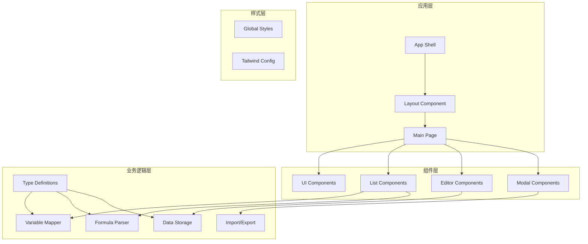
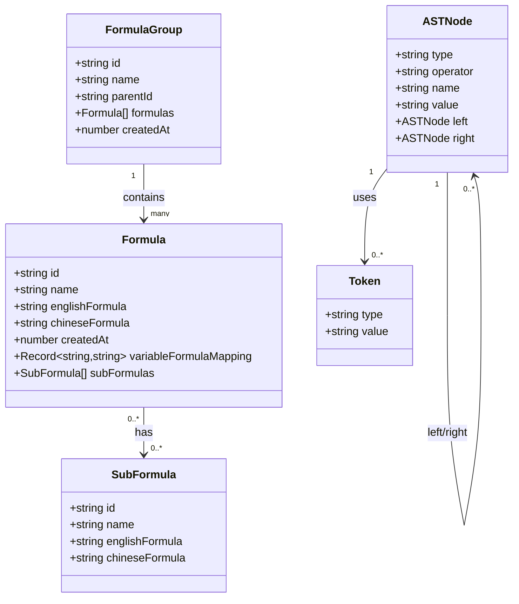
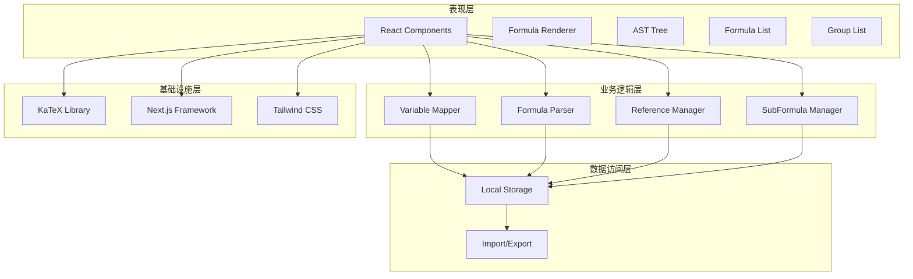
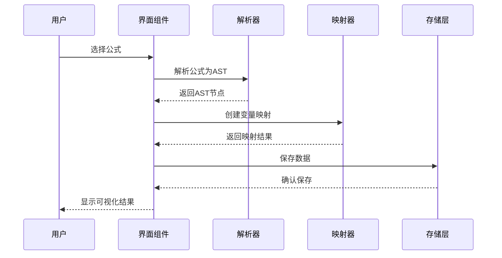
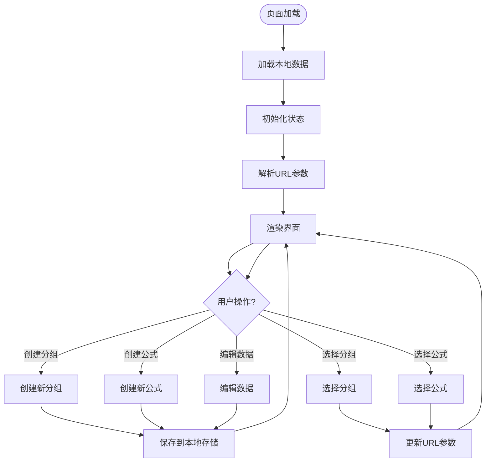
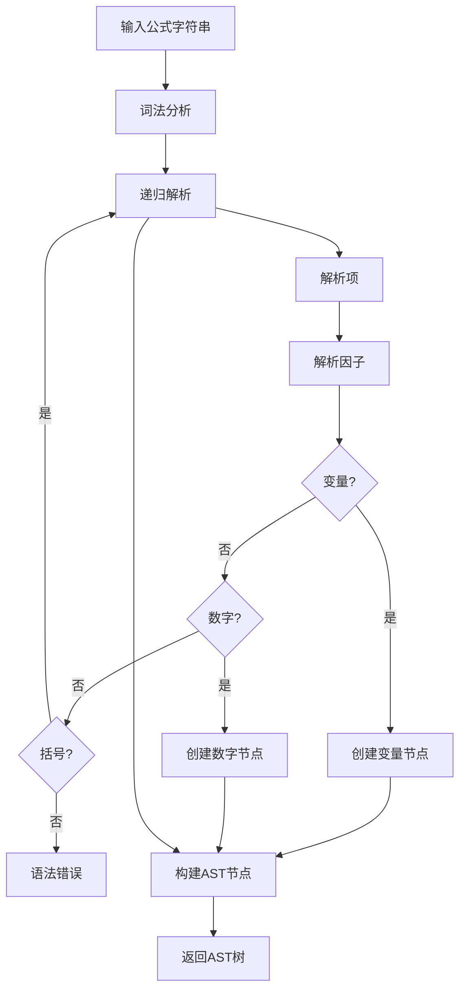
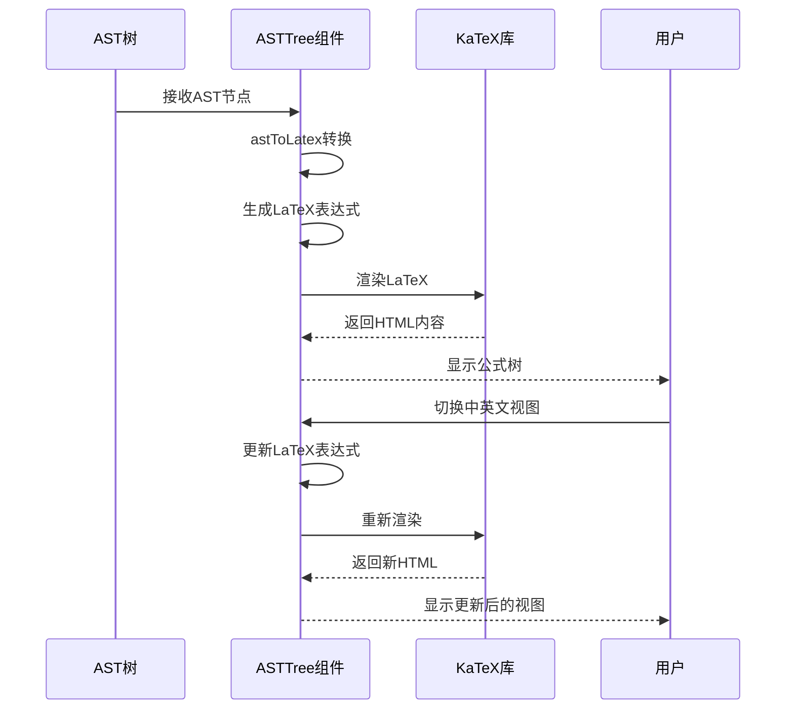
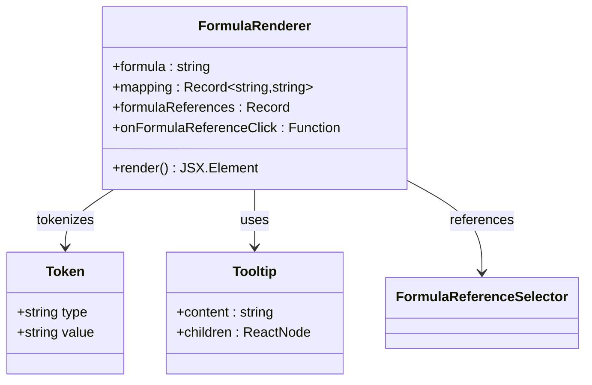
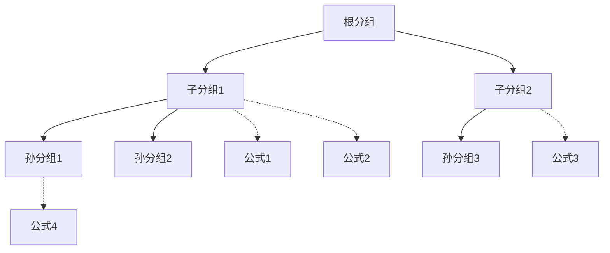

# 项目概述

<cite>
**本文档引用的文件**
- [package.json](file://package.json)
- [src/app/page.tsx](file://src/app/page.tsx)
- [src/lib/types.ts](file://src/lib/types.ts)
- [src/lib/mapper.ts](file://src/lib/mapper.ts)
- [src/lib/parser.ts](file://src/lib/parser.ts)
- [src/lib/storage.ts](file://src/lib/storage.ts)
- [src/lib/importExport.ts](file://src/lib/importExport.ts)
- [src/components/ASTTree.tsx](file://src/components/ASTTree.tsx)
- [src/components/FormulaRenderer.tsx](file://src/components/FormulaRenderer.tsx)
- [src/components/FormulaList.tsx](file://src/components/FormulaList.tsx)
- [src/components/GroupList.tsx](file://src/components/GroupList.tsx)
- [src/components/FormulaReferenceSelector.tsx](file://src/components/FormulaReferenceSelector.tsx)
- [src/components/SubFormulaManager.tsx](file://src/components/SubFormulaManager.tsx)
- [src/app/layout.tsx](file://src/app/layout.tsx)
</cite>

## 目录
1. [项目简介](#项目简介)
2. [项目结构](#项目结构)
3. [核心组件](#核心组件)
4. [架构概览](#架构概览)
5. [详细组件分析](#详细组件分析)
6. [依赖分析](#依赖分析)
7. [性能考虑](#性能考虑)
8. [故障排除指南](#故障排除指南)
9. [结论](#结论)

## 项目简介

公式变量映射与可视化工具是一个基于现代Web技术栈构建的交互式应用，专门用于管理和可视化数学公式的变量映射关系。该项目旨在解决学术研究、工程计算和教育领域中公式变量理解与维护的痛点，提供直观的英文↔中文双向映射、AST树可视化和分组管理等核心功能。

### 核心目标

- **双向变量映射**：实现英文变量与中文变量的智能识别和映射
- **可视化展示**：通过AST树和LaTeX渲染提供直观的公式结构展示
- **分组管理**：支持多层级分组，便于大规模公式的组织和管理
- **引用机制**：支持子公式和外部公式的引用，实现公式间的关联
- **数据持久化**：提供本地存储和数据导入导出功能

### 主要功能特性

1. **智能变量提取**：自动识别公式中的变量并建立映射关系
2. **AST树解析**：将公式转换为抽象语法树进行结构化展示
3. **LaTeX渲染**：使用KaTeX库进行高质量的数学公式渲染
4. **分组导航**：支持树形结构的分组管理和快速定位
5. **公式引用**：支持子公式和外部公式的引用机制
6. **数据管理**：完整的导入导出功能，支持数据备份和迁移

## 项目结构

项目采用基于功能模块的组织方式，遵循Next.js的约定式路由结构：



**图表来源**
- [src/app/page.tsx:1-707](file://src/app/page.tsx#L1-L707)
- [src/app/layout.tsx:1-20](file://src/app/layout.tsx#L1-L20)

**章节来源**
- [src/app/page.tsx:1-707](file://src/app/page.tsx#L1-L707)
- [src/app/layout.tsx:1-20](file://src/app/layout.tsx#L1-L20)

## 核心组件

### 数据模型设计

项目采用强类型设计，通过TypeScript接口定义核心数据结构：



**图表来源**
- [src/lib/types.ts:1-51](file://src/lib/types.ts#L1-L51)

### 核心算法组件

项目实现了两个关键的算法组件：

1. **变量映射器**：负责提取和建立变量映射关系
2. **公式解析器**：负责将公式转换为AST树结构

**章节来源**
- [src/lib/types.ts:1-51](file://src/lib/types.ts#L1-L51)
- [src/lib/mapper.ts:1-89](file://src/lib/mapper.ts#L1-L89)
- [src/lib/parser.ts:1-159](file://src/lib/parser.ts#L1-L159)

## 架构概览

项目采用分层架构设计，各层职责明确，耦合度低：



**图表来源**
- [src/app/page.tsx:1-707](file://src/app/page.tsx#L1-L707)
- [src/components/FormulaList.tsx:1-387](file://src/components/FormulaList.tsx#L1-L387)
- [src/components/ASTTree.tsx:1-179](file://src/components/ASTTree.tsx#L1-L179)

### 控制流分析

系统的主要控制流程如下：



**图表来源**
- [src/components/FormulaList.tsx:169-192](file://src/components/FormulaList.tsx#L169-L192)
- [src/lib/parser.ts:12-22](file://src/lib/parser.ts#L12-L22)
- [src/lib/mapper.ts:52-70](file://src/lib/mapper.ts#L52-L70)

## 详细组件分析

### 主页面组件分析

主页面组件是整个应用的核心控制器，负责协调各个子组件的工作：



**图表来源**
- [src/app/page.tsx:82-131](file://src/app/page.tsx#L82-L131)

**章节来源**
- [src/app/page.tsx:1-707](file://src/app/page.tsx#L1-L707)

### 变量映射器组件

变量映射器实现了智能的变量提取和映射功能：

```mermaid
classDiagram
class VariableMapper {
+extractEnglishVariables(formula : string) string[]
+extractChineseVariables(formula : string) string[]
+createMapping(englishFormula, chineseFormula) VariableMapping
+formatMapping(mappingResult) {items, hasMoreChinese}
}
class VariableMapping {
+Record~string,string~ mapping
+string[] englishVars
+string[] chineseVars
+boolean hasMoreChinese
}
class MappingItem {
+string english
+string chinese
}
VariableMapper --> VariableMapping : creates
VariableMapping --> MappingItem : contains
```

**图表来源**
- [src/lib/mapper.ts:3-89](file://src/lib/mapper.ts#L3-L89)

**章节来源**
- [src/lib/mapper.ts:1-89](file://src/lib/mapper.ts#L1-L89)

### 公式解析器组件

公式解析器实现了递归下降解析算法，将字符串公式转换为AST树：



**图表来源**
- [src/lib/parser.ts:78-157](file://src/lib/parser.ts#L78-L157)

**章节来源**
- [src/lib/parser.ts:1-159](file://src/lib/parser.ts#L1-L159)

### AST树渲染组件

AST树渲染组件负责将解析后的AST树转换为LaTeX格式并进行可视化展示：



**图表来源**
- [src/components/ASTTree.tsx:27-63](file://src/components/ASTTree.tsx#L27-L63)
- [src/components/ASTTree.tsx:120-142](file://src/components/ASTTree.tsx#L120-L142)

**章节来源**
- [src/components/ASTTree.tsx:1-179](file://src/components/ASTTree.tsx#L1-L179)

### 公式渲染器组件

公式渲染器组件提供了交互式的公式展示功能：



**图表来源**
- [src/components/FormulaRenderer.tsx:6-32](file://src/components/FormulaRenderer.tsx#L6-L32)

**章节来源**
- [src/components/FormulaRenderer.tsx:1-169](file://src/components/FormulaRenderer.tsx#L1-L169)

### 分组管理组件

分组管理组件实现了多层级的分组树形结构：



**图表来源**
- [src/components/GroupList.tsx:33-43](file://src/components/GroupList.tsx#L33-L43)

**章节来源**
- [src/components/GroupList.tsx:1-294](file://src/components/GroupList.tsx#L1-L294)

## 依赖分析

项目采用现代化的技术栈，各依赖项协同工作：

```mermaid
graph TB
subgraph "前端框架"
NextJS[Next.js 16.2.1]
React[React 19.2.4]
ReactDOM[React DOM 19.2.4]
end
subgraph "UI组件库"
Radix[Radix UI]
Tailwind[Tailwind CSS]
Lucide[Lucide React Icons]
end
subgraph "数学渲染"
KaTeX[KaTeX 0.16.44]
KaTeXTypes[@types/katex 0.16.8]
end
subgraph "开发工具"
TypeScript[TypeScript 6.0.2]
ESLint[ESLint 9.0.0]
PostCSS[PostCSS 8.5.8]
end
NextJS --> React
NextJS --> ReactDOM
NextJS --> Radix
NextJS --> Tailwind
NextJS --> KaTeX
React --> KaTeX
KaTeX --> KaTeXTypes
```

**图表来源**
- [package.json:15-46](file://package.json#L15-L46)

### 核心依赖选择优势

1. **Next.js**: 提供SSR、静态生成和现代化开发体验
2. **React 19**: 支持新的并发特性，提升用户体验
3. **KaTeX**: 高质量的数学公式渲染，性能优于MathJax
4. **Tailwind CSS**: 原子化CSS，提高开发效率
5. **TypeScript**: 强类型支持，增强代码质量和可维护性

**章节来源**
- [package.json:1-48](file://package.json#L1-L48)

## 性能考虑

### 内存优化策略

1. **懒加载机制**: 公式详情只有在展开时才进行解析和渲染
2. **状态缓存**: 使用localStorage缓存用户选择状态
3. **组件优化**: 使用React.memo和useMemo避免不必要的重渲染

### 渲染性能优化

1. **虚拟滚动**: 对于大量公式的场景，可以考虑实现虚拟滚动
2. **增量更新**: 只更新发生变化的部分DOM
3. **防抖处理**: 对搜索和输入操作进行防抖处理

### 数据持久化优化

1. **增量保存**: 只保存变化的数据而不是整个数据集
2. **压缩存储**: 对大型数据集考虑使用压缩算法
3. **版本控制**: 实现数据格式的向后兼容性

## 故障排除指南

### 常见问题及解决方案

1. **公式解析错误**
   - 检查公式语法是否正确
   - 确保括号配对完整
   - 验证变量命名规则

2. **LaTeX渲染失败**
   - 检查网络连接
   - 确认KaTeX库加载成功
   - 验证LaTeX表达式格式

3. **数据导入失败**
   - 检查JSON文件格式
   - 确认数据结构完整性
   - 验证文件编码格式

### 调试技巧

1. **浏览器开发者工具**: 使用Console面板查看错误信息
2. **React DevTools**: 检查组件状态和props
3. **网络面板**: 监控API请求和响应
4. **存储面板**: 查看localStorage数据状态

**章节来源**
- [src/components/FormulaList.tsx:170-192](file://src/components/FormulaList.tsx#L170-L192)
- [src/components/ASTTree.tsx:124-142](file://src/components/ASTTree.tsx#L124-L142)

## 结论

公式变量映射与可视化工具项目展现了现代Web应用开发的最佳实践。通过精心设计的架构、清晰的组件分离和高效的算法实现，该项目成功解决了公式变量理解和可视化的实际需求。

### 技术亮点

1. **架构设计**: 分层清晰，职责明确，易于维护和扩展
2. **算法实现**: 自定义的变量提取和AST解析算法，满足特定需求
3. **用户体验**: 响应式设计，流畅的交互体验
4. **数据管理**: 完整的本地存储和数据导入导出功能

### 应用场景

- **教育领域**: 数学公式教学和学习辅助
- **工程计算**: 复杂公式的管理和维护
- **学术研究**: 公式库的构建和检索
- **企业知识管理**: 公式知识的组织和分享

### 发展方向

1. **移动端适配**: 优化移动设备上的使用体验
2. **协作功能**: 支持多人协作和版本管理
3. **云端同步**: 实现跨设备的数据同步
4. **插件生态**: 支持第三方扩展和集成

该项目为公式变量映射和可视化提供了一个坚实的技术基础，具有良好的扩展性和实用性，能够满足不同用户群体的需求。